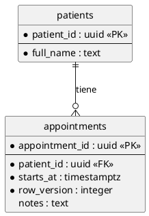

# Modelado de datos en PlantUML

Acá el diagrama no es documentación: es **código fuente**. Un generador lo lee y emite el DDL
(ver `model-driven-schema`). Por eso valen las mismas reglas que para código: una sola forma
de escribir cada cosa, sin ambigüedad, con diffs que un humano pueda revisar. Qué constituye
un buen diseño relacional está en `database-design`; esto es cómo se escribe.

## 1. Sintaxis base (diagrama de entidades, notación pata de gallo)



- `*` marca atributo **obligatorio** (`NOT NULL`); sin `*` es opcional. Dejá un espacio después
  del asterisco: pegado al texto choca con la negrita de Creole.
- `--` separa los atributos identificadores del resto.
- Estereotipo de atributo entre `<< >>` al final de la línea: `<<PK>>`, `<<FK>>`, `<<UK>>`.
- Comentarios: `'` de línea, `/' ... '/` de bloque. El generador los ignora; usalos poco.

## 2. Cardinalidades

| Símbolo | Significado |
|---|---|
| `\|o--` | cero o uno |
| `\|\|--` | exactamente uno |
| `}o--` | cero o muchos |
| `}\|--` | uno o muchos |

Los símbolos se espejan del otro lado de la línea (`--o|`, `--||`, `--o{`, `--|{`). Reglas de la casa:

1. **Toda relación declara ambos extremos.** `A -- B` a secas no dice nada: prohibido.
2. La obligatoriedad del extremo tiene que **coincidir** con el `*` de la columna FK: si la FK
   es opcional, el extremo del padre es `|o`, no `||`. Una contradicción es un error de modelo y
   el generador debe abortar, no elegir.
3. Muchos-a-muchos no se dibuja como línea directa: se modela la tabla de unión como entidad,
   con sus dos FKs y su clave.
4. La etiqueta (`: "tiene"`) es para humanos; el generador no deriva semántica de ella.

## 3. Naming

- Identificadores **idénticos** a los de la base: `snake_case`, mismo idioma, sin traducir ni
  abreviar distinto entre diagramas. El nombre del modelo es el nombre, punto.
- Alias (`as`) == nombre de la entidad. Alias crípticos (`e01`) hacen ilegibles las relaciones.
- PK como `<tabla_singular>_id`; FK con el **mismo nombre** que la PK destino salvo que haya dos
  FKs a la misma tabla (`created_by_user_id`, `approved_by_user_id`).
- PostgreSQL trunca identificadores a 63 bytes en silencio: nombres de tabla y columna cortos
  para que los índices y constraints derivados no colisionen.

## 4. Tipos

- Usá un **vocabulario cerrado** de tipos, documentado junto al generador (`uuid`, `text`,
  `integer`, `bigint`, `numeric(p,s)`, `boolean`, `date`, `timestamptz`, `jsonb`…). Tipo fuera del
  vocabulario ⇒ el generador aborta.
- Dinero `numeric(p,s)`, instantes `timestamptz`: ver `database-design` §3.
- Conjuntos cerrados de valores: **no** como enum en el diagrama. Columna `*_concept_id` que
  referencia el catálogo/servidor terminológico (ver `terminology-value-sets`).

## 5. Estereotipos de entidad: semántica que el generador consume

Definí pocos, con significado preciso, y listalos en un solo lugar. Conjunto sugerido:

| Estereotipo | Significa para el generador |
|---|---|
| `<<APPEND_ONLY>>` | Solo `INSERT`; emite guarda contra `UPDATE`/`DELETE` (ver `audit-trail-history`) |
| `<<VERSIONED>>` | Lleva columna de versión para locking optimista |
| `<<REFERENCE_ONLY>>` | La tabla real vive en otro módulo; **no** generar segunda tabla |
| `<<VIEW>>` | Solo lectura; no se materializa como tabla |
| `<<TENANT_SCOPED>>` | Lleva `tenant_id` obligatorio en tabla e índices únicos (`multi-tenancy`) |

```plantuml
entity "access_log" as access_log <<APPEND_ONLY>> {
```

Un estereotipo que el generador no conoce es un error, no un adorno. No inventes uno en un
diagrama sin darlo de alta en el generador en el mismo cambio.

## 6. Notas

```plantuml
note right of appointments
  UK: (patient_id, starts_at)
  CHECK: ends_at > starts_at
end note
```

- Preferí expresar la regla en estructura (estereotipo, `*`, cardinalidad). La nota es para lo
  que no tiene sintaxis: claves únicas compuestas, `CHECK`, exclusiones.
- Si el generador lee notas, el **formato es contrato**: prefijo fijo (`UK:`, `CHECK:`), una regla
  por línea. Texto libre para humanos va en una nota separada sin prefijos.
- No describas en una nota lo que el diagrama ya dice.

## 7. Organización en archivos

1. **Un archivo por módulo/contexto acotado**, con prefijo numérico estable para ordenar
   (`12_scheduling.puml`). No un diagrama gigante: no se puede revisar ni renderizar.
2. Dentro del archivo, `package "scheduling" { ... }` agrupa y corresponde 1:1 con el schema de base.
3. Cada tabla tiene **un solo dueño**. Desde otro módulo se referencia con `<<REFERENCE_ONLY>>`,
   sin redeclarar columnas.
4. Lo común (skinparams, `hide circle`) en un archivo aparte e `!include`. Para partes
   reutilizables, `!startsub NOMBRE` / `!endsub` e `!includesub archivo.puml!NOMBRE`.
5. Evitá `!procedure`/`!function` y variables `!$x` para **generar entidades**: el parser del
   generador lee texto, no ejecuta el preprocesador. Lo que ve el humano y lo que ve el
   generador tienen que ser lo mismo.

## 8. Diffs revisables

- Un atributo por línea; orden estable (identificadores, `--`, obligatorios, opcionales).
  **No reordenes** al pasar: convierte un cambio de una línea en un diff de cuarenta.
- Relaciones agrupadas al final del archivo, una por línea, ordenadas por entidad origen.
- Sin alineación con espacios en columnas: un rename desalinea todo el bloque.
- Un cambio de modelo por commit, con el porqué en el mensaje. Salida generada en el mismo PR,
  modelo primero en el orden de revisión.

## 9. Reglas para que el generador no adivine

| Situación | Conducta exigida |
|---|---|
| Tipo fuera del vocabulario | Abortar con archivo y línea |
| `<<FK>>` sin relación que resuelva el destino | Abortar; nunca inferir por nombre |
| Cardinalidad que contradice el `*` de la FK | Abortar |
| Entidad duplicada entre archivos sin `<<REFERENCE_ONLY>>` | Abortar |
| Estereotipo desconocido | Abortar |
| Entidad salteada a propósito (`<<VIEW>>`, referencia) | Registrar en un reporte de generación, con motivo |

"Abortar" es literal: código de salida distinto de cero y mensaje accionable. Ver
`python-tooling-standards`.

## 10. Revisión de modelo antes de código

El modelo se revisa y aprueba **antes** de generar y de escribir servicios. Preguntas del revisor:

- ¿Existe ya una tabla o catálogo que cubra esto? (`anti-hallucination-guard`)
- ¿Cada FK tiene su relación y la obligatoriedad coincide? ¿`ON DELETE` decidido?
- ¿Qué identifica unívocamente una fila para el negocio (clave natural) además de la PK?
- ¿Los conjuntos cerrados van por catálogo y no por enum?
- ¿Hay PHI/PII nueva? (`data-privacy-phi`) ¿La tabla es de auditoría? (`audit-trail-history`)
- ¿El diagrama renderiza sin errores?

## Anti-patrones

- Diagrama "lindo" mantenido aparte del que consume el generador: dos fuentes de verdad.
- Relación sin cardinalidad o con etiqueta como única pista de su significado.
- Reglas de negocio enterradas en prosa de una nota que nadie parsea ni implementa.
- Reformatear el archivo entero junto con un cambio real.
- Agregar columnas en la base "provisoriamente" y pasar después a dibujarlas.

## Checklist

- [ ] Nombres idénticos a la base, `snake_case`, alias == entidad.
- [ ] Todo atributo con tipo del vocabulario y `*` correcto; PK/FK/UK con estereotipo.
- [ ] Toda FK con su relación, ambos extremos declarados y coherentes con la nulabilidad.
- [ ] Muchos-a-muchos como entidad de unión; conjuntos cerrados por catálogo.
- [ ] Una tabla, un dueño; referencias externas con `<<REFERENCE_ONLY>>`.
- [ ] Diff mínimo: sin reordenar, sin realinear, un atributo por línea.
- [ ] El diagrama renderiza y el generador corre sin abortar ni advertencias nuevas.
- [ ] Modelo revisado antes de escribir código que dependa de él.
