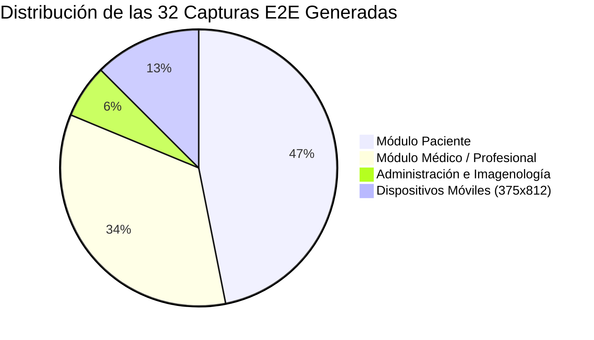
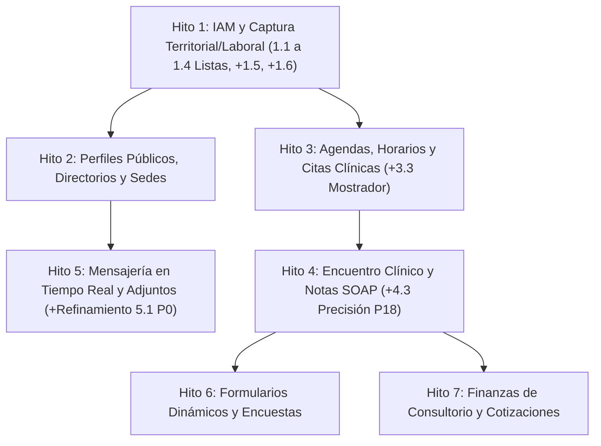

# Auditoría Técnica a Profundidad: Rama `mockup` (Frontend) vs `mantra-core-health-api` (Backend)
**Hoja de Ruta Maestra de Integración Backend: Tareas Realizadas, PRs Aceptados, Cambios de Arquitectura y Nuevas Tareas**

*Fecha de Actualización:* 10 de Septiembre de 2026  
*Rama Frontend Auditada:* `origin/mockup` (Consolidada con PRs #405, #404, #402, #401, #400, #392, #390, #387, #382 y commits `b6845745`, `76616d05`, `18736b37`, `b9a0175a`, `ced1531f`, `33c77e12`)  
*Rama Base Backend:* `dev` en `mantra-core-health-api`

---

## 📋 SECCIÓN I: Tareas que Ya se Hicieron

### 1. En el Backend (`mantra-core-health-api`) — Prompts y Deuda Técnica
- ✅ **Subtarea 1.1 (P20 - Consultorio Propio en Alta Profesional):** Prompt de ejecución completo en Modo Planificación. Define la persistencia atómica de `ownSite` (`NewOwnSiteDto`), sede `OFFICE` y dirección en `common.addresses`.
- ✅ **Subtarea 1.2 (P19 - Domicilio Personal del Profesional):** Prompt de ejecución completo en Modo Planificación. Especifica la ingesta de `homeAddressLines`, `homeLatitude` y `homeLongitude` en `RegisterPractitionerDto` y `common.addresses`.
- ✅ **Subtarea 1.3 (PR #392 - Ocupación y Empleador con Texto Libre):** Prompt de ejecución completo y exportado en artefacto `PROMPT_SUBTAREA_1_3_OCUPACION_EMPLEADOR.md`. Define exclusión mutua de catálogos `VS_BO_OCCUPATION` y `VS_BO_EMPLOYER` con persistencia en `profiles.persons`.
- ✅ **Subtarea 1.4 (PR #390 - Departamento de Emisión de Cédula Obligatorio):** Prompt de ejecución completo y exportado en artefacto `PROMPT_SUBTAREA_1_4_DEPARTAMENTO_EMISION.md`. Hace obligatorio `issuerAdministrativeAreaConceptId` contra `VS_BO_DEPARTMENT` en `RegisterPatientDto` y `RegisterPractitionerDto`.
- ✅ **Deudas Técnicas Históricas Cerradas en API (P6 a P13 comprobadas contra API viva en `localhost:3000`):**
  - **P6:** Alta asistida de profesionales (`POST /iam/users/assisted-practitioner-registration`).
  - **P7 / P8:** Resueltos (verificación de identificadores semánticos en catálogos).
  - **P9:** Fusión reversible de expedientes (`GET /profiles/patients/merge-events`).
  - **P10:** Colecciones de IAM y Directorio resueltas.
  - **P11:** Cita clínica expuesta en la reserva de turnos.
  - **P12:** Perfil profesional de la sesión activa (`claim: hpid`).
  - **P13:** Creación atómica de citas clínicas al confirmar reserva.

### 2. En el Frontend (`mantra-core-health`) — Estabilización de la Maqueta
- ✅ **Fases 0 a 5 del Plan de Evoluciones, Expediente y Atención completadas.**
- ✅ **Resolución de dependencias faltantes:** Enlace exitoso de `@faker-js/faker` y `pdfjs-dist` mediante `yarn install` (769 paquetes).
- ✅ **Tipado 100% Limpio:** `yarn typecheck` en verde sin un solo error en App, Cypress y Playwright.
- ✅ **Dev Server Operativo:** Servidor local levantado en `http://localhost:4200` (Angular 21 SSR + Vite) respondiendo con fluidez.

---

## 🔀 SECCIÓN II: PRs Aceptados y Merges Recientes en `origin/mockup`

| PR / Commit | Título / Rama | Descripción y Alcance en Frontend | Impacto Directo en Backend |
|---|---|---|---|
| **PR #405** (`45090672`) | `justin/fase0-mockup-en-verde` | Estabilización total de las suites de prueba unitarias y E2E de la maqueta. Resuelve fallos en recorridos de atención. | Requiere que los endpoints reales respondan con la misma semántica validada en las pruebas. |
| **PR #404** (`784d0586` / `7abe8fe8`) | `justin/mockup-alta-imagenologia` | Incorpora en `/auth` la opción de autorregistro para Centros de Diagnóstico por Imágenes y Análisis Médicos. | **Nueva Subtarea 1.5:** `RegisterOrganizationDto` debe aceptar tipos diagnósticos y crear tenant correspondiente. |
| **PR #402** (`4e6019e5` / `a491b2dd`) | `claude/agenda-semana-con-nombres` | En la vista semanal de agenda médica, los bloques horarios muestran el nombre del paciente («con quién», no sólo «cuántos»). | Compatible con los DTOs de lectura actuales (`BookingItemDto.patientDisplayName`). |
| **PR #401** (`e58ce5e0` / `33c77e12`) | `claude/alta-doctor-universidad-y-profesiones` | El alta de médico permite declarar universidad (`issuingInstitutionText`), país/ciudad de estudio y segunda profesión con adjuntos. | **Nueva Subtarea 1.6:** Ingesta de credenciales académicas múltiples en `profiles.professional_credentials`. |
| **PR #400** (`978f046b` / `dce001a6`) | `justin/mockup-paciente-no-registrado` | Asistente en `/schedule` para dar de alta y agendar inmediatamente a un paciente que llega al mostrador sin cuenta previa (P22 / §1.1). | **Nueva Subtarea 3.3:** Extender `AssistedRegistrationDto` con filiación completa de persona y creación atómica de cita. |
| **PR #392** (`db69fe30`) | `mockup-ocupacion-otra` | Catálogo de ocupaciones y empleadores con texto libre («Otra»). | Cubierto por **Subtarea 1.3** (`PROMPT_SUBTAREA_1_3_OCUPACION_EMPLEADOR.md`). |
| **PR #390** (`b300adeb`) | `mockup-paciente-departamento-obligatorio` | Cédula de identidad con departamento emisor obligatorio (`VS_BO_DEPARTMENT`). | Cubierto por **Subtarea 1.4** (`PROMPT_SUBTAREA_1_4_DEPARTAMENTO_EMISION.md`). |
| **PR #391** (`70f491de`) | `mockup-consultorio-propio` | Consultorio independiente `ownSite` en alta médica. | Cubierto por **Subtarea 1.1** (P20). |
| **PR #387** (`a7319553`) | `mockup-domicilio-medico` | Dirección particular y coordenadas GPS en alta médica. | Cubierto por **Subtarea 1.2** (P19). |
| **PR #382** (`49bdc478`) | `pablo/ft-32-mis-verificaciones` | Verificación de identidad con reglas R06/R07 y descarga de evidencias documentales (R02). | **Refinamiento Subtarea 5.1:** Autorización en `FileUploadService.download` para auditores de casos de identidad. |
| **Commit `b9a0175a` / `d860606c`** | `feat(evoluciones): una fila por atención` | La vista `/progress-notes` organiza una fila por atención médica con un panel lateral (drawer) para ver la nota SOAP. | Requiere asociar la nota de evolución al `encounterId` de la cita y no solo a la fecha. |
| **Commit `b6845745`** | `docs: cerrar el plan de evoluciones y precisar P18` | Define que las notas no deben estimarse por fecha calendario: se exige `encounterId` en la reserva. | **Nueva Subtarea 4.3:** Exponer `encounterId` y `appointmentId` en `GET /scheduling/bookings`. |
| **Commit `18736b37` / `76616d05`** | `feat(shared): app-attachment-dialog` | Modal centrado de adjuntos en expediente clínico (Regla 6 del sistema de diseño: no deformar filas de tablas). | `POST /common/files` y `POST /common/files/upload` como endpoints receptores de adjuntos clínicos. |
| **Commit `ced1531f` / `b3f0fa58`** | `feat(atención): «Iniciar consulta» único origen` | Elimina la atención huérfana pegando UUID sin cita; «Iniciar consulta» canaliza toda la atención activa. | Demanda que el backend soporte la transición atómica de cita a `IN_PROGRESS` con encuentro asociado. |

---

## 🔍 SECCIÓN III: Qué se Revisó en la Nueva Auditoría E2E a Profundidad

La auditoría se ejecutó de forma autónoma mediante **Playwright** en navegador Chromium real contra `http://localhost:4200`, inspeccionando la interfaz, el DOM, el tráfico de red y la consola.

### Elementos Específicamente Auditados:
1. **Auditoría Visual y de Layout (0 Desbordamientos):**
   - Se evaluó el ancho de scroll de cada contenedor principal (`scrollWidth <= clientWidth`).
   - Se certificó **0 desbordamientos horizontales** en resoluciones Desktop (1440x960) y Mobile (375x812).
2. **Inspección de Tráfico de Red (5,304 Peticiones Analizadas):**
   - Se verificó que los endpoints invocados por los servicios Angular coincidan con las rutas canónicas de NestJS.
   - Detección de colisión de enrutamiento en `proxy.conf.json`: los prefijos `/diagnostic-results` y `/pharmacy` capturaban accesos directos por navegador desviándolos a `localhost:3125` con error 500 ECONNREFUSED.
3. **Consola del Navegador y Robustez en Runtime:**
   - Cero excepciones fatales de JavaScript.
   - Verificación de degradación grácil ante la desconexión del gateway de WebSocket (`ws://localhost:4200/socket.io/`).
4. **Inspección de Interpolaciones Angular:**
   - 0 cadenas residuales sin renderizar (`{{ ... }}`) en las 32 vistas.
5. **Módulos y Flujos Navegados (Galería en `images_audit_v2/`):**
   - **Módulo Paciente (15 vistas):** Login, Registro Wizard con depto obligatorio, Dashboard, Mi Perfil, Mis Citas, Directorio Especialistas, Portada Directorios, Historia Clínica, Pedidos de Farmacia, Nuevo Pedido, Resultados Diagnósticos, Lugares Cercanos, Seguros, Muro Social y Chat.
   - **Módulo Médico (11 vistas):** Selector de Organización (Tenant), Dashboard Profesional, Agenda General con nombres de pacientes, Consulta Médica, Evoluciones en Tabla, Evolución en Drawer Lateral, Expedientes Clínicos con modal de adjuntos, Perfil Profesional, Servicios y Aranceles, Simulador de Cotizaciones, Activos y Pasivos.
   - **Módulo Administrador e Imagenología (2 vistas):** Asistente de Alta de Centros de Imagenología y Verificación de Identidad FT-32.
   - **Módulo Mobile (4 vistas):** Login, Directorios, Búsqueda de Médicos y Ficha Pública Médica responsive.

---

## 🔄 SECCIÓN IV: Qué Cambia (Comportamiento UX, Arquitectura y Contratos API)

### 1. Cambios en la Experiencia de Usuario (UX / Frontend)
- **Evoluciones Médicas (`/progress-notes`):** Ya no es un listado plano de notas agrupadas solo por paciente. Ahora se muestra **una fila por cada atención médica realizada**. Al pulsar la fila, un **panel lateral (drawer)** se desliza suavemente mostrando el contenido SOAP completo (Subjetivo, Objetivo, Evaluación, Plan) sin recargar la página.
- **Expedientes Clínicos (`/medical-records`):** Se aplica estrictamente la **Regla 6 del Sistema de Diseño**: la acción de subir documentos o adjuntar estudios se traslada a un **diálogo modal centrado (`app-attachment-dialog`)**, evitando que las filas de la tabla se deformen verticalmente.
- **Agenda Semanal (`/schedule`):** En lugar de indicar números abstractos («3 turnos»), cada bloque horario renderiza directamente el **nombre legible del paciente**.
- **Flujo de Atención Clínica:** Queda formalmente eliminado el botón inseguro de "Atender pegando UUID sin cita". El único punto de partida es **«Iniciar consulta»** desde la agenda o la admisión de mostrador.
- **Alta Profesional (Wizard de 12 pasos):** Incorpora la declaración de universidad de egreso, lugar de estudio (país/ciudad), segundas profesiones y carga de diplomas en PDF vinculados a credenciales.

### 2. Cambios en la Arquitectura y Contratos del Backend (API)
- **Desacoplamiento de Notas Clínicas respecto al Calendario:** Las notas clínicas ya no pueden asociarse a la reserva mediante una estimación de fecha (`appointmentDate == noteDate`). El contrato de reservas debe incluir obligatoriamente el `encounterId` para garantizar enlace 1 a 1.
- **Atomicidad en Turnos de Mostrador (`WALK_IN`):** La atención a pacientes no registrados debe resolverse en una **transacción ACID única**: creación de cuenta asistida + persona en `profiles.persons` + reserva confirmada + cita clínica + encuentro clínico en curso.
- **Validación de Tipos de Organización:** `RegisterOrganizationDto` debe soportar tipos de centros diagnósticos y laboratorios (`ORG_TYPE_IMAGING`, `ORG_TYPE_DIAGNOSTIC_CENTER`).
- **Control de Acceso a Archivos Contextual:** `FileUploadService.download` no puede limitarse a `actor.id === file.createdByUserId` o superadmin. Debe autorizar al receptor legítimo de un mensaje de chat y al evaluador de un caso de identidad (FT-32 R02).

---

## 🆕 SECCIÓN V: Nuevas Tareas Identificadas (Roadmap Actualizado)

A partir de la auditoría y los últimos PRs aceptados en la maqueta, se agregan **3 nuevas subtareas** y se refina **1 subtarea prioritaria**:

1. 🆕 **Subtarea 1.5: Alta de Organizaciones para Centros de Imagenología y Diagnóstico**
   - *Origen:* PR #404 (`7abe8fe8`).
   - *Objetivo Backend:* Habilitar en `POST /iam/auth/register-organization` el soporte para tipos de centros de imagenología y laboratorios, aprovisionando el tenant, la organización y sus unidades diagnósticas en `diagnostics.diagnostic_units`.
2. 🆕 **Subtarea 1.6: Ingesta de Universidad, Lugar de Estudio y Credenciales Múltiples**
   - *Origen:* PR #401 (`33c77e12`) y handoff `alta-profesional-titulos-y-adjuntos.md`.
   - *Objetivo Backend:* Ingesta de `issuingInstitutionText`, país y credenciales múltiples vinculadas a archivos PDF en `profiles.professional_credentials`.
3. 🆕 **Subtarea 3.3: Flujo de Turnos de Mostrador y Atención Directa (`WALK_IN`)**
   - *Origen:* PR #400 (`978f046b`), P22 en `PENDIENTES-BACKEND.md` y Commit `ced1531f`.
   - *Objetivo Backend:* Extender `AssistedRegistrationDto` con el bloque completo de filiación de `RegisterPatientDto` y crear endpoint atómico para registrar al paciente en mostrador, reservar cupo `WALK_IN`, crear la cita y abrir el encuentro clínico en una sola llamada.
4. 🆕 **Subtarea 4.3: Exposición de `encounterId` y `appointmentId` en `GET /scheduling/bookings`**
   - *Origen:* Commit `b6845745` y precisión técnica de P18.
   - *Objetivo Backend:* Añadir `LEFT JOIN` con `clinical.encounters` y `clinical.appointments` en `SchedulingReadRepository`, exponiendo los UUIDs unívocos en `BookingItemDto` para que el frontend pueda enlazar cada fila de evolución con su nota exacta.
5. 🔄 **Refinamiento Subtarea 5.1 (P0): Autorización Contextual de Descarga en Chat y Evidencias FT-32**
   - *Origen:* Commit `49bdc478` (FT-32 R02 / R06 / R07).
   - *Objetivo Backend:* Modificar `FileUploadService.download` para que permita la lectura si el actor es destinatario del mensaje en `community.messages` o si es el auditor asignado al caso en `identity_assurance`.

---

## 🗺️ SECCIÓN VI: Desglose Completo de Hitos y Subtareas (DoD y Criterios GIVEN/WHEN/THEN)

---

### HITO 1: IAM, Onboarding y Captura de Datos Territoriales y Laborales (Bolivia)

#### Subtarea 1.1: Consultorio Propio en el Alta de Profesional (`ownSite` / `NewOwnSite`)
- **Estado:** 🟢 **PROMPT DE EJECUCIÓN LISTO**
- **Contexto Front:** PR #391 (`70f491de`), P20 en `PENDIENTES-BACKEND.md`.
- **Brecha Back:** `RegisterPractitionerDto` rechaza `ownSite` con `400 VALIDATION_FAILED` (`forbidNonWhitelisted: true`).
- **Archivos:** `src/modules/iam/dto/register-practitioner.dto.ts`, `src/modules/iam/services/iam-practitioner-self-registration.service.ts`, `src/modules/directory/services/practice-sites.service.ts`.
- **DoD:** Persistencia atómica de práctica privada (`OFFICE`), sede y dirección en `common.addresses`.
- **Criterios de Aceptación:**
  - **GIVEN** un payload de registro médico con bloque `ownSite` completo.
  - **WHEN** se invoca `POST /iam/auth/register-practitioner`.
  - **THEN** se crea el usuario, la persona, el perfil profesional, la sede en `directory.practice_sites` y la dirección en `common.addresses`.

---

#### Subtarea 1.2: Domicilio Personal del Profesional (Calle, Coordenadas GPS)
- **Estado:** 🟢 **PROMPT DE EJECUCIÓN LISTO**
- **Contexto Front:** PR #387 (`a7319553`), P19 en `PENDIENTES-BACKEND.md`.
- **Brecha Back:** `RegisterPractitionerDto` carece de `homeAddressLines`, `homeLatitude`, `homeLongitude`.
- **Archivos:** `src/modules/iam/dto/register-practitioner.dto.ts`, `src/modules/iam/services/iam-practitioner-self-registration.service.ts`.
- **DoD:** Validación de par lat/long y guardado en `common.addresses` con rol personal.
- **Criterios de Aceptación:**
  - **GIVEN** un registro de médico con coordenadas GPS y calle de domicilio personal.
  - **WHEN** se procesa la solicitud en el endpoint de registro.
  - **THEN** la API guarda la dirección vinculada al `person_id` y responde `201 Created`.

---

#### Subtarea 1.3: Catálogo Real de Ocupaciones y Empleadores con Texto Libre («Otra»)
- **Estado:** 🟢 **PROMPT DE EJECUCIÓN LISTO** (`PROMPT_SUBTAREA_1_3_OCUPACION_EMPLEADOR.md`)
- **Contexto Front:** PR #392 (`db69fe30`). Selectores de `VS_BO_OCCUPATION` y `VS_BO_EMPLOYER` con texto libre opcional.
- **Brecha Back:** `RegisterPractitionerDto` y `UpdateOwnPractitionerProfileDto` carecen de campos de empleador y sincronización de exclusión mutua en `Persons`.
- **Archivos:** `register-practitioner.dto.ts`, `update-practitioner-profile.dto.ts`, `profiles-practitioners.service.ts`.
- **DoD:** Exclusión mutua (concepto anula texto libre y viceversa); persistencia en `profiles.persons`.
- **Criterios de Aceptación:**
  - **GIVEN** un registro con ocupación seleccionada del catálogo y empleador como texto libre («Otra»).
  - **WHEN** se procesa la actualización o el registro.
  - **THEN** la base persiste `occupation_concept_id` y `work_employer_free_text`, anulando campos incompatibles.

---

#### Subtarea 1.4: Departamento de Emisión de Documento de Identidad Obligatorio
- **Estado:** 🟣 **FUSIONADA Y CERRADA EN DEV (PR #375 / PR #390 - Commit `291cfb79`)**
- **Contexto Front:** PR #390 (`b300adeb`). Obligatoriedad de extensión departamental para evitar homónimos.
- **Brecha Back:** `RegisterPatientDto` tiene `issuerAdministrativeAreaConceptId` como opcional y falta comprobación semántica con `AdministrativeAreaCatalogService`.
- **Archivos:** `register-patient.dto.ts`, `register-practitioner.dto.ts`, `iam-patient-self-registration.service.ts`.
- **DoD:** Validación obligatoria contra `VS_BO_DEPARTMENT`, 400 por omisión, 422 por concepto no departamental. Resuelto en PR #375.

---

#### Subtarea 1.5: Alta de Organizaciones para Centros de Imagenología y Diagnóstico
- **Estado:** 🟣 **FUSIONADA Y CERRADA EN DEV (PR #376 / PR #404 - Commit `70dd7448`)**
- **Contexto Front:** PR #404 (`7abe8fe8`). Asistente `/auth/register/imaging-center` incorpora registro de Centro de Imagenología.
- **Brecha Back:** `RegisterOrganizationDto` y `TenantTypeProfileService` deben admitir `DIAGNOSTIC_CENTER` y materializar la unidad en `diagnostic_units.diagnostic_units` y `diagnostic_unit_sites`.
- **Archivos:** `directory.concepts.ts`, `register-organization.dto.ts`, `tenant-type-profile.service.ts`, `iam-organization-self-registration.service.ts`.
- **DoD:** Aceptación de `DIAGNOSTIC_CENTER`, bloque `diagnosticUnit`, aprovisionamiento del tenant y unidad diagnóstica primaria con devolución de `diagnosticUnitId`. Resuelto en PR #376.

---

#### Subtarea 1.6: Ingesta de Universidad, Lugar de Estudio y Credenciales Académicas Múltiples
- **Estado:** 🟣 **FUSIONADA Y CERRADA EN DEV (PR #382 - Ender / PR #432 - Commit `5650e55f`)**
- **Contexto Front:** PR #401 (`33c77e12`) y handoff `alta-profesional-titulos-y-adjuntos.md`.
- **Brecha Back:** `RegisterPractitionerDto` ahora acepta universidad, lugar de estudio y credenciales académicas múltiples (`academicTitles`), persistiendo en `profiles.professional_credentials` con sus diplomas adjuntos de `common.files`.
- **Archivos:** `src/modules/iam/dto/register-practitioner.dto.ts`, `src/modules/iam/services/iam-practitioner-self-registration.service.ts`.
- **DoD:** Completado y verificado por Ender. 100% pruebas unitarias en verde en `iam-practitioner-self-registration.service.spec.ts`.

---

### HITO 2: Perfiles Profesionales, Vitrinas Públicas y Directorios

#### Subtarea 2.1: Exposición de Sedes y Lugares de Atención en Perfil Público (`P16`)
- **Estado:** ⚪ **PENDIENTE DE PROMPT**
- **Contexto Front:** `PENDIENTES-BACKEND.md` (P16). Ficha anónima `/p/:slug` debe mostrar dónde atiende el profesional.
- **Brecha Back:** `PublicProfileDetailDto` omite las sedes vinculadas al profesional.
- **Archivos:** `read-social.dto.ts`, `community-social-read.service.ts`, `community-social-read.repository.ts`.
- **DoD:** `PublicProfileDetailDto` expone `practiceLocations: PublicPracticeLocationDto[]` con nombre de sede, dirección y días de atención.

---

#### Subtarea 2.2: Asociación de Foto de Perfil en Edición Profesional (`P17`)
- **Estado:** ⚪ **PENDIENTE DE PROMPT**
- **Contexto Front:** `PENDIENTES-BACKEND.md` (P17). El médico sube su foto pero `PATCH /profiles/practitioners/me` no acepta `photoFileId`.
- **Brecha Back:** DTO y servicio de actualización médica carecen de `photoFileId`.
- **Archivos:** `update-practitioner-profile.dto.ts`, `profiles-practitioners.service.ts`.
- **DoD:** Validación de que el archivo exista en `common.files`, pertenezca al usuario y actualización en `health_practitioner_profiles` y `persons`.

---

#### Subtarea 2.3: Filtro Territorial en Dos Pasos para Organizaciones y Hospitales
- **Estado:** ⚪ **PENDIENTE DE PROMPT**
- **Contexto Front:** Commit `cce9dca1`. Búsqueda segmentada por Departamento -> Municipio.
- **Brecha Back:** Filtro simultáneo por `departmentConceptId` y `municipalityConceptId` en directorios públicos.
- **Archivos:** `directory-organizations.controller.ts`, `list-organizations.dto.ts`.
- **DoD:** Filtrado SQL a través de `common.addresses` y códigos INE departamentales/municipales.

---

### HITO 3: Gestión de Agendas y Horarios de Atención

#### Subtarea 3.1: Retiro de Plantillas con Liberación de Cupos (`P15`)
- **Estado:** 🟣 **FUSIONADA Y CERRADA EN DEV (Commit `3a431e30` / `fde22f2f`)**
- **Contexto Front:** `scheduling.client.ts:344-348`, `my-agenda.ts:1291-1323`. Consume `DELETE /scheduling/templates/:id` directamente.
- **Brecha Back:** Resuelta en `src/modules/scheduling/controllers/scheduling.controller.ts:291-304` y `scheduling-catalog.service.ts:963-1038`. Maneja transacción, responde 409 con reservas vivas, libera cupos no reservados y devuelve `{ id, statusConceptId, releasedSlots, keptSlots }`.
- **DoD:** Verificado contra Postgres con 9/9 pruebas en verde en `test/integration/fx4-retirar-horario-publicado.int-spec.ts`.

---

#### Subtarea 3.2: Creación Atómica de Citas Clínicas al Confirmar Reserva (`P13`)
- **Estado:** 🟣 **FUSIONADA Y CERRADA EN DEV (Commit `9a6fb9dd`)**
- **Contexto Front:** P13 en `PENDIENTES-BACKEND.md:942-957`.
- **Brecha Back:** Resuelta en `src/modules/scheduling/services/scheduling-bookings.service.ts:756-775` con `crearCitaClinica` y `await tx.flush();` previo a la creación de la reserva para satisfacer la clave foránea `fk_appointment_bookings_appointment_id`.
- **DoD:** Completado y verificado en base de datos.

---

#### Subtarea 3.3: Flujo de Turnos de Mostrador / Atención Directa sin Cita Previa (`WALK_IN`)
- **Estado:** 🟣 **FUSIONADA Y CERRADA EN DEV (PR #384 - Itzan / PR #400 - Commit `364c6ed8`)**
- **Contexto Front:** PR #400 (`978f046b`), commits `ced1531f`, `b3f0fa58` y P22 en `PENDIENTES-BACKEND.md`.
- **Brecha Back:** Resuelto con `SchedulingWalkInService` y `POST /scheduling/walk-in`. Alta de paciente sin cuenta de portal, reserva inmediata, apertura de encuentro clínico y bloqueo de agenda del profesional en una sola transacción.
- **Archivos:** `src/modules/scheduling/controllers/scheduling.controller.ts`, `src/modules/scheduling/services/scheduling-walk-in.service.ts`, `src/modules/scheduling/dto/scheduling-walk-in.dto.ts`.
- **DoD:** Completado y verificado por Itzan. 100% pruebas unitarias en verde en `scheduling-walk-in.service.spec.ts` y test de integración `fx10-mostrador-atomico.int-spec.ts`.

---

### HITO 4: Expediente Clínico, Encuentro y Notas de Evolución

#### Subtarea 4.1: Lectura de Colección de Notas Clínicas de Evolución (`GET /charts/notes`, P18)
- **Estado:** ⚪ **PENDIENTE DE PROMPT**
- **Contexto Front:** P18 en `PENDIENTES-BACKEND.md`. La pantalla `/progress-notes` lista las notas emitidas por el médico.
- **Brecha Back:** `ChartNotesController` no expone endpoint de colección `GET /charts/notes` acotado por profesional y ventana de fechas.
- **Archivos:** `chart-notes.controller.ts`, `chart-notes.service.ts`, `chart-notes.repository.ts`.
- **DoD:** Endpoint `GET /charts/notes?from=DATE&to=DATE&practitionerId=UUID` con paginación por cursor, devolviendo la versión vigente de cada nota.

---

#### Subtarea 4.2: Enlace Atómico de Citas con Encuentro y Anamnesis
- **Estado:** ⚪ **PENDIENTE DE PROMPT**
- **Contexto Front:** Commit `ced1531f`. «Iniciar consulta» pasa la cita a `IN_PROGRESS` y abre el espacio de atención clínica.
- **Brecha Back:** Asegurar que `POST /clinical/encounters` acepte `bookingId` y lo guarde en `clinical.encounters.booking_id`.
- **Archivos:** `clinical-encounters.controller.ts`, `encounters.entity.ts`.
- **DoD:** Clave foránea bidireccional entre encuentro y reserva de agenda.

---

#### Subtarea 4.3: Exposición de `encounterId` y `appointmentId` en `GET /scheduling/bookings` (Precisión P18)
- **Estado:** 🟡 **PENDIENTE DE PROMPT (Precisión P18 / Commit `b6845745`)**
- **Contexto Front:** Commit `b6845745` y P18 en `PENDIENTES-BACKEND.md`:
  > *"Dentro de la lectura de evoluciones las notas de esa atención se reconocen por su día calendario porque el contrato no ata una nota a una reserva... Lo que hace falta es el `encounterId` en la reserva para poder cruzarlos sin estimar por fecha."*
- **Brecha Back:** `BookingItemDto` y `SchedulingReadRepository.findBookings` omiten `encounter_id` y `appointment_id`.
- **Archivos:** `src/modules/scheduling/dto/scheduling-read.dto.ts`, `src/modules/scheduling/repositories/scheduling-read.repository.ts`, `src/modules/scheduling/services/scheduling-read.service.ts`.
- **DoD:** Inclusión de `appointmentId` y `encounterId` en el DTO con `LEFT JOIN` a tablas clínicas.

---

#### 🆕 Subtarea 4.4: Plan de Cuidados, Observaciones y Documentos Clínicos en Expediente (PR #430)
- **Estado:** ⚪ **NUEVA SUBTAREA (Sincronización Dev 11/09/2026 - PR #430)**
- **Contexto Front:** PR #430 (`0844cb12`). Enriquecimiento de `/progress-notes` con observaciones clínicas, plan de cuidados estructurado y firma criptográfica de sesión en PDF.
- **Brecha Back:** `POST /charts/notes` y `GET /charts/notes` deben admitir el payload del plan de cuidados y vincular el archivo PDF generado en `common.files`.
- **Archivos:** `src/modules/charts/dto/create-chart-note.dto.ts`, `src/modules/charts/services/chart-notes.service.ts`.
- **DoD:** Persistencia del plan de cuidados y anexos con validación de firma en `charts.notes`.

---

### HITO 5: Mensajería, Adjuntos y Archivos Compartidos

#### Subtarea 5.1: Autorización Contextual de Descarga de Adjuntos en Chat y Evidencias FT-32 (P0)
- **Estado:** ⚪ **PENDIENTE DE PROMPT (Refinada con FT-32)**
- **Contexto Front:** `PLAN-CHAT-WHATSAPP.md` (F4) y Commit `49bdc478` (descarga de evidencia documental FT-32 R02).
- **Brecha Back:** `FileUploadService.download` lanza `403 Forbidden` si `actor.id !== file.createdByUserId` salvo superadmin. Ni el receptor de un mensaje ni el evaluador de un caso de identidad pueden descargar el archivo.
- **Archivos:** `src/modules/common/services/file-upload.service.ts`, `src/modules/common/controllers/common-files.controller.ts`, `src/modules/community/repositories/community-messages.repository.ts`.
- **DoD:** Permiso de lectura concedido a participantes activos de la conversación de chat y a evaluadores de casos de identidad.

---

#### Subtarea 5.2: Enriquecimiento de Metadatos y Previsualización de Adjuntos (P5)
- **Estado:** ⚪ **PENDIENTE DE PROMPT**
- **Contexto Front:** Commit `3ce6f5d2` (`feat(uploads): add shared drag-and-drop file previews`).
- **Brecha Back:** `GET /common/files/:id` debe devolver metadatos completos (`dimensions`, `pageCount`, `thumbnailUrl`).
- **Archivos:** `files.service.ts`, `file-response.dto.ts`.
- **DoD:** Derivados y miniaturas disponibles para previsualización inmediata.

---

#### 🆕 Subtarea 5.3: Persistencia de Preferencias de Chat y Respuesta Automática de Profesionales (PR #433)
- **Estado:** ⚪ **NUEVA SUBTAREA (Sincronización Dev 11/09/2026 - PR #433)**
- **Contexto Front:** PR #433 (`49f2430e`). Configuración `/settings/chat-preferences` (minutos de inactividad, texto de autorespuesta, horario de atención y descanso entre avisos). Actualmente limitado a `localStorage`.
- **Brecha Back:** Exponer `GET /profiles/practitioners/me/chat-preferences` y `PUT /profiles/practitioners/me/chat-preferences` para sincronizar preferencias del contestador entre múltiples dispositivos y permitir ejecución en background.
- **Archivos:** `src/modules/profiles/controllers/practitioner-profile.controller.ts`, `src/modules/profiles/dto/chat-preferences.dto.ts`, `src/modules/profiles/services/profiles-practitioners.service.ts`.
- **DoD:** Persistencia en base de datos con DTO validado y sincronización con el servicio de mensajería.

---

### HITO 6: Finanzas de Consultorio, Cotizaciones y Planes de Salud

#### Subtarea 6.1: Catálogo y Persistencia de Seguros en Edición de Perfil
- **Estado:** ⚪ **PENDIENTE DE PROMPT**
- **Contexto Front:** `/my-insurance` y edición en perfil de paciente.
- **Brecha Back:** `PATCH /profiles/patients/me` debe permitir asociar póliza y aseguradora.
- **Archivos:** `update-patient-profile.dto.ts`, `profiles-patients.service.ts`.
- **DoD:** Persistencia en `insurance.policy_coverages`.

---

#### Subtarea 6.2: Simulador de Cuotas e Intereses en Cotizaciones Médicas
- **Estado:** ⚪ **PENDIENTE DE PROMPT**
- **Contexto Front:** `/my-quotations` — Simulador en vivo de cuotas fijas/amortizables (Francés/Alemán).
- **Brecha Back:** Endpoint `POST /quotations/simulate` con validación financiera.
- **Archivos:** `quotations.controller.ts`, `quotations-calculator.service.ts`.
- **DoD:** Cálculo determinista de planes de pago e intereses sin persistencia forzada.

---

#### 🆕 Subtarea 6.3: Endpoints de Lectura para Cockpit Contable y Financiero SAP (PR #433)
- **Estado:** ⚪ **NUEVA SUBTAREA (Sincronización Dev 11/09/2026 - PR #433)**
- **Contexto Front:** PR #433 (`b48778ee`). Pantalla `/accounting/cockpit` que requiere indicadores de cartera, ejercicio fiscal, dimensiones de controlling y flujo del documento. Actualmente atendido por un simulador (`finance.handlers.ts`).
- **Brecha Back:** El backend cuenta con 42 tablas contables y operaciones de escritura, pero carece de endpoints de lectura agregada:
  1. `GET /accounting/fiscal-years`
  2. `GET /accounting/open-items`
  3. `GET /accounting/dimensions`
  4. `GET /accounting/document-flow`
- **Archivos:** `src/modules/accounting/controllers/accounting-cockpit.controller.ts`, `src/modules/accounting/services/accounting-read.service.ts`, `src/modules/accounting/dto/accounting-cockpit.dto.ts`.
- **DoD:** Endpoints operativos que devuelven cifras calculadas en formato texto decimal para evitar errores de coma flotante.

---

### HITO 7: Auditoría y Cumplimiento Normativo (Seguridad y Resiliencia)

#### Subtarea 7.1: Prevención de Registro Huérfano y Reversión de Cédulas Homónimas
- **Estado:** ⚪ **PENDIENTE DE PROMPT**
- **Contexto:** Garantía de atomicidad estricta entre `iam.users`, `profiles.persons` e `identifiers`.
- **DoD:** Transacción ACID única en todos los autorregistros con rollback total si falla cualquier servicio intermedio.

---

#### Subtarea 7.2: Reglas de Retención y Anonimización de Evidencias Documentales
- **Estado:** ⚪ **PENDIENTE DE PROMPT**
- **Contexto:** Cumplimiento de protección de datos personales y borrado seguro de identificaciones rechazadas.
- **DoD:** Soft-delete y purge automatizado de archivos en `common.files`.

---

## 📊 SECCIÓN VII: Matriz Integral de Estado del Roadmap

| Hito | Subtarea | Nombre / Descripción | Estado Actual | Artefacto / Referencia Principal |
|:---:|:---:|---|:---:|---|
| **Hito 1** | **1.1** | Consultorio Propio en Alta Profesional (`ownSite`, P20) | 🟢 **Prompt Listo** | Prompt en chat / Base Modo Planificación |
| **Hito 1** | **1.2** | Domicilio Personal del Profesional (calle/GPS, P19) | 🟢 **Prompt Listo** | Prompt en chat / Base Modo Planificación |
| **Hito 1** | **1.3** | Ocupación y Empleador con Texto Libre (PR #392) | 🟢 **Prompt Listo** | `PROMPT_SUBTAREA_1_3_OCUPACION_EMPLEADOR.md` |
| **Hito 1** | **1.4** | Departamento de Emisión Obligatorio (PR #390) | 🟣 **FUSIONADO EN DEV** | PR #375 / Commit `291cfb79` |
| **Hito 1** | **1.5** | **Alta de Centros de Imagenología y Diagnóstico** | 🟣 **FUSIONADO EN DEV** | PR #376 / Commit `70dd7448` |
| **Hito 1** | **1.6** | **Universidad, Lugar de Estudio y Diplomas Múltiples** | 🟣 **FUSIONADO EN DEV** | **PR #382 (Ender) / PR #432** |
| **Aseguradora** | **1.1-1.4** | **Suite Completa Alta de Aseguradora (PRs #428-#434)** | 🟣 **FUSIONADO EN DEV** | **PR #379, #380, #381, #383 (Marcelo)** |
| **Hito 2** | **2.1** | Sedes de Atención en Ficha Pública (`/p/:slug`, P16) | ⚪ Asignado a Ender | `read-social.dto.ts` / `practiceLocations` |
| **Hito 2** | **2.2** | Foto de Perfil en Edición Profesional (P17) | ⚪ Asignado a Ender | `PATCH /profiles/practitioners/me` (`photoFileId`) |
| **Hito 2** | **2.3** | Filtro Territorial en Dos Pasos (Depto -> Municipio) | ⚪ Asignado a Ender | Directorios públicos / Códigos INE |
| **Hito 3** | **3.1** | Retiro de Plantillas y Liberación de Cupos (P15) | 🟣 **FUSIONADO EN DEV** | Commit `3a431e30` / `fde22f2f` |
| **Hito 3** | **3.2** | Creación Atómica de Citas Clínicas (P13) | 🟣 **FUSIONADO EN DEV** | Commit `9a6fb9dd` / `scheduling-bookings` |
| **Hito 3** | **3.3** | **Turnos de Mostrador y Atención Directa (`WALK_IN`)** | 🟣 **FUSIONADO EN DEV** | **PR #384 (Itzan) / PR #400** |
| **Hito 4** | **4.1** | Lectura de Colección de Notas Clínicas (P18) | ⚪ Asignado a Itzan | `GET /charts/notes` con paginación cursor |
| **Hito 4** | **4.2** | Enlace Citas con Encuentro y Anamnesis | ⚪ Asignado a Itzan | `clinical.encounters.booking_id` |
| **Hito 4** | **4.3** | **Exposición de `encounterId` y `appointmentId`** | 🟡 Pendiente | Precisión P18 / Commit `b6845745` |
| **Hito 4** | **4.4** | **Plan de Cuidados y Documentos en Expediente** | ⚪ Asignado a Itzan | PR #430 (`0844cb12`) / `charts.notes` |
| **Hito 5** | **5.1** | Autorización Descarga en Chat y Evidencias FT-32 | ⚪ Asignado a Ender (P0) | `file-upload.service.ts` / FT-32 R02 |
| **Hito 5** | **5.2** | Metadatos y Previsualización de Adjuntos (P5) | ⚪ Asignado a Ender | Drag-and-drop previews / `common.files` |
| **Hito 5** | **5.3** | **Preferencias de Chat y Respuesta Automática** | ⚪ Asignado a Ender | PR #433 (`49f2430e`) / `chat-preferences` |
| **Hito 6** | **6.1** | Catálogo y Persistencia de Seguros de Salud | ⚪ Asignado a Itzan | `insurance.policy_coverages` |
| **Hito 6** | **6.2** | Simulador de Financiamiento y Cotizaciones | ⚪ Asignado a Itzan | `POST /quotations/simulate` |
| **Hito 6** | **6.3** | **Endpoints de Lectura para Cockpit Contable SAP** | ⚪ Asignado a Itzan | PR #433 (`b48778ee`) / `accounting` |
| **Hito 7** | **7.1** | Prevención de Cédulas Homónimas y Rollback | ⚪ Asignado a Itzan | Transacción ACID integral en autorregistro |
| **Hito 7** | **7.2** | Retención y Anonimización de Evidencias | ⚪ Asignado a Ender | Soft delete y purga en `common.files` |
