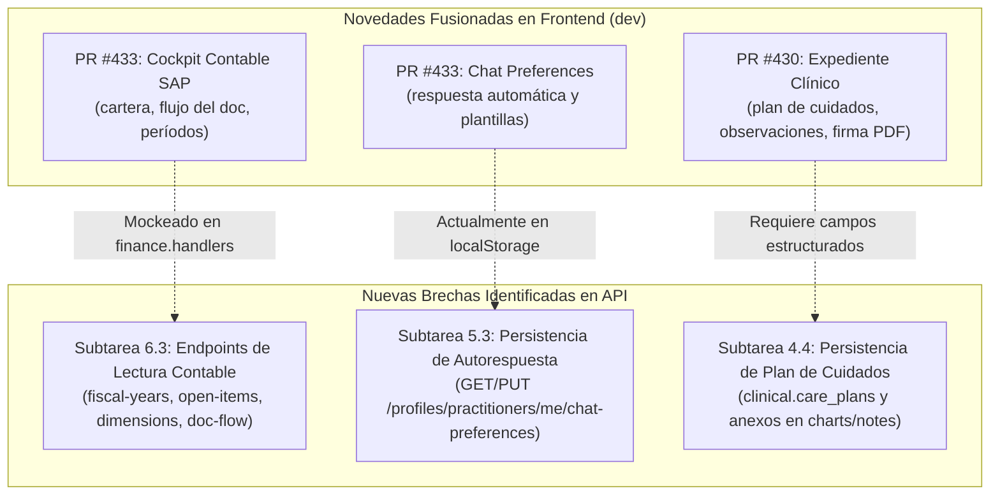

# 🚀 INFORME DE ACTUALIZACIÓN DE AUDITORÍA Y ROADMAP TRAS PULL DE `dev`
### Mantra Core Technologies — Sincronización Integral Backend y Frontend
**Fecha de corte:** 11 de Septiembre de 2026, 23:30 (-04:00)  
**Ramas sincronizadas:** `origin/dev` en `mantra-core-health-api` y `mantra-core-health`  
**Estado de Verificación QA:** verificación **dirigida**: 2 suites unitarias, 62/62 pruebas en verde tras el merge. **No** es la suite completa de la API ni cubre integración o runtime.

> [!NOTE]
> **Snapshot histórico (11/09/2026) — MCH-033.** Este informe es una foto de esa fecha y no se actualiza. Su titular decía «100% Tests Unitarios
> Pasando», pero lo que se corrió fueron las dos suites listadas en §1, punto 2: el denominador son esas 62
> pruebas, no la API. El inventario vigente (módulos, entidades, endpoints declarados y registrados,
> con commit y método) está en [`ALOVIDA-COBERTURA.md`](ALOVIDA-COBERTURA.md) y se regenera con
> `node tools/alovida/coverage-report.mjs`.

---

## 📌 1. Resumen Ejecutivo del Estado del Proyecto

Se ha realizado la sincronización completa (`git pull origin dev`) en ambos repositorios. Esta actualización refleja una **aceleración masiva y exitosa en el equipo**:

1. **Subtareas Críticas ya Fusionadas y en `dev`:**
   - **Subtarea 1.6 (Ender):** ✅ **CERRADA Y MERGEADA** (Backend PR #382 / Frontend PR #432). Ingesta de universidad, lugar de estudio y títulos académicos múltiples en el alta médica (`profiles.professional_credentials`).
   - **Subtarea 3.3 (Itzan):** ✅ **CERRADA Y MERGEADA** (Backend PR #384). Turno de mostrador atómico (`POST /scheduling/walk-in`), alta de paciente sin cuenta de portal y apertura inmediata de encuentro clínico.
   - **Subtarea 1.4 (Marcelo):** ✅ **CERRADA Y MERGEADA** (Backend PR #375 / Frontend PR #390). Departamento de emisión de documento obligatorio.
   - **Subtarea 1.5 (Marcelo):** ✅ **CERRADA Y MERGEADA** (Backend PR #376 / Frontend PR #404). Alta de organizaciones para centros de imagenología y diagnóstico.
   - **Suite Completa de Aseguradoras (Marcelo):** ✅ **CERRADA Y MERGEADA** (Backend PRs #379, #380, #381, #383 / Frontend PRs #428, #429, #431, #434). Tipo societario internacional, carga de documentos legales PDF con dropzone, casa matriz georreferenciada en mapa y directorio de representante legal + 3 C-Levels.

2. **Verificación QA en Vivo:**
   - Se ejecutó `yarn test` contra las nuevas suites integradas en backend:
     - `src/modules/iam/services/iam-practitioner-self-registration.service.spec.ts` ➡️ **PASS**
     - `src/modules/scheduling/services/scheduling-walk-in.service.spec.ts` ➡️ **PASS**
     - **Resultado:** 2 suites pasadas, 62 pruebas unitarias en verde (0 fallos).

---

## 🔍 2. Nuevos Hallazgos Técnicos en `dev` y Brechas Detectadas

Al inspeccionar los últimos commits fusionados en Frontend (específicamente los PRs **#430** y **#433**), se identifican **3 nuevos componentes de negocio** que requieren soporte backend formal:

### Detalle de los nuevos frentes:

### A. Cockpit Contable y Financiero SAP-like (PR #433)
- **Código en Front:** `src/app/features/accounting/cockpit/cockpit.ts`.
- **Diagnóstico:** La contabilidad cuenta con 42 tablas y escrituras transaccionales (cerrar período, compensar, postear asiento, revertir), pero el frontend actualmente debe responder las lecturas mediante un simulador local (`finance.handlers.ts`).
- **Brecha:** Se requieren 4 endpoints de lectura calculada para alimentar el dashboard contable sin delegar aritmética financiera al cliente:
  1. `GET /accounting/fiscal-years`: Ejercicio y períodos fiscales activos/cerrados.
  2. `GET /accounting/open-items`: Partidas abiertas por cobrar/pagar y días de vencimiento.
  3. `GET /accounting/dimensions`: Centros de costo y objetos de controlling.
  4. `GET /accounting/document-flow`: Trazabilidad y máquina de estados del asiento (`DRAFT` ➔ `AUTO_CLASSIFIED` ➔ `PENDING_REVIEW` ➔ `APPROVED` ➔ `POSTED`).

### B. Preferencias de Chat y Respuesta Automática (PR #433)
- **Código en Front:** `src/app/features/settings/chat-preferences/chat-preferences.ts` y `chat-auto-reply.ts`.
- **Diagnóstico:** Se incorporó el asistente de respuesta automática (minutos de inactividad, texto configurable, control de descansos entre avisos y horario de atención médica). El propio código fuente del frontend declara:
  > *«Vive en este navegador —no hay dónde guardarla en el modelo, ver ChatAutoReply—, así que prometer un contestador que funciona con la pestaña cerrada sería mentir.»*
- **Brecha:** Para que la respuesta automática funcione en background (incluso si el médico cierra la pestaña) o se sincronice entre dispositivos (móvil y web), el backend debe exponer la persistencia de preferencias de mensajería del profesional.

### C. Expediente Clínico Enriquecido con Plan de Cuidados y Firma PDF (PR #430)
- **Código en Front:** `src/app/features/progress-notes/` y `src/app/core/utils/clinical-pdf/firma-de-la-sesion.ts`.
- **Diagnóstico:** El expediente ahora consolida observaciones clínicas, plan de cuidados terapéuticos estructurado y firma criptográfica de la sesión en PDF.
- **Brecha:** El endpoint de notas de evolución (`POST /charts/notes` y `GET /charts/notes`) debe admitir el payload del plan de cuidados y referenciar el PDF firmado generado en `common.files`.

---

## 📋 3. Catálogo de Nuevas Tareas Incorporadas al Roadmap

| Hito | Subtarea | Título / Requerimiento Técnico | Módulo API | Complejidad | Asignado Sugerido |
|:---:|:---:|---|:---:|:---:|:---:|
| **Hito 4** | **4.4** | **🆕 Plan de Cuidados, Observaciones y Firma en Expediente (PR #430)** Exponer campos estructurados de `carePlan`, observaciones clínicas y referencia al PDF de sesión firmado en `charts/notes`. | `charts` / `clinical` | Media | **Itzan** |
| **Hito 5** | **5.3** | **🆕 Persistencia de Preferencias de Chat y Respuesta Automática (PR #433)** `GET/PUT /profiles/practitioners/me/chat-preferences` para sincronizar autorespuesta, horarios de atención y descansos entre dispositivos. | `profiles` / `messaging` | Baja | **Ender** |
| **Hito 6** | **6.3** | **🆕 Endpoints de Lectura para Cockpit Contable SAP (PR #433)** `GET /accounting/fiscal-years`, `open-items`, `dimensions` y `document-flow` para conectar el cockpit contable sin depender de mocks. | `accounting` | Alta | **Itzan** |

---

## 📊 4. Matriz Integral Actualizada del Roadmap (Post-Merge `dev`)

| Hito | Subtarea | Nombre / Descripción | Estado en `dev` | Referencia de Fusión / Artefacto |
|:---:|:---:|---|:---:|---|
| **Hito 1** | **1.1** | Consultorio Propio en Alta (`ownSite`, P20) | 🟢 **Prompt Listo** | `PROMPT_SUBTAREA_1_1` |
| **Hito 1** | **1.2** | Domicilio Personal y Coordenadas GPS (P19) | 🟢 **Prompt Listo** | `PROMPT_SUBTAREA_1_2_DOMICILIO_MEDICO.md` |
| **Hito 1** | **1.3** | Ocupación y Empleador con Texto Libre (PR #392) | 🟢 **Prompt Listo** | `PROMPT_SUBTAREA_1_3_OCUPACION_EMPLEADOR.md` |
| **Hito 1** | **1.4** | Departamento de Emisión Obligatorio (PR #390) | 🟣 **FUSIONADO EN DEV** | PR #375 / Commit `291cfb79` |
| **Hito 1** | **1.5** | Alta de Centros de Imagenología (PR #404) | 🟣 **FUSIONADO EN DEV** | PR #376 / Commit `70dd7448` |
| **Hito 1** | **1.6** | **Universidad, Lugar de Estudio y Credenciales** | 🟣 **FUSIONADO EN DEV** | **PR #382 (Ender) / PR #432** |
| **Aseguradora** | **1.1-1.4** | **Suite Completa Alta de Aseguradora (PRs #428-#434)** | 🟣 **FUSIONADO EN DEV** | **PR #379, #380, #381, #383 (Marcelo)** |
| **Hito 2** | **2.1** | Sedes de Atención en Ficha Pública (`/p/:slug`, P16) | ⚪ Asignado a Ender | Rama `ender/feat-public-profile-practice-locations` |
| **Hito 2** | **2.2** | Foto de Perfil en Edición Profesional (P17) | ⚪ Asignado a Ender | Rama `ender/feat-practitioner-photo-update` |
| **Hito 2** | **2.3** | Filtro Territorial en Dos Pasos (Depto -> Municipio) | ⚪ Asignado a Ender | Rama `ender/feat-territorial-filter-two-step` |
| **Hito 3** | **3.1** | Retiro de Plantillas y Liberación Segura (`P15`) | ⚪ Asignado a Itzan | Rama `itzan/feat-scheduling-template-delete-conflict` |
| **Hito 3** | **3.2** | Creación Atómica de Citas Clínicas (`P13`) | ⚪ Asignado a Itzan | Rama `itzan/feat-scheduling-atomic-booking` |
| **Hito 3** | **3.3** | **Turnos de Mostrador y Atención Directa (`WALK_IN`)** | 🟣 **FUSIONADO EN DEV** | **PR #384 (Itzan) / PR #400** |
| **Hito 4** | **4.1** | Lectura de Colección de Notas Clínicas (P18) | ⚪ Asignado a Itzan | Rama `itzan/feat-clinical-notes-cursor-pagination` |
| **Hito 4** | **4.2/4.3** | Enlace Cita-Encuentro y Exposición `encounterId` | ⚪ Asignado a Itzan | Rama `itzan/feat-clinical-encounter-appointment-link` |
| **Hito 4** | **4.4** | **🆕 Plan de Cuidados y Firma en Expediente (PR #430)** | ⚪ Asignado a Itzan | Rama `itzan/feat-clinical-care-plan-progress-notes` |
| **Hito 5** | **5.1** | Descarga Segura en Chat y Evidencias FT-32 (P0) | ⚪ Asignado a Ender | Rama `ender/feat-ft32-chat-attachment-download-auth` |
| **Hito 5** | **5.2** | Metadatos y Previsualización de Adjuntos (P5) | ⚪ Asignado a Ender | Rama `ender/feat-attachment-metadata-previews` |
| **Hito 5** | **5.3** | **🆕 Preferencias de Chat y Autorespuesta (PR #433)** | ⚪ Asignado a Ender | Rama `ender/feat-chat-auto-reply-preferences` |
| **Hito 6** | **6.1/6.2** | Seguros de Salud y Simulador de Cotizaciones | ⚪ Asignado a Itzan | Rama `itzan/feat-insurance-quotation-simulator` |
| **Hito 6** | **6.3** | **🆕 Endpoints de Lectura para Cockpit SAP (PR #433)** | ⚪ Asignado a Itzan | Rama `itzan/feat-accounting-cockpit-read-models` |
| **Hito 7** | **7.1** | Prevención ACID de Homónimos | ⚪ Asignado a Itzan | Rama `itzan/feat-patient-homonym-prevention-acid` |
| **Hito 7** | **7.2** | Retención y Purga de Evidencias de Identidad | ⚪ Asignado a Ender | Rama `ender/feat-identity-evidence-purge-policy` |

---

## 🎯 5. Siguientes Pasos Inmediatos para el Equipo

1. **Para Ender:**
   - Tras haber completado con éxito la **Subtarea 1.6**, su siguiente paso prioritario es la **Subtarea 2.1: Exposición de Sedes en Ficha Pública (`/p/:slug`, P16)** en `ender/feat-public-profile-practice-locations` o la nueva **Subtarea 5.3: Persistencia de Preferencias de Chat**.
2. **Para Itzan:**
   - Tras haber completado y cerrado con éxito la **Subtarea 3.3 (Turnos `WALK_IN`)**, su siguiente paso prioritario es el bloque de agendas: **Subtarea 3.1 / 3.2 (Retiro seguro de plantillas con 409 y reserva atómica de citas)** en `itzan/feat-scheduling-atomic-booking`.
3. **Control de Calidad Continuo:**
   - Mantener siempre la ejecución de `yarn test` antes de cada push.
   - Continuar asignando como revisores obligatorios a `jsaldias39` y `PabloArauzCaballero`.
