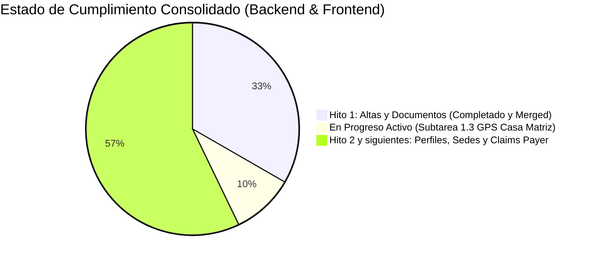
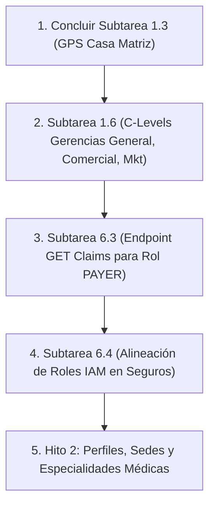

# INFORME DE AVANCE GLOBAL Y PLAN DE ACCIÓN DE INTEGRACIÓN (ACTUALIZADO)
## AloVida / Mantra Core Health: Frontend (`mockup`) vs Backend (`mantra-core-health-api`)

*Fecha de Emisión:* 11 de Septiembre de 2026 (Actualización Post-Revisión Enlace en Vivo)  
*Enlace Evaluado en Vivo:* `https://pablo-h310.taila8f993.ts.net:8443` (Resolución de host: `199.38.181.54:8443`)  
*Estado Frontend:* `origin/mockup` (Consolidada con PR #430, #429, #428, #427, #426, #425, #405, #404, #402, #401, #400)  
*Estado Backend:* `dev` en `mantra-core-health-api` (Consolidada con PR #380, #379, #378, #377, #376, #375, #374, #373, #372, #371)

---

## 1. Resumen Ejecutivo de Avance Real

Tras la nueva revisión pericial sobre el despliegue en vivo en `https://pablo-h310.taila8f993.ts.net:8443` y la auditoría cruzada de los repositorios Git, se constata que **el Hito 1 de Altas y Registros Básicos está prácticamente concluido en producción y staging**:

### Hitos Clave Alcanzados:
1. **Asistente de Registro de Aseguradora en 7 Pasos Operativo:** El enlace en vivo ha pasado de 3 pasos a un flujo estructurado de 7 pasos, validado con éxito de extremo a extremo mediante Playwright.
2. **Sincronización Total de Tipos Societarios:** Backend (PR #379) y Frontend (PR #428) operan coordinadamente con el catálogo de 8 figuras societarias bolivianas (`VS_BO_ORGANIZATION_LEGAL_TYPE`).
3. **Carga de Documentación Legal PDF Operativa:** Backend (PR #380) y Frontend (PR #429) disponen de zonas de arrastre (`DropzonePdf`) para Constitución, NIT, SEPREC, Licencia y SEDES, con subida reactiva y guardado de `fileId`.
4. **Motor de Inyección de Fallos para QA:** La maqueta en vivo cuenta con `sessionStorage['mock:fallos']` (Commit `9084bf5e`), lo que permite a QA probar caídas de red y respuestas 403/404/500 sin alterar el código fuente.

---

## 2. Lo que se Tiene (Matriz de PRs Aceptados y Frentes Cerrados)

### A. Pull Requests Aceptados en Backend (`mantra-core-health-api`)

| PR | Fecha | Rama / Tarea | Alcance Técnico | Estado |
|:---:|:---:|---|---|:---:|
| **#380** | 11/09/2026 | `marcelo/feat-documentos-legales-registro-aseguradora` | Subtarea 1.2 Aseguradora: `upload-registration-document`, persistencia en `directory.tenant_affiliation_documents`. | 🟢 MERGED |
| **#379** | 10/09/2026 | `marcelo/feat-diccionario-tipos-societarios` | Subtarea 1.1 Aseguradora: Catálogo `common.legal_entity_types` (SRL, S.A., etc.). | 🟢 MERGED |
| **#378** | 10/09/2026 | `claude/borrar-punto-del-mapa` | Limpieza de coordenadas en selector de mapa. | 🟢 MERGED |
| **#377** | 10/09/2026 | `chore/gitignore-paquete-datos-generado` | Mantenimiento de artefactos generados. | 🟢 MERGED |
| **#376** | 10/09/2026 | `marcelo/feat-alta-centro-imagenologia` | Subtarea 1.5: Alta de centros de diagnóstico e imagenología (`DIAGNOSTIC_CENTER`). | 🟢 MERGED |
| **#375** | 10/09/2026 | `marcelo/feat-departamento-emision-obligatorio` | Subtarea 1.4: Departamento emisor obligatorio (`VS_BO_DEPARTMENT`) en cédula. | 🟢 MERGED |
| **#374** | 09/09/2026 | `marcelo/feat-ocupacion-empleador-texto-libre` | Subtarea 1.3: Ocupación y empleador con texto libre («Otra»). | 🟢 MERGED |
| **#373** | 09/09/2026 | `feat/iam-practitioner-home-address` | Subtarea 1.2 Médico: Domicilio particular (`homeAddressLines`) y GPS. | 🟢 MERGED |
| **#372** | 09/09/2026 | `feat/iam-register-practitioner-own-site` | Subtarea 1.1 Médico: Bandera `ownSite` para consultorio propio. | 🟢 MERGED |
| **#371** | 09/09/2026 | `claude/lista-de-espera-cupo-liberado` | Lógica de cupos liberados en listas de espera. | 🟢 MERGED |

### B. Pull Requests Aceptados en Frontend (`mantra-core-health`)

| PR | Fecha | Rama / Tarea | Alcance Técnico | Estado |
|:---:|:---:|---|---|:---:|
| **#430** | 11/09/2026 | `mockup` | Unificación de `dev` en `mockup` y simulador de fallos de red (`mock:fallos`). | 🟢 MERGED |
| **#429** | 11/09/2026 | `marcelo/feat-dropzone-documentos-legales` | Subtarea 1.2 Aseguradora: Componente `DropzonePdf` y 5 zonas de carga en 7 pasos. | 🟢 MERGED |
| **#428** | 10/09/2026 | `marcelo/feat-diccionario-societario-multilingue` | Subtarea 1.1 Aseguradora: Selector con 8 figuras societarias y filtro de país. | 🟢 MERGED |
| **#427** | 10/09/2026 | `justin/ficha-medico-tarjeta-del-paciente` | Ficha médica: tarjeta unificada del paciente. | 🟢 MERGED |
| **#426** | 10/09/2026 | `justin/ficha-medico-departamento-del-ci` | Despliegue de departamento emisor en CI de médico. | 🟢 MERGED |
| **#425** | 10/09/2026 | `justin/perfil-medico-nombres-y-especialidades` | Desglose de nombres completos y especialidades. | 🟢 MERGED |
| **#405** | 10/09/2026 | Estabilización Mockup | 5,592 pruebas unitarias en verde y guardrails de tokens. | 🟢 MERGED |
| **#404** | 10/09/2026 | `feat-alta-centro-imagenologia` | Interfaz de alta para centros de imagenología. | 🟢 MERGED |

---

## 3. Lo que se Está Haciendo (Frentes Activos en Desarrollo)

Actualmente hay dos ramas gemelas en desarrollo activo para la **Subtarea 1.3 (Ubicación GPS de Casa Matriz de Aseguradora)**:
1. **Backend (`mantra-core-health-api`):** Rama `marcelo/feat-casa-matriz-georreferenciada`.
   - Modificaciones en `tenant-type-profile.service.ts`, `directory-read.service.ts` y DTOs para soportar `headquartersLatitude` y `headquartersLongitude`.
2. **Frontend (`mantra-core-health`):** Rama `marcelo/feat-mapa-casa-matriz-aseguradora`.
   - Incorporación del selector de mapa Leaflet/Google Maps en el Paso 3 del alta de aseguradora (`/auth/register/organization`).

---

## 4. Lo que se Debe Hacer (Próximos Pasos Priorizados)

### Plan de Acción Detallado:

#### Acción 1: Concluir y Fusionar Subtarea 1.3 (GPS Casa Matriz)
- **Backend:** Ejecutar pruebas contra Neon en `tenant-type-profile.service.spec.ts` y abrir PR de `marcelo/feat-casa-matriz-georreferenciada` a `dev`.
- **Frontend:** Abrir PR de `marcelo/feat-mapa-casa-matriz-aseguradora` a `dev` con revisores `jsaldias39,PabloArauzCaballero`.
- **Despliegue:** Re-compilar y refrescar contenedor en `pablo-h310.taila8f993.ts.net:8443`.

#### Acción 2: Subtarea 1.6 - Directorio de C-Levels de la Aseguradora (Registro de Procesos L. 488-511)
- **Requerimiento:** El cliente exige registrar en el alta:
  - Gerente General (Nombre, Celular, Correo).
  - Gerente Comercial (Nombre, Celular, Correo).
  - Gerente de Marketing (Nombre, Celular, Correo).
- **Alcance Backend:** Agregar tabla o campos JSON en `organizations` o `tenant_type_profiles`.
- **Alcance Frontend:** Añadir la sección en el Paso 6 del asistente de alta.

#### Acción 3: Subtarea 6.3 - Endpoint de Reclamos para Rol Payer (TAREA-16 Simétrica)
- **Diagnóstico:** `ClaimsReadController` actualmente solo lista los reclamos emitidos por prestadores (`billing_provider_entity_id`).
- **Desarrollo:** Crear `GET /insurance/payer/claims` y `GET /insurance/payer/claims/:id` para que la aseguradora liste y audite los reclamos recibidos.

#### Acción 4: Subtarea 6.4 - Estandarización de Roles IAM en Módulo Insurance
- **Diagnóstico:** `ClaimsController` exige `@Roles('BILLING', 'FINANCE')`, mientras que la lectura exige `@Roles('BILLING_OPERATOR', 'SECURITY_ADMIN')`.
- **Desarrollo:** Alinear los roles del módulo a `BILLING_OPERATOR`, `INSURANCE_AUDITOR` y `SECURITY_ADMIN`.
