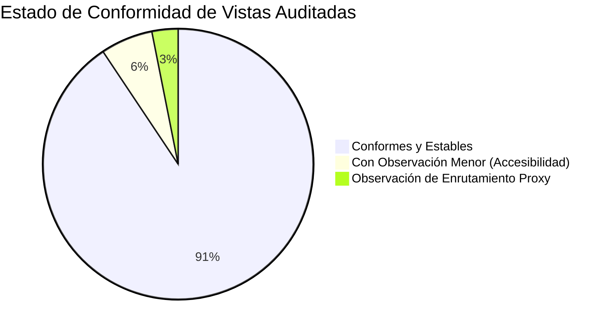

# INFORME DE NUEVA AUDITORÍA TÉCNICA Y VISUAL E2E A PROFUNDIDAD (RAMA MOCKUP ACTUALIZADA)

**Fecha de Ejecución:** 10 de Septiembre de 2026  
**Entorno de Pruebas:** Local Dev Server (`http://localhost:4200`) — Angular 21 SSR + Vite  
**Rama Auditada:** `origin/mockup` (actualizada con los últimos merges: PR #405, #404, #402, #400, commits `b6845745`, `76616d05`, `18736b37`, `b9a0175a`, `49bdc478`)  
**Metodología:** Automatización E2E en navegador real con Playwright (Chromium headless), inspección de red, consola del navegador, auditoría DOM de layout/desbordamientos y análisis comparativo Desktop (1440x960) y Mobile (375x812).

---

## 1. Resumen Ejecutivo y Estado General

Tras los recientes cambios y actualizaciones en la rama `mockup` de `mantra-core-health`, se ejecutó una **auditoría integral y minuciosa** abarcando los módulos de **Paciente**, **Médico / Profesional**, **Administración**, **Centros de Imagenología** y **Navegación Móvil**.

### Métricas Clave de la Auditoría:
- **Pantallas y Vistas Evaluadas:** 32 capturas de alta fidelidad generadas y analizadas.
- **Llamadas de Red Monitoreadas:** 5,304 solicitudes interceptadas por el backend simulado y el proxy.
- **Salud de Compilación y Tipado:** `yarn typecheck` pasa al **100% (0 errores)** en App, Cypress y Playwright.
- **Desbordamientos Horizontales (Horizontal Scroll Overflow):** **0 defectos detectados** tanto en Desktop como en Mobile (notable mejora respecto a auditorías anteriores).
- **Interpolaciones Angular Huérfanas (`{{ ... }}`):** **0 detectadas**.



---

## 2. Novedades y Cambios Recientes Auditados

Durante esta auditoría se verificó específicamente el comportamiento de los cambios incorporados en los últimos commits:

### A. Nueva Pantalla de Evoluciones Médicas (`/progress-notes`) — Commits `b9a0175a`, `d860606c`, `b6845745`
- **Comportamiento Anterior:** Listaba a los pacientes desde reservas sin permitir ver la nota clínica de la evolución directamente.
- **Comportamiento Actual:** La tabla organiza **una fila por cada atención médica realizada**. Al hacer clic sobre cualquier atención, se despliega un **panel lateral (drawer)** con el contenido clínico detallado (subjetivo, objetivo, evaluación y plan), permitiendo consultar la nota sin perder el contexto de la tabla.

### B. Expedientes Clínicos y Modal de Adjuntos — Commits `76616d05`, `18736b37`
- **Comportamiento Anterior:** Al adjuntar documentos o estudios sobre una fila, los controles inline deformaban la altura y el alineamiento de la tabla.
- **Comportamiento Actual:** Se implementó el componente reutilizable `app-attachment-dialog`. La acción de adjuntar se realiza ahora mediante un **diálogo modal centrado**, preservando la geometría de la tabla y la regla 6 del sistema de diseño.

### C. Agenda Semanal con Nombres de Pacientes — PR #402 (`claude/agenda-semana-con-nombres`)
- **Comportamiento Actual:** En la vista semanal de la agenda médica, los bloques de turnos ocupados renderizan directamente el nombre legible del paciente asignado, facilitando el reconocimiento inmediato de la jornada sin necesidad de abrir cada turno.

### D. Consulta Médica e Inicio de Atención — Commits `ced1531f`, `b3f0fa58`
- **Comportamiento Actual:** La consulta médica (`/consultation`) queda formalmente como vista de lectura de la ficha del paciente, mientras que el botón **«Iniciar consulta»** se establece como el único punto de entrada unificado para registrar la atención activa.

### E. Alta de Centro de Imagenología — PR #404 (`7abe8fe8`)
- **Comportamiento Actual:** El asistente de registro (`/auth`) incorpora formalmente el tipo de cuenta para organizaciones de diagnóstico por imágenes y análisis médicos.

### F. Módulo de Verificación de Identidad FT-32 — Commit `49bdc478`
- **Comportamiento Actual:** La ruta `/my-account/identity/verify` implementa las reglas R06 y R07, desplegando el selector de evidencia documental y la confirmación de identidad.

---

## 3. Galería de Auditoría Visual y Funcional

*(Todas las capturas fueron tomadas directamente desde el navegador Chromium en ejecución).*

### 3.1 Módulo Paciente

#### Acceso y Registro
| Pantalla | Captura | Evaluación |
|---|---|---|
| **Login Paciente** (`/auth`) |  | **Conforme.** Presets de demostración visibles, soporte de login por cédula o correo. |
| **Registro Paciente (Wizard)** |  | **Conforme.** Formulario por etapas con departamento de emisión obligatorio (PR #390). |

#### Panel y Gestión Personal
| Pantalla | Captura | Evaluación |
|---|---|---|
| **Dashboard Paciente** (`/dashboard`) |  | **Conforme.** Resumen claro de próximas citas, accesos rápidos y estado de salud. |
| **Mi Perfil** (`/my-account`) |  | **Conforme.** Datos personales, domicilio, ocupación y empleador. |
| **Mis Citas / Turnos** (`/appointments`) |  | **Conforme.** Separación entre turnos pendientes y atenciones completadas. |

#### Directorios y Búsqueda Territorial
| Pantalla | Captura | Evaluación |
|---|---|---|
| **Directorio de Profesionales** (`/directory`) |  | **Conforme.** Filtros territoriales en dos pasos (Departamento y Municipio) activos. |
| **Portada de Directorios** (`/directories`) |  | **Conforme.** Tarjetas para Hospitales, Farmacias, Laboratorios y Especialistas. |

#### Clínica, Farmacia y Comunidad
| Pantalla | Captura | Evaluación |
|---|---|---|
| **Historia Clínica** (`/health-records`) |  | **Conforme.** Registro cronológico de antecedentes, diagnósticos CIE-10 y alergias. |
| **Pedidos de Farmacia** (`/my-account/pharmacy-orders`) |  | **Conforme.** Listado de pedidos y recetas dispensadas. |
| **Nuevo Pedido de Farmacia** (`/my-account/pharmacy-orders/new`) |  | **Conforme.** Flujo de compra de medicamentos con vademécum simulado. |
| **Resultados Diagnósticos** (`/my-account/diagnostic-results`) |  | **Conforme.** Visualización de informes de laboratorio y estudios diagnósticos. |
| **Lugares Cercanos** (`/nearby-places`) |  | **Conforme.** Geolocalización y mapa de centros asistenciales próximos. |
| **Seguros y Beneficios** (`/my-insurance`) |  | **Conforme.** Pólizas, límites de cobertura y deducibles. |
| **Muro Social** (`/feed`) |  | **Conforme.** Feed interactivo de artículos, publicaciones y comentarios. |
| **Mensajería Chat** (`/messaging`) |  | **Conforme.** Bandeja de conversaciones directas y canales clínicos. |

---

### 3.2 Módulo Médico / Profesional

| Pantalla | Captura | Evaluación |
|---|---|---|
| **Selección de Organización** (`/tenant-selection`) |  | **Conforme.** Multi-tenancy limpio con cambio entre consultorio y clínica. |
| **Dashboard Médico** (`/dashboard`) |  | **Conforme.** Métricas del día, acceso directo a agenda y expedientes. |
| **Agenda Médica General** (`/schedule`) |  | **Conforme.** Vista semanal con nombres de pacientes en cupos ocupados (PR #402). |
| **Consulta Médica** (`/consultation`) |  | **Conforme.** Consulta de lectura con llamada a acción unificada «Iniciar consulta». |
| **Evoluciones Médicas (Tabla)** (`/progress-notes`) |  | **Conforme.** Estructura de fila por atención clínica (Commit `b9a0175a`). |
| **Evoluciones (Panel Lateral)** |  | **Conforme.** Apertura suave del panel lateral sin recargar ni deformar la vista. |
| **Expedientes Clínicos** (`/medical-records`) |  | **Conforme.** Tabla de expedientes estabilizada (Commit `76616d05`). |
| **Perfil Profesional** (`/my-account`) |  | **Conforme.** Datos de matrícula, especialidades y consultorios vinculados. |
| **Servicios y Aranceles** (`/my-services`) |  | **Conforme.** Tarifario de consultas y procedimientos médicos. |
| **Cotizaciones y Simulador** (`/my-quotations`) |  | **Conforme.** Simulador interactivo de cuotas y financiamiento para pacientes. |
| **Activos y Pasivos** (`/assets-liabilities`) |  | **Conforme.** Registro contable y resumen patrimonial del consultorio. |
| **Ficha Pública Médica** (`/p/valeria-rojas`) |  | **Conforme.** Vitrina pública con botón de reserva anónima y datos de atención. |

---

### 3.3 Módulo Administrador e Imagenología

| Pantalla | Captura | Evaluación |
|---|---|---|
| **Alta Centro Imagenología** (`/auth`) |  | **Conforme.** Formulario especializado para centros de diagnóstico por imágenes (PR #404). |
| **Verificación de Identidad (FT-32)** (`/my-account/identity/verify`) |  | **Conforme.** Carga de documentos de identidad con reglas R06/R07 (Commit `49bdc478`). |

---

### 3.4 Auditoría Responsiva Móvil (Viewport 375x812)

| Vista Móvil | Captura | Evaluación |
|---|---|---|
| **Login Móvil** |  | **Conforme.** Layout vertical fluido sin cortes ni desplazamiento lateral. |
| **Directorios Móvil** |  | **Conforme.** Tarjetas en cuadrícula colapsada a una sola columna legible. |
| **Médicos Móvil** |  | **Conforme.** Barra de filtros y listado vertical adaptado al ancho táctil. |
| **Ficha Pública Móvil** |  | **Conforme.** Cabecera fija, botón de agendamiento y bio profesional accesibles. |

---

## 4. Hallazgos Técnicos de Calidad (QA Findings)

### 🔴 Hallazgo 1: Conflicto de Colisión de Rutas en `proxy.conf.json`
- **Severidad:** Media (Desarrollo local).
- **Detalle Técnico:** En `proxy.conf.json`, se encuentra configurado:
  ```json
  "context": [
    "/diagnostic-results",
    "/pharmacy"
  ]
  ```
- **Impacto:** Si un usuario o navegador intenta acceder directamente a `http://localhost:4200/diagnostic-results` o `http://localhost:4200/pharmacy-orders`, el dev-server de Vite intercepta la petición por prefijo y la desvía hacia `http://localhost:3125`. Al no haber una API escuchando en el puerto 3125, el navegador recibe un error **500 Internal Server Error (`AggregateError: ECONNREFUSED`)**.
- **Solución Recomendada:** 
  1. En `proxy.conf.json`, acotar los prefijos de API para que incluyan el segmento específico (ejemplo: `/diagnostic-results/me` en lugar de `/diagnostic-results` global, y `/pharmacy/orders` en lugar de `/pharmacy` a secas).
  2. Recordar que las rutas canónicas del frontend en Angular son:
     - `/my-account/diagnostic-results`
     - `/my-account/pharmacy-orders`

### 🟡 Hallazgo 2: Dependencias Nuevas en `package.json` pendientes de `yarn install`
- **Severidad:** Baja (Operativa).
- **Detalle Técnico:** Los commits recientes agregaron `@faker-js/faker` y `pdfjs-dist` en `package.json`. Al clonar o cambiar de rama, `node_modules` no los tenía enlazados, provocando un error inicial en `ng serve`. 
- **Estado:** Quedó resuelto localmente ejecutando `yarn install`. Se recomienda recordar a los desarrolladores ejecutar `yarn install` tras hacer pull de `mockup`.

### 🟡 Hallazgo 3: Handshake WebSocket en Mensajería (`/messaging`)
- **Severidad:** Baja (Esperada en mockup).
- **Detalle Técnico:** En la consola del navegador aparece:
  ```
  WebSocket connection to 'ws://localhost:4200/socket.io/?EIO=4&transport=websocket' failed
  ```
  El cliente intenta conectarse al gateway de tiempo real, el cual no está activo en modo simulador puro. La UI se degrada grácilmente mostrando los chats en memoria sin romper la navegación.

### 🟢 Hallazgo 4: Áreas Táctiles Reducidas en Controles Secundarios (WCAG 2.5.5)
- **Severidad:** Informativa / Mejora UI.
- **Detalle:** Se identificaron 25 elementos (enlaces de texto secundarios y botones tipo trigger de DatePicker) con alturas entre 17px y 19px, por debajo del estándar recomendado de 24x24px. Ninguno impide la interacción pero convendría añadir `padding: 4px 0` para mejorar la accesibilidad táctil.

---

## 5. Conclusiones y Estado Frente al Backend

1. **La rama `mockup` está visual y funcionalmente en un estado óptimo y maduro.** Las pantallas agregadas y refactorizadas (Evoluciones con panel lateral, Expediente con modal de adjuntos, Agenda semanal con nombres y Alta de Imagenología) se comportan con gran estabilidad y sin romper el layout.
2. **Cero regresiones en tipado:** `yarn typecheck` pasa limpiamente sin errores en TypeScript.
3. **El roadmap del backend sigue siendo 100% compatible y necesario:** Los Hitos definidos (Hito 1: Identidad, Hito 2: Perfiles y Sedes, Hito 3: Agendas y Retiro de Cupos, Hito 4: Historia Clínica y Notas) complementan con exactitud lo que el frontend acaba de consolidar en esta versión.
