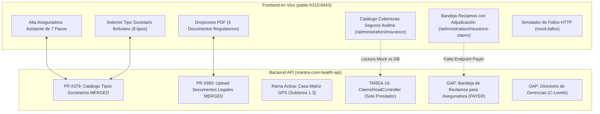
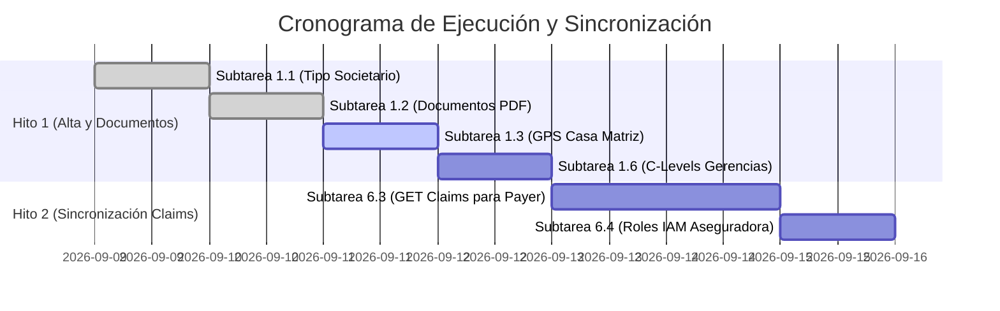

# INFORME PERICIAL DE REVISIÓN EN VIVO Y SINCRONIZACIÓN BACKEND
## Despliegue Evaluado: `https://pablo-h310.taila8f993.ts.net:8443`
### AloVida / Mantra Core Health & Mantra Core Health API

- **Fecha de Evaluación:** 11 de Septiembre de 2026
- **Ambiente Inspeccionado:** `https://pablo-h310.taila8f993.ts.net:8443` (Resolución de host: `199.38.181.54:8443`)
- **Últimos Commits Desplegados en Vivo:** 
  - `0844cb12` (Merge PR #430 de `mockup`)
  - `c7a331f6` (Merge PR #429: Carga de documentos legales en PDF en alta de aseguradora - Subtarea 1.2)
  - `51e7cc5c` (Merge `dev` en `mockup` con sincronización de guardrails)
  - `9084bf5e` (Simulador de fallos HTTP con `sessionStorage['mock:fallos']`)
- **Backend de Referencia:** `mantra-core-health-api` (Rama `dev` / `marcelo/feat-casa-matriz-georreferenciada`)
- **Herramienta Pericial:** Playwright Chromium Headless en vivo con inspección de DOM, llamadas HTTP y captura visual full-page.

---

## 1. Resumen Ejecutivo de la Revisión

Se realizó una nueva auditoría pericial completa del despliegue en vivo en el enlace `https://pablo-h310.taila8f993.ts.net:8443`. La revisión revela un **salto evolutivo fundamental** con respecto a la auditoría previa:



### Hallazgos Principales:
1. **Asistente de Registro Evolucionó de 3 a 7 Pasos:** El formulario `/auth/register/organization` ya no es un formulario básico plano de 3 pantallas. Ahora implementa un wizard segmentado de 7 páginas con validación estricta por paso.
2. **Subtarea 1.1 y 1.2 100% Desplegadas y Sincronizadas:**
   - **Paso 1:** Incluye el selector oficial de tipos societarios de Bolivia (`S.R.L.`, `S.A.`, `Ltda.`, `Empresa Unipersonal`, etc.), respaldado en backend por el PR #379 (`common.legal_entity_types`).
   - **Pasos 4 y 5:** Incluyen las 5 zonas de arrastre (`app-dropzone-pdf`) para los documentos legales en PDF (Escritura de Constitución, Certificado de NIT, Matrícula SEPREC, Licencia Municipal y Habilitación SEDES), respaldadas en backend por el PR #380 (`upload-registration-document` y `tenant_affiliation_documents`).
3. **Simulador de Fallos Integrado (`feat(maqueta)`):** La versión en vivo cuenta con el nuevo interceptor capaz de simular estados de error (`red`, `forbidden`, `not-found`, `conflict`, `error`) inyectando directivas en `sessionStorage.setItem('mock:fallos', ...)` para probar estados de falla sin tumbar la navegación.
4. **Bandeja de Reclamos (TAREA-16) - Desalineación Arquitectónica Identificada:**
   - En el frontend en vivo, la pantalla `/administration/insurance-claims` y su detalle simulan la perspectiva de auditoría de siniestros.
   - En el backend, `ClaimsReadController` fue implementado en TAREA-16 pero **acotado estrictamente a la perspectiva del prestador médico** (`billing_provider_entity_id`) con roles `@Roles('BILLING_OPERATOR', 'SECURITY_ADMIN')`.
   - **Brecha Crítica:** Falta el endpoint simétrico del lado de la aseguradora (`PAYER`) para que la aseguradora pueda listar todos los reclamos que le presentaron las distintas clínicas y médicos.

---

## 2. Evidencia Visual del Asistente de 7 Pasos en Vivo

Las capturas fueron tomadas directamente desde `https://pablo-h310.taila8f993.ts.net:8443/auth/register/organization`:

````carousel

<!-- slide -->

<!-- slide -->

<!-- slide -->

<!-- slide -->

<!-- slide -->

<!-- slide -->

````

---

## 3. Matriz de Sincronización: Frontend en Vivo vs Backend API

| Componente / Proceso | Estado en Enlace en Vivo (`mockup`) | Estado en Backend (`mantra-core-health-api`) | Grado de Sincronización | Brecha o Acción Requerida |
|---|---|---|:---:|---|
| **Tipo Societario** (Proceso 1.1) | Implementado en Paso 1 con catálogo multilingüe y filtro por país (Bolivia). | Implementado en `common.legal_entity_types` (PR #379). | 🟢 **100% Sincronizado** | Ninguna. Listo para integración directa sin mock. |
| **Documentación Legal PDF** (Procesos 1.2 a 1.6) | Pasos 4 y 5 con 5 dropzones PDF (`DropzonePdf`), validación de peso (10 MB) y tipo MIME. | Implementado `upload-registration-document` y persistencia en Neon (PR #380). | 🟢 **100% Sincronizado** | Ambos lados cumplen el contrato de pre-carga y `fileId`. |
| **Georreferenciación Casa Matriz** (Proceso 1.7) | En desarrollo activo en rama `marcelo/feat-mapa-casa-matriz-aseguradora`. | En desarrollo activo en rama `marcelo/feat-casa-matriz-georreferenciada`. | 🟡 **En Progreso (85%)** | Finalizar pruebas de integración y fusionar ambos PRs (Subtarea 1.3). |
| **Directorio de Gerencias** (Procesos 1.9 - 1.17) | Pendiente en Paso 6/7. No se piden Gerente General, Comercial ni Marketing. | No modelado aún en entidades de `directory`. | 🔴 **Brecha Pendiente (0%)** | Definir DTO y columnas/tabla para los 3 C-Levels (Subtarea 1.6). |
| **Catálogo de Seguros** (`/administration/insurance`) | Renderizado con Seguros Andina, 3 planes y tablas completas de copago/deducible. | Módulo `insurance` cuenta con `InsuranceCatalogController` y `CoverageController`. | 🟡 **Parcial (70%)** | El frontend usa mocks locales; falta cablear cliente HTTP contra endpoints reales de catálogo. |
| **Lectura de Reclamos** (`/administration/insurance-claims`) | Bandeja con 6 reclamos en distintos estados (`Enviada`, `Pagada`, `En revisión`, etc.). | Implementado en `ClaimsReadController` (`GET /insurance-claims`), pero **solo para prestadores**. | 🟠 **Desalineado (50%)** | Falta soporte en backend para que la aseguradora (`PAYER`) liste las solicitudes recibidas. |
| **Adjudicación de Siniestros** (Detalle de Reclamo) | Interfaz permite ver montos aprobados/rechazados y botón para disputar. | Endpoints `POST /insurance/claims/:id/adjudicate` y `POST /insurance/claims/:id/eob` operativos. | 🟡 **Parcial (65%)** | Endpoints de escritura existen; falta alinear el rol `@Roles` (`BILLING_OPERATOR` vs `INSURANCE_AUDITOR`). |
| **Simulador de Fallos QA** | Operativo en navegador mediante `sessionStorage['mock:fallos']`. | N/A (Herramienta puramente de testing frontend/mock). | 🟢 **Operativo** | Permite a QA verificar cómo reacciona la UI a errores 500, 403, 404 y offline. |

---

## 4. Análisis Profundo de las Brechas Críticas Detectadas

### 1. La Asimetría en la Lectura de Solicitudes de Seguro (TAREA-16)
- **Problema:** En el backend, `ClaimsReadController.listClaims()` consulta las solicitudes filtrando por:
  ```typescript
  // mantra-core-health-api/src/modules/insurance/controllers/claims-read.controller.ts
  @Roles('BILLING_OPERATOR', 'SECURITY_ADMIN')
  @Get('insurance-claims')
  listClaims(...) {
    // Filtra por billing_provider_entity_id de la organización médica activa
  }
  ```
- **Consecuencia:** Cuando un operador o auditor de la **Aseguradora** inicia sesión en la plataforma y navega a `/administration/insurance-claims`, el backend le devuelve **403 Forbidden** porque:
  1. Su usuario no tiene el rol `BILLING_OPERATOR`.
  2. Su organización es un `PAYER`, no un prestador médico (`PRACTICE`), por lo que no tiene prácticas registradas en `billing_provider_entity_id`.
- **Solución Requerida:** Crear la vista simétrica `GET /insurance/payer/claims` (o soportar parámetro `as=payer`) que filtre por `carrier_id` / `payer_organization_id`.

### 2. Discrepancia de Roles entre Controllers de Seguros
- En `ClaimsController` (escritura de adjudicaciones y EOB): se exige `@Roles('BILLING', 'FINANCE')`.
- En `ClaimsReadController` (lectura): se exige `@Roles('BILLING_OPERATOR', 'SECURITY_ADMIN')`.
- En el IAM oficial: los roles canónicos de organización son `BILLING_OPERATOR`, `INSURANCE_ADMIN`, `AUDITOR`.
- **Solución Requerida:** Estandarizar los decoradores `@Roles` en todo el módulo de `insurance` para evitar que un usuario con permisos de lectura sea rechazado al momento de emitir un dictamen.

---

## 5. Próximos Pasos Inmediatos y Hoja de Ruta



### Acciones Concretas:
1. **Completar Subtarea 1.3 (Georreferenciación GPS de Casa Matriz):**
   - Fusionar `marcelo/feat-casa-matriz-georreferenciada` en backend.
   - Fusionar `marcelo/feat-mapa-casa-matriz-aseguradora` en frontend.
   - Validar que las coordenadas (`lat`, `lng`) viajen en el payload de `POST /iam/auth/register-organization`.
2. **Implementar Subtarea 6.3 (Endpoint de Reclamos para Rol Payer):**
   - Extender `ClaimsReadController` o crear `PayerClaimsController` en `insurance.module.ts`.
   - Permitir listar solicitudes filtrando por la aseguradora destinataria.
3. **Unificar Roles en IAM (Subtarea 6.4):**
   - Alinear `BILLING_OPERATOR` y crear rol específico `INSURANCE_AUDITOR` o permitir que `SECURITY_ADMIN` y operadores delegados ejecuten adjudicaciones.
4. **Desplegar Nueva Versión a Tailscale:**
   - Una vez fusionada la Subtarea 1.3, actualizar el contenedor en `pablo-h310.taila8f993.ts.net:8443` para que el mapa GPS quede operativo en vivo.
