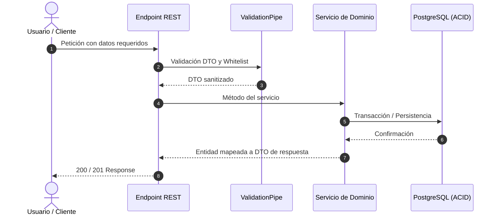

# 📋 PLANTILLA OFICIAL: Prompts de Ejecución Técnica y Tareas (Modo Planificación)
### Mantra Core Technologies — Estándar de Ingeniería y Aseguramiento QA

Esta plantilla define la **estructura canónica y obligatoria** que debe tener todo prompt técnico o especificación de tarea para el desarrollo de funcionalidades (backend o frontend) en el ecosistema Mantra.

---

```markdown
# TASK PROMPT: Subtarea [X.Y] — [Nombre Descriptivo de la Tarea]

> **MODO DE EJECUCIÓN:** Este prompt está diseñado para ejecutarse en **Modo Planificación (Planning Mode)**.
> El desarrollador o agente de IA debe iniciar en fase de investigación sin alterar código fuente, generar un `implementation_plan.md` detallado, esperar la aprobación explícita del usuario, ejecutar los cambios con rigor atómico, verificar la solución mediante pruebas unitarias e integración con garantía QA, y documentar el resultado final en `walkthrough.md`.

---

## 1. Contexto de Negocio y Justificación Técnica

- **Origen del Requerimiento:** [Explicar la necesidad clínica/operativa según el registro de procesos o especificación de producto].
- **Contexto en Frontend (`mantra-core-health`, rama `mockup`):**
  - PR / Commits de referencia: [Ej. PR #XXX (`hash`)].
  - Pantallas / Componentes involucrados: [Rutas, formularios, pasos del wizard].
  - Payload / Datos enviados: [Estructura JSON emitida por la interfaz].
- **Brecha en Backend (`mantra-core-health-api`):**
  - Diagnóstico del código actual: [Por qué falla o qué falta en DTOs, entidades, pipes o servicios].
  - Tablas / Esquemas involucrados: [Esquema PostgreSQL, columnas, restricciones de clave foránea].
- **Distinción Modular y Aislamiento:** [Aclarar el impacto entre módulos, ej. Paciente vs Médico vs Aseguradora para evitar contaminación].

---

## 2. Flujo de Git y Procedimiento de Entrega

Debes ejecutar estrictamente el siguiente procedimiento en la terminal del proyecto:

1. **Preparación y verificación del espacio de trabajo:**
   - Situarse en el repositorio correspondiente (`mantra-core-health-api` o `mantra-core-health`).
   - Confirmar working tree limpio: `git status`.
   - Actualizar rama base `dev`:
     ```bash
     git fetch origin dev
     git checkout dev
     git pull origin dev
     ```

2. **Creación de rama con nomenclatura obligatoria:**
   - **Formato estricto:** `(nombre-del-dev)/(feature-o-fix)-(dato-de-la-tarea)`
   - *Ejemplo:* `marcelo/feat-practitioner-university-credentials`
     ```bash
     git checkout -b <nombre-del-dev>/<tipo>-<nombre-tarea>
     ```

3. **Estrategia de Commits Atómicos y Convencionales:**
   - Commits modulares respetando Conventional Commits (`feat(...)`, `fix(...)`, `test(...)`, `refactor(...)`).

4. **Publicación y Apertura de Pull Request:**
   - Pushear al remoto `origin`:
     ```bash
     git push -u origin <nombre-del-dev>/<tipo>-<nombre-tarea>
     ```
   - Crear Pull Request apuntando a `dev` con revisores asignados:
     ```bash
     gh pr create --base dev --title "<tipo>(<alcance>): <descripción corta>" --body "<resumen técnico detallado>" --reviewer mdavila-2001,jsaldias39,PabloArauzCaballero
     ```

---

## 3. Diagrama de Flujo / Secuencia



---

## 4. Archivos a Modificar / Crear

- `[ACCION]` `src/path/to/dto.ts` — Descripción del cambio en DTO y validaciones.
- `[ACCION]` `src/path/to/service.ts` — Lógica de negocio y persistencia.
- `[ACCION]` `src/path/to/controller.ts` — Exposición HTTP y decoradores Swagger.
- `[ACCION]` `src/path/to/entity.ts` — Mapeo TypeORM y relaciones.
- `[ACCION]` `src/path/to/test.spec.ts` — Suite de pruebas con garantía QA.

---

## 5. Reglas de Implementación y Arquitectura

- **Clean Architecture & NestJS:** Respetar la separación entre capas (Controller -> Service -> Repository).
- **Validación Estricta:** Uso obligatorio de `@IsNotEmpty()`, `@IsUUID()`, `@IsOptional()`, `@Type()`, etc., garantizando compatibilidad con `whitelist: true` y `forbidNonWhitelisted: true`.
- **Transaccionalidad ACID:** Todas las operaciones compuestas deben envolverse en `EntityManager.transaction()` o QueryRunner para garantizar consistencia y rollback en caso de fallo.
- **Integridad Referencial:** Verificar existencia de claves foráneas antes de insertar registros dependientes.
- **Mapeo de Errores HTTP:** Retornar códigos semánticos estándar:
  - `400 Bad Request`: Parámetros faltantes o inválidos.
  - `404 Not Found`: Recursos no existentes.
  - `409 Conflict`: Reglas de negocio violadas o duplicidad.
  - `422 Unprocessable Entity`: Errores de semántica o conceptos de catálogo inválidos.

---

## 6. Criterios de Aceptación (Gherkin)

```gherkin
Scenario: [Nombre del Escenario Exitoso]
  Given [Estado inicial válido del sistema]
  When [El cliente envía la solicitud con datos completos]
  Then [El sistema responde con código HTTP esperado]
  And [Los datos son persistidos correctamente en la base de datos]

Scenario: [Nombre del Escenario de Error / Validación]
  Given [Estado inicial o datos inválidos]
  When [El cliente envía la solicitud con datos omitidos o erróneos]
  Then [El sistema rechaza la petición con código 400/422 y mensaje descriptivo]
```

---

## 7. Definition of Done (DoD)

- [ ] Código fuente implementado respetando convenciones y estándares de Clean Code.
- [ ] DTOs tipados y validados exhaustivamente sin warnings.
- [ ] Base de datos y migraciones sincronizadas (si aplica).
- [ ] Pruebas unitarias (`*.spec.ts`) creadas y ejecutadas con **100% de éxito**.
- [ ] Cobertura de pruebas superior al 90% en la lógica de negocio modificada.
- [ ] Commits atómicos pusheados a la rama del dev.
- [ ] Pull Request abierto hacia `dev` con revisores `mdavila-2001`, `jsaldias39` y `PabloArauzCaballero`.
- [ ] Documento `walkthrough.md` generado con evidencias de pruebas y verificación.

---

## 8. Plan de Aseguramiento y Garantía QA

### A. Pruebas Unitarias Automatizadas
- Ejecutar suite específica con Jest:
  ```bash
  yarn test -- src/modules/<modulo>/<archivo>.spec.ts
  ```
- Probar caminos felices (*happy paths*).
- Probar casos borde (*edge cases*): campos opcionales nulos, arreglos vacíos, strings con espacios en blanco.
- Probar casos de fallo: UUIDs malformados, datos no existentes en catálogo.

### B. Pruebas de Integración y Transaccionalidad
- Verificar que ante un fallo a mitad del proceso se aplique rollback completo sin dejar registros huérfanos.

### C. Verificación Manual y Logs
- Inspección de logs en consola de desarrollo.
- Verificación del contrato OpenAPI / Swagger en `/docs`.
```
