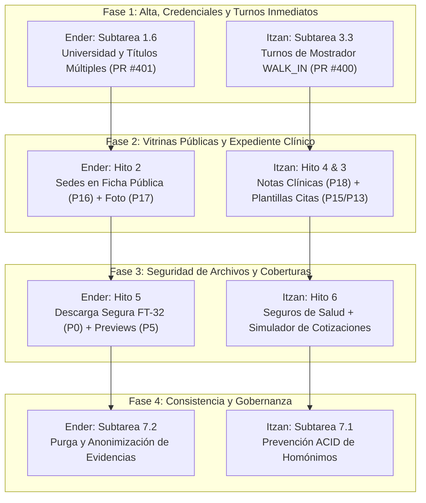

# 👥 PLAN DE REPARTO DE TAREAS: ENDER e ITZAN
### Mantra Core Technologies — Roadmap Backend (`mantra-core-health-api`)

Este documento establece la **distribución oficial y coordinada del trabajo técnico** entre los desarrolladores **Ender** e **Itzan**, asegurando que ambos puedan avanzar en paralelo sin pisarse código, manteniendo las convenciones estrictas de Git, la garantía QA y el flujo de revisión con `mdavila-2001`, `jsaldias39` y `PabloArauzCaballero`.

---

## 🧭 1. Especialización Técnica y Dominio de Dominio

Para maximizar la eficiencia y evitar bloqueos en la base de datos o colisiones en TypeORM, se dividen los módulos por afinidad funcional:

| Desarrollador | Enfoque de Dominio Principal | Módulos Arquitectónicos Asignados |
|---|---|---|
| **Ender** | **IAM, Perfiles, Identidad, Directorios y Archivos** | `iam`, `profiles`, `directory`, `common.files`, `verifications (FT-32)` |
| **Itzan** | **Operación Clínica, Agendas, Encuentros y Finanzas** | `scheduling`, `charts`, `clinical`, `insurance`, `quotations` |

---

## 📊 2. Matriz General de Asignación de Tareas



---

## 👨‍💻 3. Ficha de Trabajo: ENDER

### Perfil y Responsabilidad:
Ender lidera la capa de **Identidad, Acreditación Profesional, Directorios Públicos y Seguridad de Documentos/Archivos**.

### Protocolo Git para Ender:
- **Rama Base:** `dev`
- **Nomenclatura Obligatoria:** `ender/(feature-o-fix)-(dato-de-la-tarea)`
- **Flujo de Terminal:**
  ```bash
  git checkout dev
  git pull origin dev
  git checkout -b ender/<tipo>-<nombre-tarea>
  # Desarrollo y pruebas unitarias...
  git push -u origin ender/<tipo>-<nombre-tarea>
  gh pr create --base dev --title "..." --body "..." --reviewer mdavila-2001,jsaldias39,PabloArauzCaballero
  ```

### Tareas Asignadas a Ender:

| # | Subtarea | Título / Objetivo | Rama de Trabajo Exigida | Estado | Prompt Listo |
|:---:|:---:|---|---|:---:|:---:|
| **1** | **1.6** | **Universidad, Lugar de Estudio y Títulos Múltiples (Médico y Paciente)**<br>Ingesta en `RegisterPractitionerDto` y persistencia en `profiles.professional_credentials`. | `ender/1.6-universidad-titulos` | 🟣 **FUSIONADA EN DEV (PR #382)** | ✅ `PROMPT_SUBTAREA_1_6_UNIVERSIDAD_TITULOS.md` |
| **2** | **2.1** | **Exposición de Sedes de Atención en Ficha Pública (`P16`)**<br>Exponer `practiceLocations` en `PublicProfileDetailDto` para `/p/:slug`. | `ender/feat-public-profile-practice-locations` | 🟣 **FUSIONADA EN DEV (PR #394)** | ✅ Completado |
| **3** | **2.2** | **Asociación de Foto de Perfil en Edición Profesional (`P17`)**<br>Admitir `photoFileId` en `PUT /profiles/practitioners/:id/photo`. | `PUT /profiles/practitioners/:id/photo` | 🟣 **FUSIONADA EN DEV** | ✅ Consumido en front |
| **4** | **2.3** | **Filtro Territorial en Dos Pasos (Depto -> Municipio)**<br>Filtro en cascada para directorio de organizaciones y prestadores. | `justin/cierre-plan-2-3-y-7-1` | 🔵 **EN PR** — `department`/`municipality` en `/public/search/practitioners` y `/organizations` (ver `docs/trabajo/2026-09-24-cierre-plan-2-3-y-7-1/`) | ✅ Tests en verde |
| **5** | **5.1** | **Autorización de Descarga en Chat y Evidencias FT-32 (`P0`)**<br>Presigned URLs y token efímero seguro para descarga de documentos médicos. | `ender/feat-ft32-chat-attachment-download-auth` | 🟣 **FUSIONADA EN DEV (PR #402)** | ✅ Completado |
| **6** | **5.2** | **Metadatos Enriquecidos y Previews de Adjuntos (`P5`)**<br>Extracción de mime-type, tamaño, páginas y previsualizaciones drag-and-drop. | `ender/feat-attachment-metadata-previews` | 🟣 **FUSIONADA EN DEV (PR #406)** | ✅ Completado |
| **7** | **5.3** | **🆕 Preferencias de Chat y Respuesta Automática de Profesionales (PR #433)**<br>`GET/PUT /profiles/practitioners/me/chat-preferences` para autorespuesta y descansos. | `ender/feat-chat-auto-reply-preferences` | 🟡 **CUBIERTA DE OTRA FORMA** — autorespuesta en `GET/PUT /community/profiles/:profileId/auto-reply`, no en la ruta planeada | Decidir si se acepta |
| **8** | **7.2** | **Retención, Anonimización y Purga de Evidencias**<br>Soft-delete y limpieza periódica de documentos de identidad rechazados. | `ender/feat-identity-evidence-purge-policy` | 🟣 **FUSIONADA EN DEV (PR #405)** | ✅ Completado |

---

## 👨‍💻 4. Ficha de Trabajo: ITZAN

### Perfil y Responsabilidad:
Itzan lidera la capa de **Agendas Médicas, Creación de Citas, Expediente/Notas Clínicas, Contabilidad, Seguros y Transaccionalidad ACID**.

### Protocolo Git para Itzan:
- **Rama Base:** `dev`
- **Nomenclatura Obligatoria:** `itzan/(feature-o-fix)-(dato-de-la-tarea)`
- **Flujo de Terminal:**
  ```bash
  git checkout dev
  git pull origin dev
  git checkout -b itzan/<tipo>-<nombre-tarea>
  # Desarrollo y pruebas unitarias...
  git push -u origin itzan/<tipo>-<nombre-tarea>
  gh pr create --base dev --title "..." --body "..." --reviewer mdavila-2001,jsaldias39,PabloArauzCaballero
  ```

### Tareas Asignadas a Itzan:

| # | Subtarea | Título / Objetivo | Rama de Trabajo Exigida | Estado | Prompt Listo |
|:---:|:---:|---|---|:---:|:---:|
| **1** | **3.3** | **Turnos de Mostrador y Atención Directa (`WALK_IN`, PR #400 / P22)**<br>Permitir generación de turnos inmediatos sin reserva web previa. | `itzan/feat-scheduling-walk-in-appointments` | 🟣 **FUSIONADA EN DEV (PR #384)** | ✅ Completado |
| **2** | **3.1** | **Retiro de Plantillas de Horarios y Liberación Segura (`P15`)**<br>`DELETE /scheduling/templates/:id` respondiendo `409 Conflict` si hay reservas activas. | Commit `3a431e30` / `fde22f2f` | 🟣 **FUSIONADA EN DEV** | ✅ 9/9 tests en verde |
| **3** | **3.2** | **Creación Atómica de Citas Clínicas (`P13`)**<br>`SchedulingConfirmationService` con flush y control de solapamiento de slots. | Commit `9a6fb9dd` (`crearCitaClinica`) | 🟣 **FUSIONADA EN DEV** | ✅ Verificado en DB |
| **4** | **4.1** | **Lectura y Paginación Cursor de Notas Clínicas (`P18`)**<br>`GET /charts/notes` con paginación cursor para navegación fluida de evoluciones. | `itzan/feat-chart-notes-collection-read` | 🟣 **FUSIONADA EN DEV (PR #385)** | ✅ Tests fx11 en verde |
| **5** | **4.2** | **Check-in Idempotente por Cita y Manejo 409 (`POST /clinical/encounters/check-in`)**<br>Garantizar correlación unívoca cita-encuentro sin duplicados ante recargas. | `itzan/feat-clinical-encounter-checkin-idempotency` | 🟣 **FUSIONADA EN DEV (PR #390)** | ✅ Completado |
| **6** | **4.3** | **Exposición de `encounterId` en Reservas (`BookingItemDto`)**<br>Proyectar `encounterId` en `aBookingItem` para enlace 1:1 en frontend. | `itzan/feat-scheduling-bookings-encounter-id` | 🟣 **FUSIONADA EN DEV (PR #392)** | ✅ Completado |
| **7** | **4.4** | **🆕 Plan de Cuidados y Firma en Expediente (PR #430)**<br>Persistencia estructurada de `carePlan` y firma PDF de sesión en `charts.notes`. | `itzan/feat-chart-care-plan-documents` | 🟣 **FUSIONADA EN DEV (PRs #408 y #413)** | ✅ Completado |
| **8** | **6.1** | **Catálogo y Consola de Coberturas y Planes de Salud**<br>Módulo `insurance` y consola administrativa de planes en frontend. | PR #386 (API) / PR #437 (Front) | 🟣 **FUSIONADA EN DEV** | ✅ Completado hoy |
| **9** | **6.2** | **Simulador de Financiamiento y Cotizaciones**<br>Endpoint `POST /quotations/simulate` con cálculo determinista de planes. | — | ⚪ **REEMPLAZADA** — el simulador `POST /quotations/simulate` se retiró en v4.2.18 por el plan de pagos sin interés (PR #419); coberturas por Marcelo (PRs #400, #407, #433) | Decidir si se da por cerrada |
| **10** | **6.3** | **🆕 Endpoints de Lectura para Cockpit Contable SAP (PR #433)**<br>`GET /accounting/fiscal-years`, `open-items`, `dimensions` y `document-flow`. | `itzan/feat-accounting-cockpit-read-models` | 🟣 **FUSIONADA EN DEV (PR #403)** | ✅ Completado |
| **11** | **7.1** | **Prevención Atómica de Cédulas Homónimas y Rollback**<br>Manejo de concurrencia e integridad transaccional en autorregistro de personas. | `justin/cierre-plan-2-3-y-7-1` | 🔵 **EN PR** — cerrojo transaccional por cédula en el auto-registro de paciente; el índice único ya impedía la doble cuenta | ✅ Tests en verde |

---

## ⚡ 5. Siguientes Pasos Inmediatos (Sprint Activo)

> **Estado al 2026-09-24:** 2.3 y 7.1 en PR (`justin/cierre-plan-2-3-y-7-1`); 5.3 y 6.2 resueltas por otra vía y pendientes de aceptación; el resto, fusionado en `dev`. Las instrucciones de abajo son las del 2026-09-12 y quedaron cumplidas.

### Instrucciones para Ender:
1. Con Subtareas 1.6 y 2.2 cerradas, arrancar con la **Subtarea 2.1: Exposición de Sedes de Atención en Ficha Pública (`/p/:slug`, P16)** o **Subtarea 5.1 (P0: Descarga segura de archivos FT-32)**.
2. Crear rama: `git checkout -b ender/feat-public-profile-practice-locations`.
3. Reviewers obligatorios: `mdavila-2001,jsaldias39,PabloArauzCaballero`.

### Instrucciones para Itzan:
1. Con Hito 3 completo y Subtarea 4.1 recién fusionada (PR #385), arrancar de inmediato con la **Subtarea 4.2: Check-in de Encuentro Idempotente por Cita**.
2. Crear rama: `git checkout -b itzan/feat-clinical-encounter-checkin-idempotency`.
3. Siguiente tarea tras la 4.2: **Subtarea 4.3** en rama `itzan/feat-scheduling-bookings-encounter-id`.
4. Reviewers obligatorios: `mdavila-2001,jsaldias39,PabloArauzCaballero`.

---

## 🛡️ 6. Reglas de Convivencia y Garantía QA

1. **Revisores Obligatorios en todos los PRs:** Ningún PR puede fusionarse sin la aprobación de Marcelo (`mdavila-2001`), Justin Saldias (`jsaldias39`) o Pablo Arauz (`PabloArauzCaballero`). Todo comando `gh pr create` debe incluir:
   ```bash
   --reviewer mdavila-2001,jsaldias39,PabloArauzCaballero
   ```
2. **Cero Rompimiento de Tests:** Antes de pushear a su remoto, cada dev debe correr:
   ```bash
   yarn test
   yarn test:int
   ```
3. **No Colisión de Entidades:** Si una tarea requiere alterar una entidad cruzada (como `profiles.persons`), deben coordinarse mediante un contrato de interfaz o DTO antes de tocar el esquema.
4. **Modo Planificación Obligatorio:** Todo desarrollo debe arrancar con un plan técnico aprobado para evitar retrabajo.
