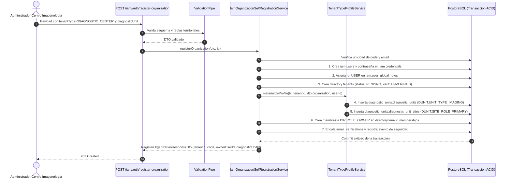

# TASK PROMPT: Subtarea 1.5 — Alta de Organizaciones para Centros de Imagenología y Diagnóstico (`DIAGNOSTIC_CENTER`)

> **MODO DE EJECUCIÓN:** Este prompt está diseñado para ejecutarse en **Modo Planificación (Planning Mode)**.
> El agente o desarrollador debe iniciar en fase de investigación sin tocar código fuente, generar un `implementation_plan.md` exhaustivo, esperar la aprobación explícita del usuario, ejecutar los cambios con rigor atómico, verificar la solución mediante pruebas unitarias e integración con garantía QA, y documentar el resultado final en `walkthrough.md`.

---

## 1. Contexto de Negocio y Justificación Técnica

En el registro de procesos del cliente («MODULO ANALISIS MEDICOS (RAYOS X, RESONANCIA, ETC.)»), se especificó que las empresas que realizan estudios diagnósticos por imágenes y laboratorio deben contar con su propio flujo de registro e incorporación al ecosistema de salud.

### El cambio en Frontend (`mantra-core-health`, rama `mockup`)
En el frontend se aprobó e integró el **PR #404** (commit `7abe8fe8`: *"feat(auth): alta del centro de imagenología (módulo análisis médicos)"*), el cual introduce:
1. Asistente de 11 pasos en `/auth/register/imaging-center` con tarjeta especializada «Imagenología» en la rejilla de tipos de cuenta.
2. Captura de datos corporativos: Razón social, NIT, tipo de sociedad mercantil (8 opciones), licencia de funcionamiento, SEPREC y certificado del SEDES.
3. Declaración obligatoria de modalidades diagnósticas (Rayos X, Ecografía, Tomografía computarizada, Resonancia magnética, Mamografía, Densitometría ósea).
4. Declaración de sede central y sucursales con coordenadas geográficas y geocodificación.
5. Carga de evidencias documentales (7 adjuntos de respaldo).
6. Representante legal y accesos de administración.

### La brecha técnica en Backend (`mantra-core-health-api`)
En el backend, el endpoint público de autorregistro de organizaciones `POST /iam/auth/register-organization`:
1. **Restricción de Códigos de Tenant:** `RegisterOrganizationDetailsDto.tenantType` está validado con `@IsIn(TENANT_TYPE_CODES)`. Actualmente solo admite `PROVIDER`, `PAYER`, `BROKER`, `UNIVERSITY`, `PHARMACY`, `HOSPITAL`, `MEDICAL_OFFICE`, `NURSING`, `HEALTH_OTHER`, `HEALTH_BUSINESS`. No existe soporte tipado ni semántico para centros de diagnóstico por imágenes (`DIAGNOSTIC_CENTER`).
2. **Falta de Materialización del Perfil Diagnóstico:** En `TenantTypeProfileService.materializeProfile`, solo los tipos `PAYER` (aseguradoras) y `BROKER` (corredores) materializan entidades propias (`carriers` / `brokers`). Para prestadores diagnósticos, no se aprovisiona la unidad diagnóstica en el schema `diagnostic_units.diagnostic_units` ni la sede principal en `diagnostic_units.diagnostic_unit_sites`.
3. **Desconexión con el Módulo 23 (`diagnostic_units`):** El backend ya cuenta con la infraestructura completa de unidades diagnósticas (`DiagnosticUnitsRepository`, `DiagnosticUnitSitesRepository`, `DUNIT.UNIT_TYPE_IMAGING`), pero carece del puente en el autorregistro que cree el tenant B2B y su unidad diagnóstica de forma atómica.

---

## 2. Flujo de Git y Procedimiento de Entrega

Debes ejecutar estrictamente el siguiente procedimiento en la terminal del proyecto:

1. **Preparación y verificación del espacio de trabajo:**
   - Situarse en el repositorio backend: `d:\Trabajos Secundarios\Mantra Core Technologies\mantra-core-health-api`.
   - Confirmar que el working tree esté limpio:
     ```bash
     git status
     ```
   - Actualizar y situarse en la rama base `dev`:
     ```bash
     git fetch origin dev
     git checkout dev
     git pull origin dev
     ```

2. **Creación de la rama de trabajo con nomenclatura obligatoria:**
   - **Formato exigido:** `(nombre-del-dev)/(feature-o-fix)-(dato-de-la-tarea)`
   - *Ejemplo con tu nombre de desarrollador (ej. `marcelo`):*
     ```bash
     git checkout -b marcelo/feat-alta-centro-imagenologia
     ```

3. **Estrategia de Commits Atómicos y Convencionales:**
   - Realizar commits modulares respetando Conventional Commits:
     - `feat(directory): agregar tipo de tenant DIAGNOSTIC_CENTER a catalogo y tipos territoriales`
     - `feat(iam): incorporar bloque opcional diagnosticUnit en RegisterOrganizationDto`
     - `feat(iam): materializar unidad diagnostica inicial y sede operativa en autorregistro`
     - `test(iam): pruebas unitarias para autorregistro de centros de imagenologia y validacion de esquemas`

4. **Publicación y Apertura de Pull Request:**
   - Pushear la rama al remoto `origin`:
     ```bash
     git push -u origin marcelo/feat-alta-centro-imagenologia
     ```
   - Crear el Pull Request hacia la rama `dev` mediante `gh pr create`, asignando a `jsaldias39` y `PabloArauzCaballero` como revisores:
     ```bash
     gh pr create --base dev --title "feat(iam): alta de centros de imagenologia y unidades diagnosticas en register-organization (PR #404)" --body "## Resumen de Cambios
     - directory.concepts: Añade DIAGNOSTIC_CENTER a TenantTypeCode, TENANT_TYPE_CONCEPT_BY_CODE y TERRITORIAL_TENANT_TYPES.
     - RegisterOrganizationDto: Incorpora el bloque opcional diagnosticUnit (tipo de unidad, modalidades, opciones de mostrador/toma de muestras y sucursales).
     - TenantTypeProfileService: Materializa la unidad diagnostica en diagnostic_units.diagnostic_units y su sede primaria en diagnostic_units.diagnostic_unit_sites dentro de la transaccion del alta.
     - IamOrganizationSelfRegistrationService: Retorna diagnosticUnitId en la respuesta del autorregistro.
     - Pruebas unitarias e integracion en verde cubriendo creacion exitosa, validaciones de territorio (412) y unicidad de codigo/correo (409).
     - Habilita la integracion directa de la pantalla /auth/register/imaging-center de la rama mockup (PR #404)." --reviewer jsaldias39,PabloArauzCaballero
     ```

---

## 3. Requerimientos Técnicos y Arquitectura de la Solución



### A. Catálogo de Directorio y Tipos de Tenant
- **Archivo:** `src/modules/directory/directory.concepts.ts`
- **Modificaciones:**
  1. Extender `TenantTypeCode` con `'DIAGNOSTIC_CENTER'`:
     ```typescript
     export type TenantTypeCode =
       | 'PROVIDER'
       | 'PAYER'
       | 'BROKER'
       | 'UNIVERSITY'
       | 'PHARMACY'
       | 'HOSPITAL'
       | 'MEDICAL_OFFICE'
       | 'NURSING'
       | 'HEALTH_OTHER'
       | 'HEALTH_BUSINESS'
       | 'DIAGNOSTIC_CENTER';
     ```
  2. Mapear el concepto en `TENANT_TYPE_CONCEPT_BY_CODE`. Debe mapear a `CONCEPTS.TENANT_TYPE_HEALTH_OTHER` (o concepto específico de centro diagnóstico).
  3. Agregar `'DIAGNOSTIC_CENTER'` a `TERRITORIAL_TENANT_TYPES` para exigir validación obligatoria de `countryConceptId` y `jurisdictionConceptId`.

### B. DTOs de Alta de Organización
- **Archivo:** `src/modules/iam/dto/register-organization.dto.ts`
- **Modificaciones:**
  1. Crear el DTO `RegisterDiagnosticUnitDto`:
     ```typescript
     export class RegisterDiagnosticUnitDto {
       /** Código de la unidad diagnóstica (opcional; por defecto el código del tenant). */
       @ApiPropertyOptional({ maxLength: 60, example: 'CENTRO_IMAGEN_CENTRAL' })
       @IsOptional()
       @IsString()
       @MaxLength(60)
       code?: string;

       /** Nombre operativo de la unidad (opcional; por defecto legalName). */
       @ApiPropertyOptional({ maxLength: 200, example: 'Centro de Diagnóstico por Imágenes' })
       @IsOptional()
       @IsString()
       @MaxLength(200)
       name?: string;

       /** Concepto de tipo de unidad (por defecto DUNIT.UNIT_TYPE_IMAGING). */
       @ApiPropertyOptional({ format: 'uuid' })
       @IsOptional()
       @IsUUID()
       diagnosticUnitTypeConceptId?: string;

       /** Modalidades ofrecidas (ej. Rayos X, Ecografía, Tomografía). */
       @ApiPropertyOptional({ type: [String], example: ['Rayos X', 'Ecografía'] })
       @IsOptional()
       @IsString({ each: true })
       modalities?: string[];

       /** Si acepta pacientes espontáneos de mostrador sin orden previa. */
       @ApiPropertyOptional({ default: true })
       @IsOptional()
       walkInAvailable?: boolean;

       /** Si realiza toma de muestras / estudios a domicilio. */
       @ApiPropertyOptional({ default: false })
       @IsOptional()
       homeCollectionAvailable?: boolean;
     }
     ```
  2. Agregar `diagnosticUnit?: RegisterDiagnosticUnitDto` en `RegisterOrganizationDetailsDto`:
     ```typescript
     @ApiPropertyOptional({ type: RegisterDiagnosticUnitDto })
     @IsOptional()
     @ValidateNested()
     @Type(() => RegisterDiagnosticUnitDto)
     diagnosticUnit?: RegisterDiagnosticUnitDto;
     ```
  3. Agregar `diagnosticUnitId?: string` en `RegisterOrganizationResponseDto`:
     ```typescript
     @ApiPropertyOptional({ format: 'uuid', description: 'ID de la unidad diagnóstica creada' })
     diagnosticUnitId?: string;
     ```

### C. Materialización en `TenantTypeProfileService`
- **Archivo:** `src/modules/directory/services/tenant-type-profile.service.ts`
- **Modificaciones:**
  1. Inyectar `DiagnosticUnitsRepository` y `DiagnosticUnitSitesRepository` (o el servicio `DiagnosticUnitsService`).
  2. En `TenantTypeProfileInput`, incluir `diagnosticUnit?: RegisterDiagnosticUnitDto`.
  3. En `assertProfileMatchesType`, validar que si `tenantType === 'DIAGNOSTIC_CENTER'`, no se envíen bloques `payer` ni `broker`.
  4. En `materializeProfile`:
     ```typescript
     if (input.tenantType === 'DIAGNOSTIC_CENTER' || input.diagnosticUnit) {
       const unitTypeConceptId =
         input.diagnosticUnit?.diagnosticUnitTypeConceptId ??
         DUNIT.UNIT_TYPE_IMAGING;

       const unit = this.diagnosticUnitsRepo.create(tx, {
         tenantId,
         code: input.diagnosticUnit?.code ?? input.legalName.substring(0, 30).toUpperCase().replace(/\s+/g, '_'),
         name: input.diagnosticUnit?.name ?? input.legalName,
         diagnosticUnitTypeConceptId: unitTypeConceptId,
         ownershipTypeConceptId: DUNIT.OWNERSHIP_PRIVATE,
         walkInAvailable: input.diagnosticUnit?.walkInAvailable ?? true,
         homeCollectionAvailable: input.diagnosticUnit?.homeCollectionAvailable ?? false,
         acceptsExternalOrders: true,
         actorUserId,
       });
       await tx.flush();

       // Crear sede primaria operativa de la unidad
       this.diagnosticUnitSitesRepo.create(tx, {
         diagnosticUnitId: unit.id,
         siteRoleConceptId: DUNIT.SITE_ROLE_PRIMARY,
         name: 'Sede Central',
         statusConceptId: DUNIT.SITE_ACTIVE,
         actorUserId,
       });

       return unit.id;
     }
     ```

### D. Ajuste en `IamOrganizationSelfRegistrationService`
- **Archivo:** `src/modules/iam/services/iam-organization-self-registration.service.ts`
- **Modificaciones:**
  1. Capturar el `profileId` devuelto por `this.typeProfile.materializeProfile(...)`.
  2. Asignar `diagnosticUnitId` en el DTO de respuesta si el tipo corresponde a centro diagnóstico.

---

## 4. Garantía de Calidad y Pruebas Requeridas (QA Guarantee)

Se exige la adición y ejecución de pruebas automatizadas rigurosas en Jest:

### Pruebas Unitarias (`src/modules/iam/services/iam-organization-self-registration.service.spec.ts`)
1. **Caso 1: Alta exitosa de Centro de Imagenología (`DIAGNOSTIC_CENTER`)**
   - Mockear `typeProfile.materializeProfile` para devolver `diagnostic-unit-1`.
   - Verificar que la llamada completa responda con `tenantId`, `ownerUserId`, `membershipId` y `diagnosticUnitId: 'diagnostic-unit-1'`.
   - Validar que el evento de seguridad se registre con `detailJson.flow = 'organization-self-registration'`.
2. **Caso 2: Validación Territorial**
   - Invocar con `tenantType: 'DIAGNOSTIC_CENTER'` omitiendo `countryConceptId` o `jurisdictionConceptId`.
   - Verificar que `typeProfile.assertProfileMatchesType` lance `PreconditionFailedException` con código HTTP 412.
3. **Caso 3: Conflicto de Unicidad de Código y Correo**
   - Simular código de organización ya existente en `tenantsRepo.findByCode`. Debe lanzar `ConflictException (409)` sin intentar crear el usuario.
   - Simular correo del owner ya registrado en `credentialsRepo.findLivePasswordBySubject`. Debe lanzar `ConflictException (409)` sin crear el tenant.

### Comandos de Validación QA:
```bash
# 1. Ejecutar pruebas unitarias del servicio
yarn test src/modules/iam/services/iam-organization-self-registration.service.spec.ts

# 2. Ejecutar pruebas de perfiles de tenant
yarn test src/modules/directory/services/tenant-type-profile.service.spec.ts

# 3. Verificación de tipado estricto sin errores TypeScript
yarn typecheck
```

---

## 5. Definition of Done (DoD) y Criterios de Aceptación

### Definition of Done (DoD)
- [ ] `TenantTypeCode` incluye `'DIAGNOSTIC_CENTER'` y está incluido en `TERRITORIAL_TENANT_TYPES`.
- [ ] `RegisterOrganizationDetailsDto` admite `diagnosticUnit` y lo valida anidado.
- [ ] `TenantTypeProfileService.materializeProfile` crea atómicamente la entidad en `diagnostic_units.diagnostic_units` y su sede primaria en `diagnostic_units.diagnostic_unit_sites`.
- [ ] `RegisterOrganizationResponseDto` devuelve `diagnosticUnitId`.
- [ ] La transacción es 100% ACID (rollback total si falla la creación de cualquier entidad hija).
- [ ] Pruebas unitarias pasan con 100% de éxito.
- [ ] `yarn typecheck` pasa con 0 errores.
- [ ] Rama con nomenclatura `(nombre-del-dev)/(feature-o-fix)-(dato-de-la-tarea)` creada desde `dev`.
- [ ] PR creado hacia `dev` con revisores `jsaldias39,PabloArauzCaballero`.

### Criterios de Aceptación (GIVEN / WHEN / THEN)

#### Escenario 1: Alta exitosa de centro de imagenología
- **GIVEN** un payload de registro de organización con `tenantType: 'DIAGNOSTIC_CENTER'`, datos legales válidos, país, jurisdicción y bloque `diagnosticUnit`.
- **WHEN** se invoca `POST /iam/auth/register-organization`.
- **THEN** la API responde `201 Created` con `{ tenantId, code, ownerUserId, membershipId, diagnosticUnitId, status }`, dejando el tenant en `PENDING` y la unidad diagnóstica aprovisionada.

#### Escenario 2: Omisión de datos territoriales obligatorios
- **GIVEN** un registro con `tenantType: 'DIAGNOSTIC_CENTER'` sin `countryConceptId` o sin `jurisdictionConceptId`.
- **WHEN** se envía la solicitud.
- **THEN** la API rechaza con `412 Precondition Failed` detallando los campos territoriales faltantes.

#### Escenario 3: Código de organización o correo duplicado
- **GIVEN** un código de organización que ya pertenece a otra institución.
- **WHEN** se envía la solicitud de registro.
- **THEN** la API rechaza con `409 Conflict` indicando que el código ya está en uso, sin persistir registros huérfanos.
