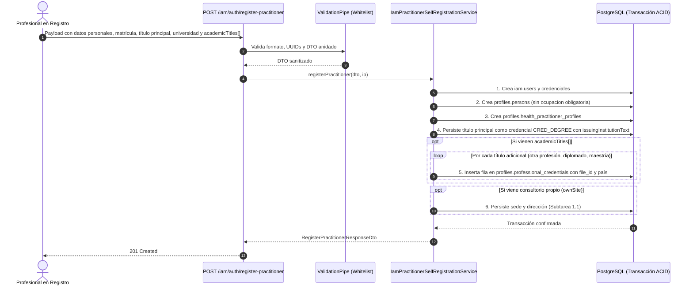

# TASK PROMPT: Subtarea 1.6 — Ingesta de Universidad, Lugar de Estudio y Credenciales Académicas Múltiples (Médico y Paciente)

> **MODO DE EJECUCIÓN:** Este prompt está diseñado para ejecutarse en **Modo Planificación (Planning Mode)**.
> El agente o desarrollador debe iniciar en fase de investigación sin tocar código fuente, generar un `implementation_plan.md` exhaustivo, esperar la aprobación explícita del usuario, ejecutar los cambios con rigor atómico, verificar la solución mediante pruebas unitarias e integración con garantía QA, y documentar el resultado final en `walkthrough.md`.

---

## 1. Contexto de Negocio y Justificación Técnica

En el registro de procesos del cliente («MÓDULO MÉDICO», §1.4 y §1.15 a §1.20), el propietario solicitó tres capacidades fundamentales para el alta y perfil del profesional de salud:
1. **Declarar la universidad o institución de egreso** del título con el que ejerce.
2. **Indicar el lugar de estudio** (país y ciudad de expedición).
3. **Declarar múltiples profesiones o títulos de postgrado** (*«hay doctores que aparte de ser doctores han estudiado otra profesión o tienen varios diplomados/maestrías»*), cada uno con su respectiva institución, lugar de estudio y archivo PDF de su diploma o matrícula respaldatoria.

### El cambio en Frontend (`mantra-core-health`, rama `mockup`)
A través del **PR #401** (commits `e58ce5e0` y `33c77e12`: *"feat(alta profesional): la universidad, el lugar de estudio y la segunda profesión"*):
- **Paso 7 del Wizard («Tu título profesional y foto»):** Incorpora el bloque de educación del título principal: universidad (`issuingInstitutionText`), país de estudio (`issuingCountryConceptId` / texto libre) y ciudad (`issuingCityText`), además del diploma opcional adjunto (`diplomaFileId`).
- **Paso 10 del Wizard («Tus títulos»):** Permite agregar dinámicamente múltiples credenciales por categoría (`CREDENTIAL_TYPE_DEGREE` para segunda carrera/otra profesión, `CREDENTIAL_TYPE_DIPLOMA`, `CREDENTIAL_TYPE_MASTER`, `CREDENTIAL_TYPE_DOCTORATE`), cada una con nombre, número, institución, país, ciudad y archivo adjunto.
- **Distinción Crítica entre Módulos Paciente y Médico:** En este mismo PR se eliminó formalmente el selector de «Ocupación» del formulario de registro médico. «Ocupación» pertenece a la persona en el **Módulo Paciente** (`profiles.persons.occupation_concept_id` / `VS_BO_OCCUPATION` con texto libre, resuelto en Subtarea 1.3). Para el médico, lo que define su ejercicio legal son sus **Títulos y Credenciales Académicas** (`profiles.professional_credentials`).

### La brecha técnica en Backend (`mantra-core-health-api`)
1. **Infraestructura Existente en Base de Datos:** La tabla `profiles.professional_credentials` **ya existe** en PostgreSQL y cuenta con soporte para `practitioner_profile_id`, `credential_type_concept_id`, `number`, `issuing_institution_text`, `issuing_country_concept_id` y `file_id` (FK a `common.files`).
2. **Desconexión en el Endpoint de Autorregistro:** `POST /iam/auth/register-practitioner` recibe `RegisterPractitionerDto`. Actualmente, este DTO no acepta el arreglo de credenciales académicas ni la información de universidad/diploma del título principal. Si el frontend envía estos campos, `ValidationPipe` con `forbidNonWhitelisted: true` rechaza la petición con error `400 / 422`.
3. **Endpoints Existentes Post-Alta:** Existe `POST /profiles/practitioners/me/credentials` (`AddOwnCredentialDto`), pero este exige sesión autenticada (`/me/`). Sin embargo, el autorregistro concluye en la pantalla de login sin sesión automática. Por ello, el alta inicial debe aceptar el bloque formativo e invocar atómicamente la persistencia de credenciales en `profiles.professional_credentials`.
4. **Campo País en `AddOwnCredentialDto`:** `AddOwnCredentialDto` omitía el campo `issuingCountryConceptId`, a pesar de que la columna existe en el modelo.

---

## 2. Flujo de Git y Procedimiento de Entrega

Debes ejecutar estrictamente el siguiente procedimiento en la terminal del proyecto:

1. **Preparación y verificación del espacio de trabajo:**
   - Situarse en el repositorio backend: `d:\Trabajos Secundarios\Mantra Core Technologies\mantra-core-health-api`.
   - Confirmar que el working tree esté limpio:
     ```bash
     git status
     ```
   - Actualizar y situarse en la rama base `dev`:
     ```bash
     git fetch origin dev
     git checkout dev
     git pull origin dev
     ```

2. **Creación de la rama de trabajo con nomenclatura obligatoria:**
   - **Formato exigido:** `(nombre-del-dev)/(feature-o-fix)-(dato-de-la-tarea)`
   - *Ejemplo:* Si tu identificador es `marcelo`:
     ```bash
     git checkout -b marcelo/feat-practitioner-university-credentials
     ```

3. **Estrategia de Commits Atómicos y Convencionales:**
   - Realizar commits modulares respetando Conventional Commits:
     - `feat(profiles): exponer issuingCountryConceptId en AddOwnCredentialDto`
     - `feat(iam): agregar DTO de credenciales academicas en RegisterPractitionerDto`
     - `feat(iam): persistir credenciales academicas y diplomas en registro de profesional`
     - `test(iam): pruebas unitarias para alta medica con universidad, multiples titulos y archivos`

4. **Publicación y Apertura de Pull Request:**
   - Pushear la rama al remoto `origin`:
     ```bash
     git push -u origin marcelo/feat-practitioner-university-credentials
     ```
   - Crear el Pull Request hacia la rama `dev` mediante `gh pr create`, asignando a `jsaldias39` y `PabloArauzCaballero` como revisores:
     ```bash
     gh pr create --base dev --title "feat(iam): ingesta de universidad, lugar de estudio y credenciales multiples en alta medica (PR #401)" --body "## Resumen de Cambios
     - RegisterPractitionerDto: Incorpora campos de educacion del titulo principal (university, issuingCountryConceptId, issuingCityText, diplomaFileId) y arreglo academicTitles de tipo RegisterPractitionerAcademicTitleDto.
     - AddOwnCredentialDto: Expone issuingCountryConceptId e issuingCityText opcionales.
     - IamPractitionerSelfRegistrationService: Persiste atómicamente las credenciales en profiles.professional_credentials vinculadas al nuevo practitioner_profile_id con estado CRED_PENDING y referencia a common.files.
     - Claridad modular Paciente vs Medico: Mantiene occupation en paciente (persons) mientras el medico estructura su formacion en professional_credentials sin colisiones.
     - Pruebas unitarias en verde cubriendo alta simple, alta con multiples titulos y validacion de archivos adjuntos.
     - Cierra la integracion con la pantalla de alta medica consolidada en la rama mockup (PR #401)." --reviewer jsaldias39,PabloArauzCaballero
     ```

---

## 3. Requerimientos Técnicos y Archivos a Modificar



### A. DTO de Credencial Propia (`AddOwnCredentialDto`)
- **Archivo:** `src/modules/profiles/dto/own-credential.dto.ts`
- **Modificación:** Exponer `issuingCountryConceptId` (y tolerar `issuingCityText` si el front lo envía):
  ```typescript
  /**
   * País donde se emitió el título (catálogo terminology.catalog_concepts).
   */
  @ApiPropertyOptional({
    format: 'uuid',
    description: 'País emisor del título (miembro de VS_COUNTRY)',
  })
  @IsOptional()
  @IsUUID()
  issuingCountryConceptId?: string;

  /**
   * Ciudad de expedición o estudio (texto libre descriptivo).
   */
  @ApiPropertyOptional({ maxLength: 100 })
  @IsOptional()
  @IsString()
  @MaxLength(100)
  issuingCityText?: string;
  ```

### B. DTO de Registro de Profesional (`RegisterPractitionerDto`)
- **Archivo:** `src/modules/iam/dto/register-practitioner.dto.ts`
- **Modificaciones:**
  1. Crear la clase anidada `RegisterPractitionerAcademicTitleDto`:
     ```typescript
     export class RegisterPractitionerAcademicTitleDto {
       /** Concepto del tipo de credencial (CREDENTIAL_TYPE_DEGREE, _DIPLOMA, _MASTER, _DOCTORATE). */
       @ApiProperty({
         format: 'uuid',
         description: 'Tipo de credencial académica (catálogo profiles:CREDENTIAL_TYPE_*)',
       })
       @IsUUID()
       credentialTypeConceptId!: string;

       /** Número, registro o folio del diploma. */
       @ApiPropertyOptional({ maxLength: 100 })
       @IsOptional()
       @IsString()
       @MaxLength(100)
       number?: string;

       /** Universidad o institución académica donde se estudió. */
       @ApiPropertyOptional({ maxLength: 200 })
       @IsOptional()
       @IsString()
       @MaxLength(200)
       issuingInstitutionText?: string;

       /** País de estudio. */
       @ApiPropertyOptional({ format: 'uuid' })
       @IsOptional()
       @IsUUID()
       issuingCountryConceptId?: string;

       /** Ciudad de estudio. */
       @ApiPropertyOptional({ maxLength: 100 })
       @IsOptional()
       @IsString()
       @MaxLength(100)
       issuingCityText?: string;

       /** Fecha de emisión (ISO YYYY-MM-DD). */
       @ApiPropertyOptional({ format: 'date' })
       @IsOptional()
       @IsISO8601()
       issueDate?: string;

       /** Identificador del archivo PDF o imagen del diploma en common.files. */
       @ApiPropertyOptional({ format: 'uuid' })
       @IsOptional()
       @IsUUID()
       fileId?: string;
     }
     ```
  2. En `RegisterPractitionerDto`, incorporar la educación del título principal y el arreglo de títulos adicionales:
     ```typescript
     /** Universidad donde obtuvo el título principal con el que ejerce. */
     @ApiPropertyOptional({ maxLength: 200 })
     @IsOptional()
     @IsString()
     @MaxLength(200)
     university?: string;

     /** País de estudio del título principal. */
     @ApiPropertyOptional({ format: 'uuid' })
     @IsOptional()
     @IsUUID()
     degreeCountryConceptId?: string;

     /** Ciudad de estudio del título principal. */
     @ApiPropertyOptional({ maxLength: 100 })
     @IsOptional()
     @IsString()
     @MaxLength(100)
     degreeCityText?: string;

     /** Archivo adjunto del diploma del título principal (referencia a common.files). */
     @ApiPropertyOptional({ format: 'uuid' })
     @IsOptional()
     @IsUUID()
     diplomaFileId?: string;

     /** Títulos adicionales o segundas profesiones (paso 10 del asistente). */
     @ApiPropertyOptional({
       type: [RegisterPractitionerAcademicTitleDto],
       description: 'Arreglo de títulos académicos adicionales o segundas profesiones',
     })
     @IsOptional()
     @IsArray()
     @ValidateNested({ each: true })
     @Type(() => RegisterPractitionerAcademicTitleDto)
     academicTitles?: RegisterPractitionerAcademicTitleDto[];
     ```

### C. Persistencia en `IamPractitionerSelfRegistrationService`
- **Archivo:** `src/modules/iam/services/iam-practitioner-self-registration.service.ts`
- **Modificaciones:**
  1. Inyectar o acceder al repositorio `ProfessionalCredentialsRepository` (o persistir vía `tx.create(ProfessionalCredentials, ...)`).
  2. Al crear el perfil profesional `health_practitioner_profiles`:
     - Si se envía `dto.university` o `dto.diplomaFileId`, registrar la credencial principal de grado (`PROFILES.CREDENTIAL_TYPE_DEGREE` o concepto por defecto) asignando `issuingInstitutionText: dto.university`, `issuingCountryConceptId: dto.degreeCountryConceptId`, `fileId: dto.diplomaFileId` y `number: dto.licenseNumber ?? 'S/N'`.
     - Si se recibe `dto.academicTitles && dto.academicTitles.length > 0`, iterar e insertar cada credencial vinculada al `practitionerProfileId` recién creado con estado `PROFILES.CRED_PENDING`.
  3. **Preservación Modular Paciente vs Médico:**
     - Confirmar que `persons.occupation_concept_id` quede intacto para el paciente (`RegisterPatientDto`) y que la omisión de ocupación en el médico no rompa ninguna validación de persona.

---

## 4. Garantía de Calidad y Pruebas Requeridas (QA Guarantee)

Se exige cobertura exhaustiva en Jest:

### Pruebas Unitarias (`src/modules/iam/services/iam-practitioner-self-registration.service.spec.ts`)
1. **Caso 1: Alta médica estándar con universidad y diploma adjunto**
   - Enviar payload con `university: 'Universidad Mayor de San Andrés'` y `diplomaFileId: 'uuid-archivo-1'`.
   - Verificar que se cree la fila correspondiente en `professional_credentials` con `issuingInstitutionText` y `fileId`.
2. **Caso 2: Alta médica con segunda profesión y maestría (`academicTitles[]`)**
   - Enviar `academicTitles` con 2 elementos (un `CREDENTIAL_TYPE_DEGREE` adicional y un `CREDENTIAL_TYPE_MASTER`).
   - Verificar que se persistan exactamente 2 credenciales adicionales con sus respectivos tipos, instituciones y enlaces a `common.files`.
3. **Caso 3: Validación contra `forbidNonWhitelisted`**
   - Verificar que todos los campos enviados por el frontend (`university`, `degreeCountryConceptId`, `degreeCityText`, `diplomaFileId`, `academicTitles`) sean aceptados limpiamente sin rechazo 400.
4. **Caso 4: No interferencia con módulo Paciente**
   - Ejecutar la suite de `IamPatientSelfRegistrationService` para certificar que el registro de paciente sigue funcionando con su ocupación y cédula sin regresiones.

### Comandos de Validación QA:
```bash
# 1. Pruebas unitarias de registro médico
yarn test src/modules/iam/services/iam-practitioner-self-registration.service.spec.ts

# 2. Pruebas de credenciales profesionales
yarn test src/modules/profiles/services/profiles-practitioners.service.spec.ts

# 3. Verificación de tipado estricto
yarn typecheck
```

---

## 5. Definition of Done (DoD) y Criterios de Aceptación

### Definition of Done (DoD)
- [ ] `AddOwnCredentialDto` expone `issuingCountryConceptId` e `issuingCityText`.
- [ ] `RegisterPractitionerDto` admite `university`, `degreeCountryConceptId`, `diplomaFileId` y `academicTitles[]`.
- [ ] `IamPractitionerSelfRegistrationService` persiste atómicamente los títulos en `profiles.professional_credentials` con estado `CRED_PENDING`.
- [ ] La ocupación del paciente se mantiene intacta en `RegisterPatientDto` sin efectos secundarios.
- [ ] Pruebas unitarias pasan al 100%.
- [ ] `yarn typecheck` pasa con 0 errores.
- [ ] Rama `(nombre-del-dev)/(feature-o-fix)-(dato-de-la-tarea)` creada desde `dev`.
- [ ] PR abierto hacia `dev` con revisores `jsaldias39,PabloArauzCaballero`.

### Criterios de Aceptación (GIVEN / WHEN / THEN)

#### Escenario 1: Alta médica con títulos múltiples y diplomas adjuntos
- **GIVEN** un médico que declara su universidad de egreso, diploma en PDF y una segunda carrera con maestría en `academicTitles`.
- **WHEN** se invoca `POST /iam/auth/register-practitioner`.
- **THEN** la API responde `201 Created`, crea la cuenta, el perfil profesional y las credenciales académicas enlazadas a sus archivos en `common.files`.

#### Escenario 2: Alta médica sin títulos adicionales (formulario básico)
- **GIVEN** un profesional que solo completa los campos obligatorios del registro.
- **WHEN** se envía la solicitud sin el arreglo `academicTitles`.
- **THEN** la API responde `201 Created` sin errores de validación.

#### Escenario 3: Independencia de datos entre Paciente y Médico
- **GIVEN** un registro de paciente con ocupación declarada y un registro de médico sin ocupación pero con títulos académicos.
- **WHEN** se procesan ambos autorregistros.
- **THEN** la persona del paciente guarda su ocupación en `profiles.persons`, y el médico guarda sus títulos en `profiles.professional_credentials` sin colisiones ni campos forzados.
