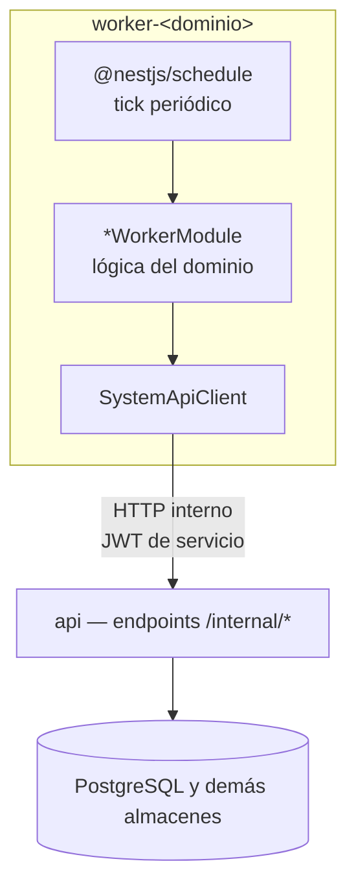

# Procesamiento en segundo plano

> Fase 10. 20 procesos worker, cada uno documentado con evidencia de código
> (`src/worker-<dominio>.ts`, `src/worker/jobs/<dominio>/`).

## Modelo de ejecución

Cada worker es un **`NestFactory.createApplicationContext`** independiente (no HTTP, sin
`listen()`), arrancado por `bootstrapWorker()` (`src/worker/bootstrap.ts`) con
`@nestjs/schedule` (`ScheduleModule.forRoot()`) para los ticks periódicos. Comparten:

- `AuthModule` — autenticación de servicio para llamar a la API.
- `SystemApiClientModule` — cliente HTTP hacia `WORKER_API_BASE_URL` (`/internal/*`),
  timeout `WORKER_HTTP_TIMEOUT_MS` (default 30s).
- `app.enableShutdownHooks()` — apagado ordenado en despliegues (`SIGTERM`).

## Los 20 workers

| Worker | Dominio | Job real (`src/worker/jobs/<dominio>/`) |
|---|---|---|
| `worker-automation` | `automation` | Ticks de reglas de automatización |
| `worker-billing` | `billing` | Dunning (cobranza), facturación periódica |
| `worker-consent` | `consent` | Barrido de expiración de consentimientos (`UC-07-11`) |
| `worker-cross_store_consistency` | `cross_store_consistency` | Reconciliación entre Postgres/Mongo/OpenSearch |
| `worker-delegated_access` | `delegated_access` | Expiración de accesos delegados |
| `worker-health_context` | `health_context` | Ticks de contexto de salud |
| `worker-identity_assurance` | `identity_assurance` | Ticks de verificación de identidad |
| `worker-integrations` | `integrations` | Ticks de integraciones externas |
| `worker-messaging` | `messaging` | Drena el outbox: reclama, despacha, registra acuse |
| `worker-pharmacy_inventory` | `pharmacy_inventory` | Barridos de inventario farmacéutico |
| `worker-promotions` | `promotions` | Expiración/activación de promociones |
| `worker-qa_lab` | `qa_lab` | Ticks de laboratorio de calidad |
| `worker-read_models` | `read_models` | Reconstrucción de proyecciones de lectura |
| `worker-reporting` | `reporting` | Generación periódica de reportes |
| `worker-scheduling` | `scheduling` | Expira holds (`UC-41-07`), promueve lista de espera (`UC-41-12`), despacha recordatorios (`UC-41-14`) |
| `worker-tracking` | `tracking` | Ticks de seguimiento |
| `worker-workflow` | `workflow` | Ticks del motor de workflow |
| `worker-vector_rag` | `vector_rag` | Drena jobs de embedding pendientes, con adapter fail-closed (ver [`EmbeddingJobQueued`/`EmbeddingJobCompleted`](../events/event-catalog.md)) |
| `worker-lakehouse` | `lakehouse` | Cierra `dataset-releases` vencidos (ver [`DatasetReleaseRequested`/`DatasetReleaseRevoked`](../events/event-catalog.md)) |
| `worker-time_series` | `time_series` | Compresión/rollups automáticos de TimescaleDB, retención opt-in por tabla vía `TS_RETENTION_POLICIES` |

**Añadidos durante esta auditoría** (no presentes en el inventario original de Fase 1-12,
incorporados en un commit paralelo al trabajo documental — ver
[nota de reconciliación](../reports/final-validation.md)): `worker-vector_rag`,
`worker-lakehouse`, `worker-time_series`. Confirma el patrón: cada uno de los tres dominios que
más eventos de dominio publican ([catálogo de eventos](../events/event-catalog.md) — `vector_rag`
16, `lakehouse` 12) terminó necesitando su propio worker, coherente con el resto del sistema.

**`graph_intelligence` deliberadamente sin worker propio** — pese a publicar 10 eventos de
dominio (segundo mayor productor de eventos), no tiene un `worker-graph_intelligence`. Razón
documentada en el propio proyecto: requeriría CDC (Change Data Capture) que no existe en el
sistema — construir un worker sin esa base "fabricaría evidencia" de un mecanismo que no procesa
datos reales. Es una decisión de honestidad técnica explícita, no un descuido.

## Por qué no hay broker de mensajería

Ver [contenedores](containers.md) §"Sin broker de mensajería como contenedor propio" —
outbox transaccional propio sobre PostgreSQL, no Kafka/RabbitMQ/BullMQ. Catálogo completo de
colas y eventos: Fase 12 (AsyncAPI).

## Brecha operativa conocida

`ESTADO-Y-PENDIENTES.md` (P0) documenta que la infraestructura base de los 20 workers ya existe,
pero varios jobs siguen dependiendo de completar llamadas externas periódicas (planificadores de
`reporting`, `automation`, `qa_lab`, `health_context`; reconciliación de `cross_store_consistency`,
`graph_intelligence`, `vector_rag`, `lakehouse`, `time_series`). No se documenta aquí como
"completo" lo que el propio equipo registra como trabajo en curso — ver `OPS-001` en
[matriz de trazabilidad](../governance/traceability-matrix.md).
