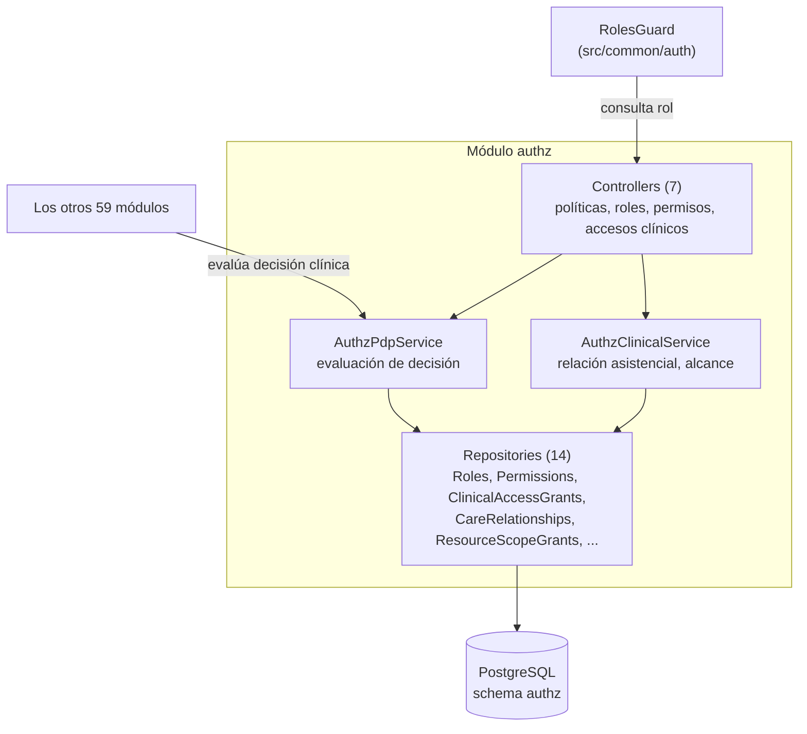
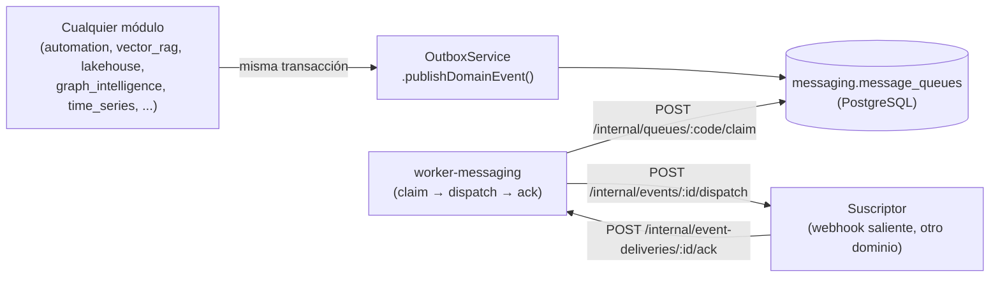
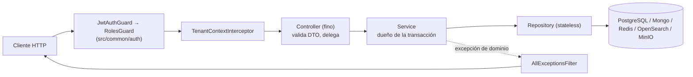

# Componentes (C4 nivel 3) — dominios críticos

> Fase 10. C4 nivel 3 para los dos dominios de mayor centralidad arquitectónica
> ([graphify-audit.md](../reports/graphify-audit.md) §5, §9): `authz` (hub de autorización,
> presente en 71/97 pares de dependencia cruzada) y `messaging` (bus de eventos). El resto de los
> 60 módulos siguen el mismo patrón de capas (controller fino → service → repository) descrito en
> `docs/modules/*` — no se repite el diagrama para cada uno.

## `authz` — autorización

Detalle funcional completo: [módulo `authz`](../modules/authz.md) ·
[autorización](../api/authorization.md).

## `messaging` — bus de eventos (outbox)

Detalle funcional completo: [módulo `messaging`](../modules/messaging.md) · eventos (Fase 12).

## Patrón de capas común (los 58 módulos restantes)

Fuente del patrón: convención documentada en `src/modules/README.md` y verificada en el
[catálogo de módulos](../modules/index.md) (191 controllers, 252 services, 352 repositories sobre
60 módulos, con la misma forma en todos).
