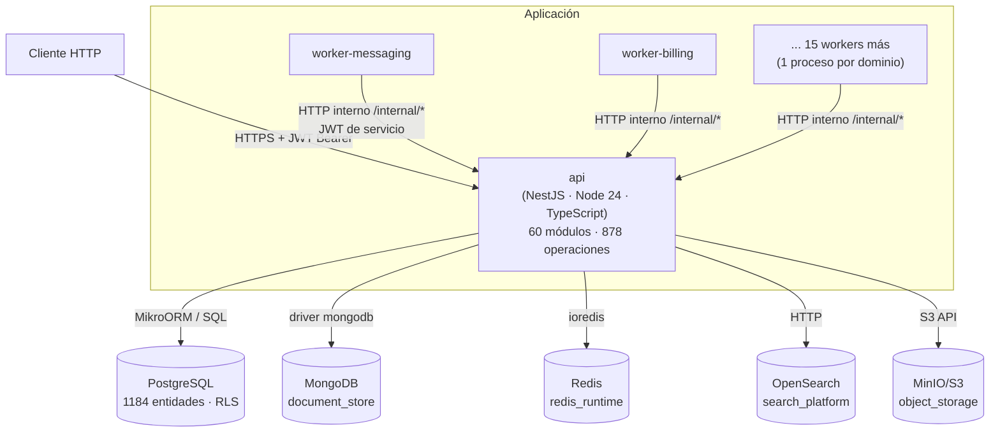

# Contenedores (C4 nivel 2)

> Fase 10. "Contenedor" en sentido C4: unidad de despliegue/ejecución independiente — no
> necesariamente un contenedor Docker, aunque en este sistema coinciden 1:1
> (`docker-compose.yml`).

## Inventario de contenedores

| Contenedor | Tecnología | Responsabilidad | Réplicas esperadas |
|---|---|---|---|
| `api` | NestJS 11 / Node 24 / TypeScript, Express | Único punto de entrada HTTP; 60 módulos de dominio | Horizontal (sin estado propio más allá de la conexión a datos) |
| `worker-<dominio>` ×17 | NestJS `ApplicationContext` + `@nestjs/schedule` | Tick periódico de un dominio; llama a `api` por HTTP, nunca toca la base directamente | 1 por dominio, escalable independientemente |
| `postgres` | PostgreSQL | Almacén transaccional primario, RLS por tenant | Ver estrategia real de HA en `docs/operations/environments.md` (Fase 14) — no verificada en esta fase |
| `mongodb` | MongoDB | Documentos no relacionales (`document_store`) | — |
| `redis` | Redis | Estado efímero/caché (`redis_runtime`) | — |
| `opensearch` | OpenSearch | Búsqueda/indexación (`search_platform`) | — |
| `minio` | MinIO (S3-compatible) | Objetos/archivos (`object_storage`), incluye DICOM | — |

## Por qué `api` y los workers son contenedores separados

Comentario de diseño explícito en `src/worker/bootstrap.ts`: un tick largo o un crash de
`automation` no debe afectar el tick de `messaging`; cada worker escala y se despliega por
separado del resto. Es una decisión de aislamiento de fallos, no de tecnología (los 20 workers
comparten exactamente el mismo framework y `bootstrapWorker()` que la API).

## Sin broker de mensajería como contenedor propio

A diferencia de una arquitectura basada en Kafka/RabbitMQ, la mensajería asíncrona **no tiene
contenedor propio**: es un patrón outbox transaccional sobre el mismo `postgres` (tabla
`messaging.message_queues` y relacionadas), drenado por `worker-messaging`. Catálogo de eventos
detallado en la documentación de eventos (Fase 12).
