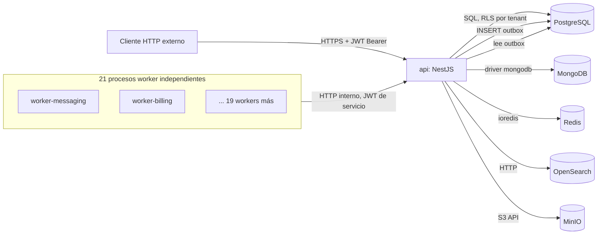

# Mapa de integraciones

> Fase 1. Integraciones reales del sistema: procesos, almacenes de datos y límites de red
> verificados en `docker-compose.yml`, `src/worker/`, `.env.example` y el grafo de Graphify.

## 1. Procesos que componen el sistema en ejecución

| Proceso | Entrypoint | Rol |
|---|---|---|
| `api` | `dist/main.js` (`src/main.ts`) | API HTTP pública (NestJS), 915 operaciones OpenAPI generadas en CI |
| `worker-audio-assets` | `dist/worker-audio-assets.js` | Consumo durable de `audio-generation`, TTS y persistencia en storage propio |
| `worker-billing` | `dist/worker-billing.js` | Ticks periódicos de dominio `billing` |
| `worker-automation` | `dist/worker-automation.js` | Ticks periódicos de dominio `automation` |
| `worker-consent` | `dist/worker-consent.js` | Ticks periódicos de dominio `consent` |
| `worker-cross_store_consistency` | `dist/worker-cross_store_consistency.js` | Reconciliación entre almacenes (Postgres/Mongo/OpenSearch) |
| `worker-delegated_access` | `dist/worker-delegated_access.js` | Expiración de accesos delegados |
| `worker-health_context` | `dist/worker-health_context.js` | Ticks de dominio `health_context` |
| `worker-identity_assurance` | `dist/worker-identity_assurance.js` | Ticks de verificación de identidad |
| `worker-integrations` | `dist/worker-integrations.js` | Ticks de integraciones externas |
| `worker-messaging` | `dist/worker-messaging.js` | Drena la cola de outbox (`message_queues`) y despacha eventos |
| `worker-pharmacy_inventory` | `dist/worker-pharmacy_inventory.js` | Barridos de inventario farmacéutico |
| `worker-promotions` | `dist/worker-promotions.js` | Expiración/activación de promociones |
| `worker-qa_lab` | `dist/worker-qa_lab.js` | Ticks de dominio `qa_lab` |
| `worker-read_models` | `dist/worker-read_models.js` | Reconstrucción de proyecciones de lectura |
| `worker-reporting` | `dist/worker-reporting.js` | Generación periódica de reportes |
| `worker-scheduling` | `dist/worker-scheduling.js` | Expiración de citas/slots |
| `worker-tracking` | `dist/worker-tracking.js` | Ticks de dominio `tracking` |
| `worker-workflow` | `dist/worker-workflow.js` | Ticks de motor de workflow |
| `worker-time_series` | `dist/worker-time_series.js` | Compresión, rollups y retención de TimescaleDB |
| `worker-lakehouse` | `dist/worker-lakehouse.js` | Cierre/reconciliación de releases de lakehouse |
| `worker-vector_rag` | `dist/worker-vector_rag.js` | Drena jobs de embeddings pendientes |

**21 workers**, cada uno un proceso Node independiente y su propio contenedor Docker
(`docker-compose.yml`), montados sobre `bootstrapWorker()` (`src/worker/bootstrap.ts`). Diseño
explícito: aislar el fallo de un dominio (`automation`) del tick de otro (`messaging`), y permitir
escalado/despliegue independiente por dominio (comentario de diseño en el propio código fuente).

**Patrón de acceso a datos de los workers:** no acceden a Postgres/Mongo directamente — llaman a
endpoints `/internal/*` de la API vía HTTP (`SystemApiClientModule`, `WORKER_API_BASE_URL`,
timeout configurable `WORKER_HTTP_TIMEOUT_MS`, por defecto 30s). El worker de `messaging` filtra
qué colas drenar vía `MESSAGING_QUEUE_CODES`.

## 2. Almacenes de datos

| Almacén | Uso | Config | Módulo(s) propietario(s) |
|---|---|---|---|
| PostgreSQL | Almacén transaccional primario (1184 entidades, RLS por tenant) | `DB_HOST`/`POSTGRES_*`, MikroORM | Todos los dominios de negocio |
| MongoDB | Documentos no relacionales | `MONGODB_URI`, `MONGO_DB` | `document_store` |
| Redis | Runtime de caché/estado efímero | `REDIS_HOST`, `REDIS_PORT`, driver `ioredis` | `redis_runtime` |
| OpenSearch | Búsqueda/indexación | `OPENSEARCH_NODE` | `search_platform` |
| MinIO (S3-compatible) | Almacenamiento de objetos/archivos | `MINIO_ENDPOINT`, `MINIO_PORT`, `MINIO_BUCKET`, SDK `@aws-sdk/client-s3` | `object_storage` |

No hay broker de mensajería externo (Kafka/RabbitMQ/NATS/BullMQ no están en `package.json`); la
mensajería asíncrona es un **outbox transaccional propio sobre Postgres**
(`OutboxService.publishDomainEvent`, `src/modules/messaging/`), drenado por `worker-messaging` y
consumido por los workers de dominio que correspondan según el evento y la cola configurada.

## 3. Integraciones externas

`src/modules/integrations` modela conexiones externas como configuración de dominio (entidades
`repositories`/`services` propias), no como credenciales fijas en `.env`: no se encontraron
variables de entorno de gateways de pago, proveedores de mensajería externa o webhooks en
`.env.example`. La referencia real observada en código (`payments-transactions.service.ts`) apunta
a que el secreto de webhook se resuelve dinámicamente desde
`gateway_connections.webhook_secret_ref` (una tabla de configuración por conexión, no una env var
global) — patrón de **integraciones multi-tenant configurables en base de datos**, no integraciones
hardcodeadas por despliegue.

**Brecha documental identificada:** el catálogo completo de proveedores externos soportados
(pasarelas de pago, aseguradoras, laboratorios, etc.) vive en datos de configuración, no en código
ni en este grafo — se documenta como pendiente de completar en `docs/architecture/integration-map.md`
§4 tras inventariar `gateway_connections` y tablas equivalentes en Fase 10 (catálogo de datos).

## 4. Límites de confianza (trust boundaries)

- El único punto de entrada externo autenticado es `api` (JWT Bearer, `helmet()`, CORS
  deshabilitado por defecto — `app.enableCors({ origin: false })`).
- Los workers **no exponen puerto HTTP entrante**: solo salen hacia `api` vía `/internal/*`. Esto
  reduce la superficie de ataque de los 21 procesos worker a "cliente HTTP saliente", relevante
  para el modelo de amenazas (Fase 12).
- `RLS_ENFORCE` (`docker-compose.yml`) controla si Postgres aplica Row-Level Security por tenant;
  su valor real por entorno es una decisión operativa crítica documentada en
  `docs/security/tenant-isolation.md` (Fase 12), coherente con el hallazgo de auditoría previo
  registrado en memoria de sesión ("validar aislamiento por tenant en cada entorno").

## 5. Brechas para fases posteriores

- Catálogo formal de eventos de dominio (nombre, productor, consumidores, esquema) → Fase 11 (AsyncAPI).
- Runbook de arranque/apagado ordenado de los 21 workers → Fase 13 (operación).
- Inventario de proveedores externos reales desde `gateway_connections` y tablas equivalentes → Fase 10.
