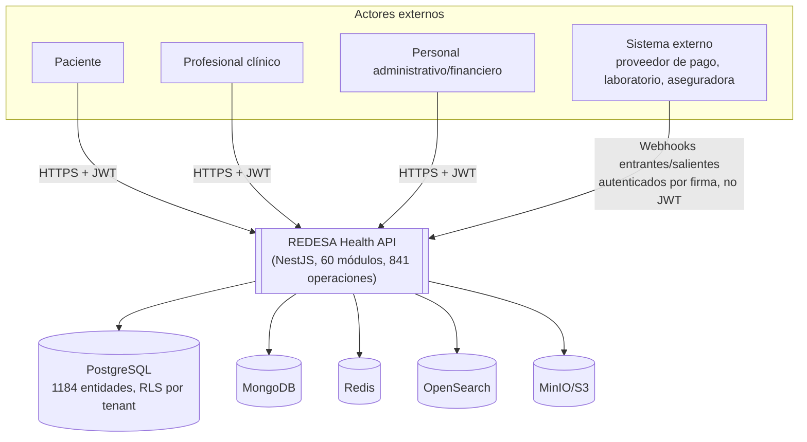

# Contexto del sistema (C4 nivel 1)

> Fase 10.

## Actores

| Actor | Naturaleza | Cómo interactúa |
|---|---|---|
| Paciente | Persona externa | API HTTP autenticada (JWT); algunos endpoints públicos (`/public/*`, ver [autenticación](../api/authentication.md)) |
| Profesional clínico | Persona interna a la organización de salud | API HTTP autenticada, sujeto al PDP clínico aditivo |
| Personal administrativo/financiero | Persona interna | API HTTP autenticada, RBAC por rol |
| Sistema externo (pagos, laboratorio, aseguradora, etc.) | Sistema de terceros | Webhooks entrantes (`/webhooks/providers/{code}/receipts`, `/integrations/webhooks/inbound`) y llamadas salientes desde `integrations`/`payments` |

**120 roles de negocio distintos** consumen la API — ver
[actores y roles](../business/actors-and-roles.md) para el catálogo completo agrupado.

## Frontera del sistema

Todo lo que vive dentro de `docker-compose.yml` (API, 20 workers, 5 almacenes de datos) es
"el sistema". No hay frontend propio en este repositorio — es un backend puro que sirve
cualquier cliente HTTP autenticado.

## Brecha conocida

No se identificó en esta fase un catálogo verificado de sistemas externos reales conectados
(nombres de proveedores de pago, laboratorios, aseguradoras concretas) — las conexiones se
modelan como configuración de dominio (`gateway_connections` y equivalentes), no como
integraciones fijas en código. Ver `docs/architecture/integration-map.md` §3 y `GAP-010` en
[análisis de brechas](../reports/documentation-gap-analysis.md).
