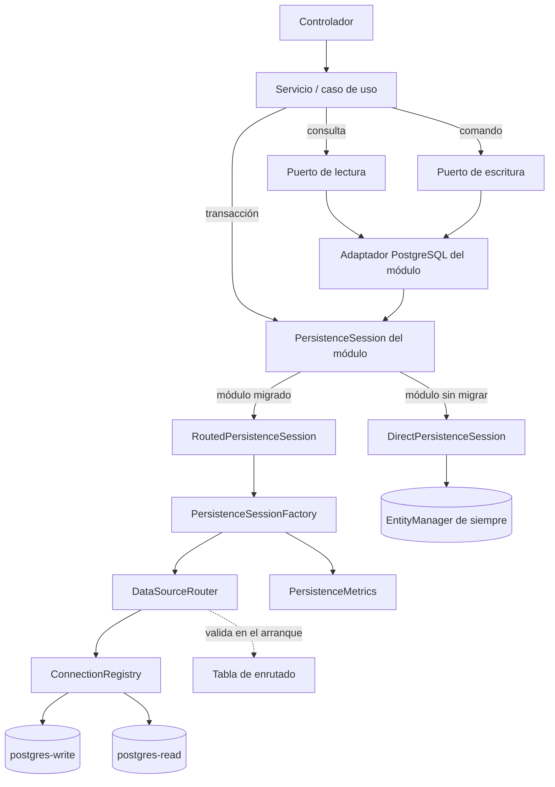

# Rutas de lectura y escritura

> Ver [ADR-0022](../adr/ADR-0022-puertos-persistencia-read-write.md) para la decisión que explica
> esta capa, y [configuración de conexiones](connection-configuration.md) para las variables.

## Qué problema resuelve

Antes de esta capa, cada servicio inyectaba el `EntityManager` de MikroORM y todas las operaciones
—1363 lecturas y 870 escrituras— salían por la misma conexión. Eso tenía tres consecuencias:

1. La capa de aplicación dependía de una clase de infraestructura, así que no había forma de
   cambiar de motor, de proveedor o de credencial sin tocar los 60 módulos.
2. No se podía mandar una consulta pesada a una réplica sin reescribir el servicio que la lanza.
3. Las lecturas se ejecutaban con la misma credencial que las escrituras, así que un bug que
   escribiera desde un camino de solo lectura no tenía forma de manifestarse.

## El recorrido de una operación



El servicio nunca nombra una conexión. Declara **qué módulo es**, **si lee o escribe** y **con qué
consistencia**; el router decide el resto. Si el servicio pudiera nombrar la conexión, la decisión
volvería a estar repartida por el código, que es de lo que se venía.

## Reglas de resolución

| Operación | Consistencia | Destino |
|---|---|---|
| Escritura | — | Conexión de escritura, siempre |
| Transacción | — | Conexión de escritura, siempre |
| Lectura | `eventual` (por defecto) | Conexión de lectura |
| Lectura | `strong` | Conexión de escritura |
| Lectura | `read-after-write` | Conexión de escritura |
| Lectura dentro de una transacción | — | La transacción activa, sin enrutar |

`read-after-write` existe para el caso concreto de «reservo una cita y acto seguido pido mi
agenda». Servir esa lectura desde una réplica con retraso mostraría una agenda sin la cita que el
usuario acaba de crear.

Una lectura dentro de una transacción **no se enruta**: leer fuera de la transacción que está
escribiendo devolvería el estado anterior y, con réplica, el de un servidor que aún no ha visto
nada.

## Escenarios de despliegue soportados

| Escenario | Configuración | Pools |
|---|---|---|
| Una sola conexión (por defecto) | Ninguna variable nueva | 1 |
| Mismo servidor, roles distintos | `DB_READ_USER` / `DB_READ_PASSWORD` | 2 |
| Primaria y réplica | `POSTGRES_READ_URL` a otro host | 2 |
| Proveedores distintos | `POSTGRES_READ_URL` y `POSTGRES_WRITE_URL` | 2 |

La detección es automática: se compara una **huella sanitizada** de cada conexión —motor, host,
puerto, base, usuario y modo TLS, nunca la contraseña— y, si coinciden, se publica una única
instancia bajo los dos nombres lógicos. Abrir un segundo pool por costumbre duplicaría las
conexiones contra el servidor y, con 1184 entidades, también la metadata en memoria.

El **usuario entra en la huella** a propósito: `mantra_reader` y `mantra_writer` contra el mismo
servidor y la misma base son conexiones distintas porque tienen privilegios distintos. Compartir
pool entre ambos anularía el mínimo privilegio entero.

## Validación en el arranque

El router valida su tabla al construirse, es decir, antes de que el proceso acepte tráfico. Aborta
si:

- una ruta nombra una conexión que no está registrada;
- una escritura apunta a una conexión declarada de solo lectura;
- cualquier ruta apunta a la conexión administrativa;
- una ruta exige una capacidad que el motor destino no ofrece (por ejemplo, transacciones).

Un enrutado que manda escrituras a la réplica no falla al configurarse: falla la primera vez que
alguien reserva una cita, en producción, con un error del motor que nadie relaciona con un fichero
de configuración. Por eso se valida temprano.

## Fallback de lectura

`DATA_READ_FALLBACK` controla qué pasa si la conexión de lectura falla:

- **`fail-fast`** (por defecto): el fallo se propaga.
- **`fallback-to-primary`**: se reintenta en la primaria y se registra el desvío con motivo,
  conexión original, conexión de destino y duración.

El desvío solo ocurre ante un fallo **de conexión**. Un `23505` o un error de sintaxis fallarían
igual contra la primaria, así que reintentarlos allí solo duplicaría la carga y el ruido.

El valor por defecto es `fail-fast` por dos razones, y ninguna es la comodidad. El desvío cambia la
consistencia de la lectura sin que nadie lo haya pedido; y cuando la separación es por rol, haría
que las lecturas se ejecutaran con la credencial de **escritura**, que es una escalada de
privilegios silenciosa.

## Migración progresiva

`PERSISTENCE_PORTS_MODULES` lista los módulos que ya operan por el enrutado nuevo. Los ausentes
siguen usando el `EntityManager` de siempre.

```bash
# activar el piloto
PERSISTENCE_PORTS_MODULES=scheduling

# revertirlo, sin desplegar código
PERSISTENCE_PORTS_MODULES=
```

Es un flag **por módulo** y no global porque la migración es módulo a módulo: un interruptor único
obligaría a mover los 60 a la vez.

Las dos implementaciones de `PersistenceSession` están cubiertas por una **suite de contrato
común** (`persistence-session.contract.spec.ts`). No es una formalidad: si el camino de vuelta
tuviera semántica distinta, el flag no sería una red de seguridad sino un tercer comportamiento.

### Cómo migrar un módulo

1. Definir los puertos en `src/modules/<módulo>/ports/`, con nombres de negocio y **modelos de
   lectura propios** — nunca entidades del ORM.
2. Implementar el adaptador en `src/modules/<módulo>/adapters/`, reutilizando el repositorio
   existente en vez de reescribir sus consultas.
3. Registrar `createPersistenceSessionProvider('<módulo>')` y los puertos en el módulo de Nest.
4. Cambiar el servicio para que dependa de los puertos y abra transacciones por la sesión.
5. Añadir el módulo a `PERSISTENCE_PORTS_MODULES` en un entorno de prueba antes que en producción.

## Observabilidad

`GET /health/data-sources` (requiere autenticación) informa del estado de cada conexión, cuántos
pools distintos hay y el enrutado vigente. No expone host, usuario, base ni cadena de conexión: un
health check suele ser el endpoint menos protegido de un servicio.

`GET /health/data-sources/metrics` devuelve, por conexión: operaciones totales, lecturas,
escrituras, errores por tipo normalizado, desvíos por consistencia, desvíos por fallo, tiempo
acumulado y máximo.

## Estado real

El piloto es **un solo módulo** (`scheduling`, servicio de lista de espera y recordatorios). Los
otros 59 siguen con el acoplamiento anterior. Los roles `mantra_reader` y `mantra_writer` existen
y están verificados, pero **ningún despliegue tiene `DB_READ_USER` fijado todavía**: la separación
de credenciales es hoy una capacidad disponible, no un hecho en producción.
