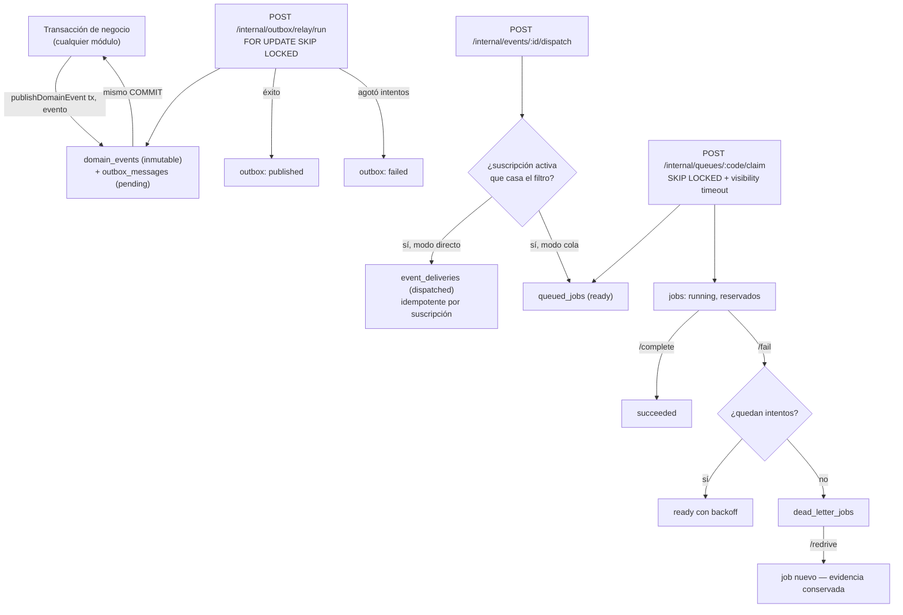

# Eventos — visión general

> Fase 12. El mecanismo real: outbox transaccional propio (ver
> [ADR-0007](../adr/ADR-0007-eventos-sin-broker-externo.md),
> [ADR-0019](../adr/ADR-0019-patron-outbox.md)), implementado en el módulo `messaging`
> (`src/modules/messaging/README.md`). Esta página resume el mecanismo; el catálogo de eventos
> reales está en [event-catalog.md](event-catalog.md).

## Por qué `messaging` "desbloquea a los demás"

Cita textual del propio README del módulo: *"Los 17 módulos de la tanda A declaran sus eventos en
el 'Pendiente' de su README porque no había dónde publicarlos. `OutboxService` es esa API."* —
`messaging` no es un dominio de negocio más entre 60: es la infraestructura de eventos que el
resto del sistema consume.

## Flujo end-to-end

## Los tres sub-mecanismos

1. **Outbox de eventos de dominio** — `domain_events` + `outbox_messages`, publicados dentro de la
   misma transacción del cambio que los origina.
2. **Colas de trabajo genéricas** — `message_queues` + `queued_jobs`, con `SKIP LOCKED`,
   `visibility_timeout_s` configurable por cola, y `dead_letter_queue_id` (cada cola puede
   encadenar a su propia cola muerta).
3. **Notificación multicanal consciente del consentimiento** — `notification_requests` respeta
   opt-in/horas de silencio (`recipient_preferences`), deduplica por `debounce key`, y concilia
   acuses reales del proveedor (`POST /webhooks/providers/:code/receipts`).

## Por qué `UC-35-01` no tiene endpoint HTTP

`OutboxService.publishDomainEvent()` es intencionalmente **interno**, invocado en proceso dentro
de la transacción del módulo productor — exponerlo por HTTP rompería la garantía central: el
evento debe confirmarse en el mismo commit que el cambio que describe, no en una llamada HTTP
aparte que podría fallar independientemente.

## Ver también

- [Catálogo de eventos](event-catalog.md)
- [Semántica de entrega](delivery-semantics.md)
- [Reintentos y cola muerta](retries-and-dlq.md)
- [Guía para consumidores](consumer-guidelines.md)
- [`asyncapi/asyncapi.yaml`](https://github.com/mdavila-2001/mantra-core-health-redesa-api/blob/master/asyncapi/asyncapi.yaml)
