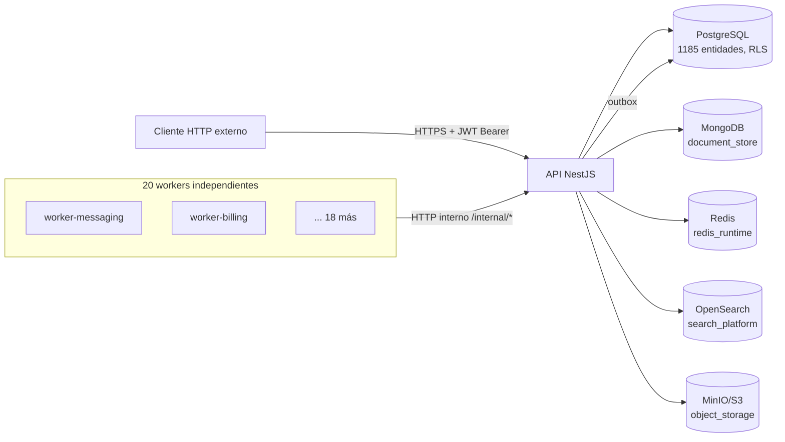

# REDESA Health API

Backend del ecosistema de salud REDESA (Mantra Core Technologies): una API NestJS modular de
**60 módulos de negocio documentados** (más el grupo raíz `app`), **869 operaciones HTTP**
documentadas en OpenAPI, sobre PostgreSQL con aislamiento por tenant, complementada por MongoDB,
Redis, OpenSearch, MinIO y **20 procesos
worker** independientes.

Esta documentación se genera y verifica junto al código: cada afirmación técnica aquí es
rastreable a un archivo, un comando o una prueba real — no hay contenido genérico ni
funcionalidad documentada que no exista. Ver el mandato completo en
[`PLAN_MAESTRO_DOCUMENTACION_BACKEND_PRODUCCION.md`](https://github.com/mdavila-2001/mantra-core-health-redesa-api/blob/master/PLAN_MAESTRO_DOCUMENTACION_BACKEND_PRODUCCION.md).

**Última reconciliación del contrato:** `0.0.1`, 2026-07-31. Ver
[reportes de auditoría](reports/baseline.md) para el detalle de cómo se verificó.

## Diagrama de contexto

Detalle completo: [visión general de arquitectura](architecture/overview.md) ·
[mapa de integraciones](architecture/integration-map.md) ·
[dependencias entre módulos](architecture/module-dependencies.md) ·
[decisiones arquitectónicas (ADR)](adr/index.md).

## Capacidades principales

60 módulos agrupados en grandes áreas de negocio — catálogo completo, con métricas reales de cada
uno, en [catálogo de módulos](modules/index.md). Áreas destacadas: identidad y acceso (`iam`,
`authz`, `auth_providers`, `identity_assurance`), clínica (`clinical`, `clinical_ext`,
`diagnostics`, `pharmacy`, `procedures_perioperative`), operación de práctica (`practice`,
`scheduling`, `billing`, `accounting`, `insurance`), y una capa de datos/integración transversal
(`messaging`, `read_models`, `lakehouse`, `vector_rag`, `integrations`).

## Enlaces rápidos

| Quiero...                                      | Ir a                                                                                                                                                                                            |
| ---------------------------------------------- | ----------------------------------------------------------------------------------------------------------------------------------------------------------------------------------------------- |
| Ejecutar el backend en local                   | [Arranque local](getting-started/local-setup.md)                                                                                                                                                |
| Ver el contrato de la API                      | `/reference` (Scalar) o `/docs` (Swagger UI) con el servidor arriba, o [`openapi/openapi.yaml`](https://github.com/mdavila-2001/mantra-core-health-redesa-api/blob/master/openapi/openapi.yaml) |
| Entender la autenticación/autorización         | [Autenticación](api/authentication.md) · [Autorización](api/authorization.md)                                                                                                                   |
| Entender el modelo de error                    | [Modelo de error](api/error-model.md)                                                                                                                                                           |
| Saber qué flujos están verificados para el front | [Flujos verificados](api/flujos-verificados-frontend.md)                                                                                                                                      |
| Ver un módulo de negocio concreto              | [Catálogo de módulos](modules/index.md)                                                                                                                                                         |
| Entender cómo se relacionan los módulos        | [Dependencias entre módulos](architecture/module-dependencies.md)                                                                                                                               |
| Ver qué se auditó y cómo                       | [Línea base](reports/baseline.md) · [Auditoría Graphify](reports/graphify-audit.md)                                                                                                             |
| Ver el estado real para producción             | [Auditoría de producción 2026-07-31](reports/production-readiness-2026-07-31.md)                                                                                                                |
| Ver brechas documentales conocidas y su estado | [Análisis de brechas](reports/documentation-gap-analysis.md)                                                                                                                                    |
| Ver riesgos y su trazabilidad                  | [Matriz de trazabilidad](governance/traceability-matrix.md)                                                                                                                                     |
| Responder a un incidente en producción         | [Runbooks](operations/runbooks/index.md)                                                                                                                                                        |
| Ver qué se corrigió antes de documentar        | [Corrección de inconsistencias](reports/inconsistency-remediation.md)                                                                                                                           |
| Probar la API sin Scalar                       | [Colección Postman](postman/README.md)                                                                                                                                                          |

## Cómo consumir la API

1. Autenticarse: `POST /iam/auth/login` (público) → token JWT.
2. Enviar `Authorization: Bearer <token>` en cada request subsecuente.
3. Explorar operaciones por módulo en `/reference` (Scalar) — genera ejemplos de código.
4. Ver [convenciones de API](api/conventions.md) para paginación, idempotencia y formato de error.

## Estado de esta documentación

Este portal se construye por fases, siguiendo el plan maestro. Estado actual — ver
[matriz de trazabilidad](governance/traceability-matrix.md) para el detalle vivo de qué está
completo, qué está aceptado como limitación conocida, y qué sigue abierto. No se declara
"completo" hasta que la Fase 18 (auditoría final) lo confirme con evidencia.
