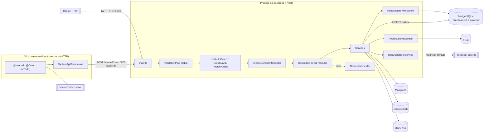

# 00 · Auditoría del estado actual (previa a OpenTelemetry)

> Fase 0 de la iniciativa de trazabilidad distribuida. Este documento describe **lo que el
> repositorio tiene hoy**, antes de instalar ninguna dependencia de OpenTelemetry. Nada de lo
> aquí descrito es aspiracional: cada afirmación se apoya en un archivo concreto del repo.

## 1. Resumen de la arquitectura detectada

| Aspecto | Valor real detectado | Evidencia |
| --- | --- | --- |
| Framework | NestJS 11 | `package.json` → `@nestjs/core@^11` |
| Adaptador HTTP | **Express** (no Fastify) | `@nestjs/platform-express`, `import { json, urlencoded } from 'express'` en `src/main.ts` |
| Lenguaje / módulos | TypeScript 5.7, `module: nodenext` sin `"type": "module"` → **salida CommonJS** | `tsconfig.json`, `package.json` |
| Runtime | Node 24 (`v24.18.0` local; `node:24-bookworm-slim` en la imagen) | `Dockerfile` |
| Gestor de paquetes | **Yarn 4.14.1 Berry**, `nodeLinker: node-modules` | `package.json` → `packageManager`, `.yarnrc.yml` |
| ORM | **MikroORM 7 (PostgreSQL)** — *no Sequelize* | `@mikro-orm/postgresql`, `src/orm/config/orm.config.ts` |
| Driver SQL real | `pg` 8 (usado por MikroORM y directamente en el harness de pruebas) | `package.json`, `test/integration/harness.ts` |
| Cliente Redis | **ioredis 5** | `src/modules/redis_runtime/redis.provider.ts` |
| Otros almacenes | MongoDB 7 (`document_store`), OpenSearch 3 (`search_platform`), S3/MinIO (`@aws-sdk/client-s3`) | `src/modules/*` |
| HTTP saliente | `@nestjs/axios` (3 módulos de worker) + `axios` directo (despacho firmado de webhooks) | `src/worker/*-client.module.ts`, `src/common/http/http-dispatcher.service.ts` |
| Logs | **pino 10 + nestjs-pino 4 + pino-http 11** | `src/logging/` |
| Sistema de colas | **No hay Bull/BullMQ/Kafka/RabbitMQ.** Patrón *outbox* en PostgreSQL + polling HTTP | ADR-0019, `src/worker/jobs/messaging/outbox-relay.job.ts` |
| Programación | `@nestjs/schedule` (`@Interval`/`@Cron`) — **solo dentro de los procesos worker** | 30 archivos bajo `src/worker/jobs/**` |
| Microservicios Nest | No se usa `@nestjs/microservices` | ausencia en `package.json` |
| WebSockets | No se usa `@nestjs/websockets` | ausencia en `package.json` |
| Health checks | `GET /health` público en `AppController` (sin `@nestjs/terminus` activo) | `src/app.controller.ts` |
| Configuración | `@nestjs/config` global + esquemas Joi concatenados por dominio | `src/app.module.ts`, `src/*/*.env.ts` |
| Pruebas | Jest 30 en **modo ESM** (`--experimental-vm-modules`), 4 configuraciones | `package.json`, `test/jest-*.json` |
| CI | `.github/workflows/docs.yml` (solo gate documental) | `.github/workflows/` |

## 2. Procesos ejecutables

El backend **no es un solo proceso**. Son **21 procesos Node independientes** que comparten la
misma imagen Docker y se diferencian por el `command`:

1. **`api`** — `dist/src/main.js`. Servidor HTTP Express con los 61 módulos de dominio.
2. **20 workers** — `dist/src/worker-<dominio>.js`, uno por dominio
   (`automation`, `billing`, `consent`, `cross_store_consistency`, `delegated_access`,
   `health_context`, `identity_assurance`, `integrations`, `lakehouse`, `messaging`,
   `pharmacy_inventory`, `promotions`, `qa_lab`, `read_models`, `reporting`, `scheduling`,
   `time_series`, `tracking`, `vector_rag`, `workflow`).

Cada entrypoint de worker es una sola línea:

```ts
// src/worker-messaging.ts
import { bootstrapWorker } from './worker/bootstrap';
import { MessagingWorkerModule } from './worker/jobs/messaging/messaging.worker-module';
void bootstrapWorker(MessagingWorkerModule, 'messaging');
```

`bootstrapWorker` (`src/worker/bootstrap.ts`) crea un **contexto de aplicación sin servidor HTTP**
(`NestFactory.createApplicationContext`) con `ConfigModule`, `LoggingModule`, `AuthTokenModule`,
los tres clientes HTTP y `ScheduleModule.forRoot()`. Es el **único punto compartido** por los 20
workers, y por tanto el punto natural de inserción de telemetría para todos ellos.

### Punto exacto de arranque de cada proceso

| Proceso | Entrypoint | Primera importación actual |
| --- | --- | --- |
| API | `src/main.ts` → `bootstrap()` | `@nestjs/common` |
| Worker (×20) | `src/worker-<dominio>.ts` | `./worker/bootstrap` |

Ambos son los lugares donde debe insertarse la importación del bootstrap de telemetría, **antes**
de cualquier otra importación (requisito de la instrumentación automática, que parchea módulos en
el momento de su carga).

## 3. Flujo actual del sistema



**Observación central:** la comunicación worker → API es **HTTP saliente iniciada por el worker**,
no un broker. Eso significa que la propagación de contexto entre procesos no requiere un carrier
de mensajería: basta con que la instrumentación HTTP inyecte `traceparent` en la petición del
worker y que la API lo extraiga. El carrier de mensajería **sí** hace falta para el otro salto: el
evento que la API escribe en el outbox y que un worker recoge minutos después (ver §7).

## 4. Puntos de instrumentación identificados

| # | Punto | Archivo | Tipo |
| --- | --- | --- | --- |
| 1 | Arranque de la API | `src/main.ts` | bootstrap del SDK |
| 2 | Arranque de los 20 workers | `src/worker/bootstrap.ts` + `src/worker-*.ts` | bootstrap del SDK |
| 3 | Peticiones HTTP entrantes | auto (`http` + `express` + `nestjs-core`) | automática |
| 4 | Controllers / handlers | auto (`@opentelemetry/instrumentation-nestjs-core`) | automática |
| 5 | Consultas SQL | auto (`instrumentation-pg`; MikroORM usa `pg` por debajo) | automática |
| 6 | Redis | auto (`instrumentation-ioredis`) | automática |
| 7 | HTTP saliente (workers y webhooks) | auto (`instrumentation-http`; axios usa `http`/`https`) | automática |
| 8 | Logs | `src/logging/pino-options.ts` (`mixin`) | manual, en la config de pino |
| 9 | Errores | `src/common/filters/all-exceptions.filter.ts` | manual |
| 10 | Cabecera de respuesta `x-trace-id` | nuevo interceptor global | manual |
| 11 | Ticks de worker (traza raíz) | `src/worker/run-tick.util.ts` | manual — punto único para los 30 jobs |
| 12 | Publicación/consumo de eventos outbox | `messaging` (publicación) y `outbox-relay.job.ts` (consumo) | manual, con carrier |
| 13 | Operaciones de negocio críticas | services de `iam`, `messaging`, `scheduling`, `billing`, … | manual |

`src/worker/run-tick.util.ts` es un hallazgo importante: **los 30 jobs programados pasan por esa
única función**. Instrumentarla da traza raíz a todos los cron/interval del sistema sin tocar 30
archivos.

## 5. Dependencias involucradas y su instrumentación disponible

| Tecnología presente | Instrumentación OTel | Decisión preliminar |
| --- | --- | --- |
| `http` / `https` | `@opentelemetry/instrumentation-http` | activar (entrante + saliente) |
| Express | `@opentelemetry/instrumentation-express` | activar |
| NestJS | `@opentelemetry/instrumentation-nestjs-core` | activar |
| `pg` | `@opentelemetry/instrumentation-pg` | activar |
| `ioredis` | `@opentelemetry/instrumentation-ioredis` | activar |
| `pino` | `@opentelemetry/instrumentation-pino` | **no activar**: se inyecta `trace_id` con un `mixin` propio, que evita el doble parcheo del logger y mantiene el control del nombre de los campos |
| MongoDB | `@opentelemetry/instrumentation-mongodb` | activar (barato, cubre `document_store`) |
| `fs`, `dns`, `net` | disponibles en `auto-instrumentations-node` | **desactivar**: ruido masivo sin valor diagnóstico |
| MikroORM | sin instrumentación oficial | cubierto indirectamente por `pg`; no se añade capa propia |
| OpenSearch / AWS SDK | `instrumentation-aws-sdk` cubre S3; OpenSearch no tiene oficial | S3 vía auto-instrumentación; OpenSearch queda como span manual si hace falta |

## 6. Estrategia de configuración actual

- `ConfigModule.forRoot({ isGlobal: true, validationSchema })` con esquemas Joi **concatenados**:
  `ormEnvSchema.concat(loggingEnvSchema).concat(authEnvSchema).concat(storageEnvSchema)` en
  `AppModule`; `authEnvSchema.concat(loggingEnvSchema).concat(workerEnvSchema)` en los workers.
- Patrón establecido por dominio: `src/<dominio>/<dominio>.env.ts` exporta un `Joi.object()` y una
  función pura `load<Dominio>Env(source = process.env)`.
- **Precedente relevante**: `src/logging/logging.env.ts` documenta explícitamente por qué el
  logging usa una función pura y no un proveedor inyectable — «el logger se construye al evaluar
  `LoggingModule`, antes de que exista el contenedor de dependencias de NestJS». La telemetría
  tiene exactamente la misma restricción, y con más fuerza: se inicializa antes incluso de que se
  importe NestJS. La configuración de telemetría debe seguir ese mismo patrón.

## 7. Correlación y propagación existentes

| Capacidad | Estado hoy |
| --- | --- |
| Request ID | **Sí** — `req.id` generado por `pino-http`, expuesto como `correlationId` en el cuerpo de error (`AllExceptionsFilter`) |
| Correlación log ↔ respuesta de error | **Sí**, dentro de una sola petición |
| Propagación entre procesos | **No** — las llamadas `/internal/*` del worker no llevan cabecera de traza |
| Propagación asíncrona (outbox) | **No** — `messaging.outbox_messages` no guarda contexto de traza |
| Contexto de tenant por petición | **Sí** — `runWithTenant` sobre `AsyncLocalStorage` (`src/common/tenant/tenant-context.ts`) |

El propio `docs/observability/tracing.md` ya documentaba esta brecha y su coste: reconstruir el
camino «pedido creado → evento publicado → email entregado» exige hoy correlacionar a mano varios
logs por `aggregateId`/`domainEventId`.

## 8. Datos sensibles: superficie de riesgo

Es un backend **de salud** (PHI) con datos de identidad y facturación. Riesgos concretos:

| Vector | Riesgo | Mitigación existente | Acción requerida |
| --- | --- | --- | --- |
| Cabecera `Authorization` | Bearer JWT en claro | `REDACT_PATHS` en pino | la instrumentación HTTP **no debe** capturar cabeceras por defecto |
| Cookies | sesión | `REDACT_PATHS` en pino | ídem |
| Cuerpos de petición/respuesta | PHI completa | pino no los registra | **prohibido** capturarlos como atributos de span |
| Parámetros SQL | diagnósticos, documentos de identidad | — | `instrumentation-pg` con `enhancedDatabaseReporting: false` (el valor por defecto no captura parámetros) |
| Valores en Redis | PHI cacheada | — | `instrumentation-ioredis` con `dbStatementSerializer` que emite solo el comando, no los argumentos |
| Rutas con IDs (`/patients/:id`) | identificadores en el nombre del span | — | la instrumentación de Express/Nest usa la **plantilla** de ruta, no la URL concreta; se verifica en la Fase 4 |
| Query strings | tokens de descarga firmados (`DOWNLOAD_URL_SECRET`) | — | no exportar `url.query` |
| Excepciones | mensajes de error con SQL/valores | el filtro ya oculta el detalle al cliente | registrar `exception.type` y `exception.message`, nunca el objeto completo |

## 9. Endpoints que deben excluirse del muestreo

Superficie real del proyecto (no una lista genérica):

| Ruta | Motivo |
| --- | --- |
| `/health` | sonda de liveness, ejecutada cada 10 s por Docker y por el orquestador |
| `/docs`, `/docs-json` | Swagger UI (solo fuera de producción) |
| `/reference` | Scalar API Reference |
| `/favicon.ico` | ruido de navegador |

Se dejan también preparadas `/healthz`, `/ready`, `/readiness`, `/liveness` y `/metrics` aunque
hoy no existan, para que la incorporación futura de `@nestjs/terminus` no reintroduzca ruido.

## 10. Arquitectura de despliegue

- **Local / desarrollo**: `docker-compose.yml` con 27 servicios en la red `mantra-redesa-network`:
  `postgres` (timescaledb-ha pg18), `postgres-init`, `mongodb`, `mongo-init`, `redis`,
  `opensearch`, `opensearch-init`, `minio`, `mock-provider-server`, `api` y los 20 workers.
- Una **única imagen** (`mantra-redesa-api:local`) para API y workers; cambia solo `command`.
- Variables compartidas por el ancla YAML `x-app-env`, con límites de recursos por
  `x-api-resources` / `x-worker-resources`.
- Usuario no root (`nodeapp`), `NODE_ENV=production` en la imagen.
- No hay manifiestos de Kubernetes ni pipeline de despliegue en el repo: el despliegue documentado
  es Docker Compose (ADR-0014).

## 11. Riesgos de compatibilidad identificados

| # | Riesgo | Impacto | Mitigación adoptada |
| --- | --- | --- | --- |
| R1 | La instrumentación automática exige cargarse **antes** que los módulos parcheados. `src/main.ts` importa NestJS en la línea 1 | Sin esto, cero spans automáticos | importación de efecto lateral en la primera línea de `main.ts` y de `worker/bootstrap.ts` |
| R2 | Jest corre en **modo ESM** con `ts-jest`; el SDK de OTel es CJS | Pruebas rotas o SDK duplicado | las pruebas unitarias **no** cargan el bootstrap; usan `NodeTracerProvider` + `InMemorySpanExporter` construidos en el propio test |
| R3 | Doble inicialización del SDK (p. ej. un worker que importara `main.ts`) | Spans duplicados | guarda de idempotencia por módulo (`let sdk` a nivel de módulo) |
| R4 | Jaeger caído o lento | Latencia añadida a las peticiones de negocio | `BatchSpanProcessor` (exportación asíncrona fuera de la ruta de la petición) + `OTEL_EXPORT_TIMEOUT_MS` acotado; los errores del exportador se degradan a diagnóstico, no se propagan |
| R5 | 21 procesos × exportador propio | 21 conexiones a Jaeger | aceptable en desarrollo; en producción, Collector como agregador (Fase 15) |
| R6 | El lint del repo tiene ~22 500 errores preexistentes (`docs/reports/baseline.md`) | `yarn lint` no puede usarse como semáforo global | se verifica el lint **solo sobre los archivos nuevos** |
| R7 | `enableShutdownHooks()` ya registra manejadores de `SIGTERM`/`SIGINT` | Un `process.exit()` desde telemetría cortaría el drenaje | el cierre del SDK **no** llama a `process.exit`; se engancha a `beforeExit`/señales sin terminar el proceso |
| R8 | `helmet()` y CORS ya fijan cabeceras | Un header nuevo podría chocar | `x-trace-id` no colisiona con ninguna cabecera existente |
| R9 | Las pruebas de integración levantan `AppModule` completo | Si el módulo de observabilidad exigiera Jaeger, romperían | el módulo funciona con `OTEL_ENABLED=false` y sin exportador |

## 12. Plan de implementación adaptado a este repositorio

| Fase | Adaptación concreta a este repo |
| --- | --- |
| 1 · Diseño | Nombres `redesa-api` / `redesa-worker-<dominio>`; namespace `redesa` |
| 2 · Dependencias | Instrumentaciones **individuales**, no el meta-paquete `auto-instrumentations-node`: evita arrastrar ~40 instrumentaciones (Kafka, gRPC, MySQL…) que este backend no usa |
| 3 · Bootstrap | `src/observability/telemetry.bootstrap.ts`, importado en la línea 1 de `src/main.ts` y de `src/worker/bootstrap.ts` |
| 4 · Automática | 6 instrumentaciones activas; `fs`/`dns`/`net` fuera |
| 5 · Módulo Nest | `ObservabilityModule` global, para que los 61 módulos inyecten `TracingService` sin reimportar |
| 6 · Logs | `mixin` en `buildPinoOptions()` — un solo punto para API y workers |
| 7 · Errores | Enganche en `AllExceptionsFilter`, sin alterar el contrato de error existente |
| 8 · Negocio | Spans en `iam` (login/registro), `messaging` (outbox), `scheduling`, `billing` |
| 9 · SQL | `instrumentation-pg`; se verifica que MikroORM no genere spans duplicados |
| 10 · Redis | `instrumentation-ioredis` con serializador que no expone argumentos |
| 11 · HTTP saliente | Verificar `traceparent` en `SystemApiClient` y `HttpDispatcherService` |
| 12 · Colas | Carrier `_trace` en el payload del outbox; span PRODUCER al publicar, CONSUMER al relevar |
| 13 · Cron | Instrumentación única en `runTick()` |
| 14 · Docker | `docker-compose.jaeger.yml` independiente + servicio opcional en el compose principal |
| 15 · Collector | `infra/otel-collector/otel-collector.config.yml` |
| 16-18 · Prod/muestreo/privacidad | Documentos; OpenSearch ya existe en el stack y es backend soportado por Jaeger |
| 19-21 · Pruebas | Unitarias con `InMemorySpanExporter`; integración sobre el harness existente; E2E con `scripts/verify-jaeger.sh` |
| 22-25 · Cierre | Medición real con `autocannon`/`ab` si están disponibles; en caso contrario se declara no medido |

## 13. Archivos que serán creados o modificados

### Se crearán

```text
src/observability/{index,telemetry.config,telemetry.constants,telemetry.types,
                   telemetry.bootstrap,telemetry.shutdown,instrumentations,
                   observability.module,tracing.service,trace-context.service,
                   trace-response.interceptor,messaging-trace.service}.ts
src/observability/*.spec.ts
test/integration/observability.int-spec.ts
docker-compose.jaeger.yml
infra/otel-collector/otel-collector.config.yml
scripts/verify-jaeger.sh
docs/observability/0{0,1,2,3,4,5,6}-*.md, docs/observability/README.md
docs/adr/ADR-0020-trazas-opentelemetry-jaeger.md
```

### Se modificarán

| Archivo | Modificación |
| --- | --- |
| `src/main.ts` | primera línea: importación del bootstrap de telemetría |
| `src/worker/bootstrap.ts` | ídem + `ObservabilityModule` + nombre de servicio por worker |
| `src/app.module.ts` | importar `ObservabilityModule` y registrar `TraceResponseInterceptor` |
| `src/logging/pino-options.ts` | `mixin` con `trace_id`/`span_id`/`trace_flags` |
| `src/common/filters/all-exceptions.filter.ts` | registrar la excepción en el span activo |
| `src/worker/run-tick.util.ts` | traza raíz por tick |
| `src/worker/system-api-client.service.ts` | verificación de propagación (sin cambio funcional) |
| `package.json` | dependencias + scripts `jaeger:*` |
| `.env.example` | bloque `OTEL_*` |
| `docker-compose.yml` | variables `OTEL_*` en `x-app-env` + servicio `jaeger` opcional |
| `Dockerfile` | copia de `scripts/` no requerida; sin cambios salvo documentación |
| `README.md` | sección de trazas |
| `docs/observability/tracing.md` | reescritura: la brecha queda cerrada |
| `docs/adr/ADR-0010-observabilidad-pino.md` | referencia cruzada al nuevo ADR |

### Que **no** deben modificarse

- `database/**` — el esquema SQL canónico. La propagación por outbox **no** añade columnas: el
  carrier viaja dentro del payload JSON del evento ya existente.
- `src/orm/catalog/**` y `src/orm/fidelity/**` — el catálogo declarativo y su verificador.
- Los 61 `src/modules/*/entities/**`.
- Cualquier regla de negocio, DTO, guard o política de autorización.
- `mock-provider-server/` — proyecto independiente, fuera del alcance.
- `.github/workflows/docs.yml` — gate documental, no relacionado.

## 14. Criterio de aceptación de esta fase

Se entiende cómo arranca cada uno de los 21 procesos, qué bibliotecas usa cada uno y dónde debe
insertarse la telemetría sin alterar la lógica de negocio. **Cumplido.** El diseño derivado de
esta auditoría está en [01-architecture-design.md](01-architecture-design.md).

## Ver también

- [Diseño de la arquitectura de observabilidad](01-architecture-design.md)
- [Guía para desarrolladores](README.md)
- [ADR-0010 — Observabilidad con Pino](../adr/ADR-0010-observabilidad-pino.md)
- [ADR-0019 — Patrón outbox](../adr/ADR-0019-patron-outbox.md)
