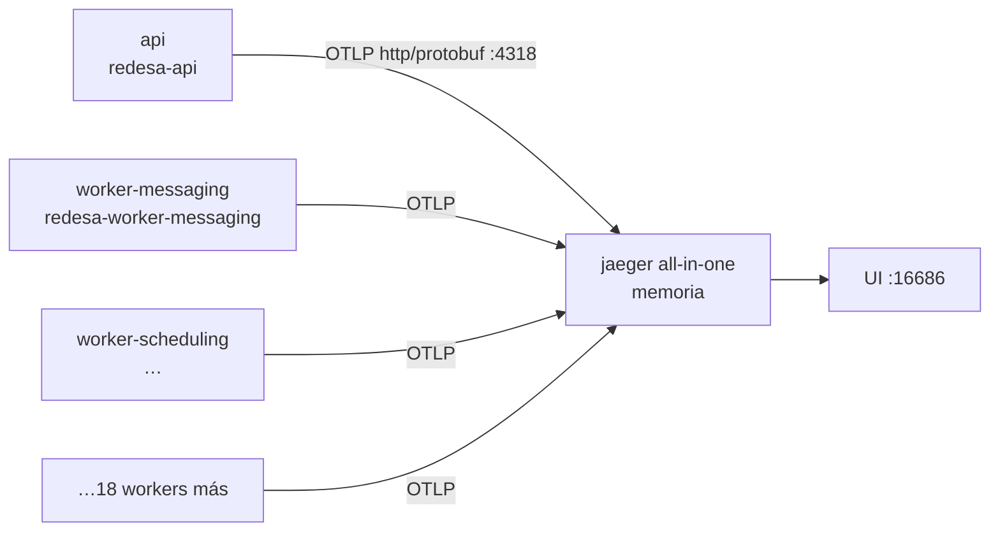
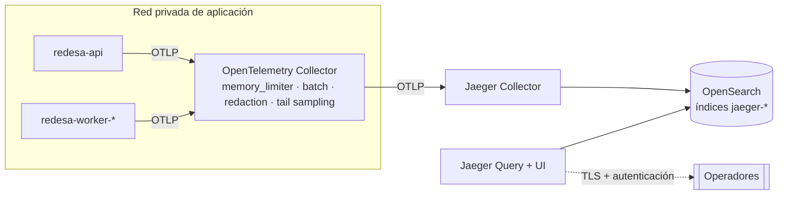
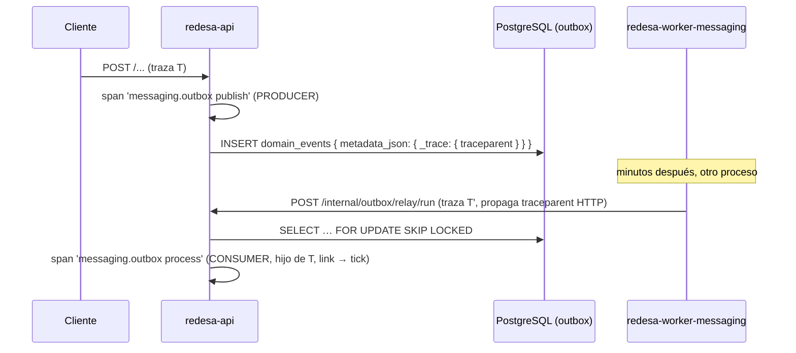

# 01 · Diseño de la arquitectura de observabilidad

> Fase 1. Decide **cómo** se integra OpenTelemetry en los 21 procesos que describe la
> [auditoría inicial](00-current-state-audit.md), sin acoplar ningún módulo de dominio a Jaeger.

## 1. Principio rector

```text
Aplicación NestJS  →  OpenTelemetry SDK  →  OTLP  →  Jaeger
```

Jaeger es **un detalle de despliegue**, no una dependencia del código. Ningún archivo bajo
`src/modules/` importa `@opentelemetry/*`: los dominios reciben `TracingService`, una interfaz
propia y deliberadamente pequeña. Sustituir Jaeger por Tempo, Zipkin o un SaaS compatible con OTLP es un
cambio de variable de entorno, no de código.

## 2. Topología

### Desarrollo



### Producción



El Collector desacopla la aplicación del backend de trazas: si Jaeger cae, el Collector encola y
reintenta; la aplicación solo habla con un endpoint local y estable.

## 3. Decisiones

### D1 · Protocolo: OTLP **http/protobuf**

| Opción | Ventajas | Riesgos | Veredicto |
| --- | --- | --- | --- |
| `http/protobuf` (:4318) | Sin dependencias nativas; atraviesa proxies e ingress HTTP corrientes; depurable con `curl` | Ligeramente más verboso en la red que gRPC | **Elegida** |
| `grpc` (:4317) | Multiplexado, algo más eficiente a volumen alto | Arrastra `@grpc/grpc-js` (binario, +peso de imagen); más difícil de depurar | Descartada |

A 21 procesos con lotes de spans, la diferencia de eficiencia es irrelevante frente al coste de
añadir una dependencia nativa a una imagen que ya compila `argon2`. La constante
`OTEL_EXPORTER_OTLP_PROTOCOL` queda expuesta para poder cambiar de opinión sin tocar código.

### D2 · Instrumentaciones individuales, no `auto-instrumentations-node`

El meta-paquete arrastra ~40 instrumentaciones (Kafka, gRPC, MySQL, Cassandra, GraphQL, AWS
Lambda…) de las que este backend usa 7. Instalarlas todas aumenta el tamaño de la imagen, el
tiempo de arranque y la superficie de parcheo sin ganancia. Se instalan **solo** las que
corresponden a tecnologías realmente presentes (§5).

### D3 · Nombres de servicio

```text
<producto>-<componente>
```

| Proceso | `service.name` |
| --- | --- |
| API | `redesa-api` |
| Workers | `redesa-worker-<dominio>` (p. ej. `redesa-worker-messaging`) |

- `service.namespace` = `redesa`
- `service.version` = versión de `package.json` (`OTEL_SERVICE_VERSION`)
- `deployment.environment.name` = `development` | `test` | `staging` | `production`

El nombre **se deriva del entrypoint en ejecución** (`resolveServiceName`), no de 21 variables de
entorno distintas: `dist/src/main.js` → `redesa-api`, `dist/src/worker-messaging.js` →
`redesa-worker-messaging`. Es lo único que distingue a los 21 procesos, que comparten imagen y
`.env`, y evita el error operativo clásico: veinte workers exportando bajo el nombre de la API.
`OTEL_SERVICE_NAME`, si está presente, gana (permite sobreescribir por contenedor).

### D4 · Convención de nombres de spans

| Tipo | Convención | Ejemplo |
| --- | --- | --- |
| HTTP entrante | la fija la instrumentación: `GET /iam/users/:id` | plantilla de ruta, **nunca** el id concreto |
| Negocio | `<dominio>.<acción>` | `iam.authenticate`, `iam.patient.self-register` |
| Cron / tick | `worker.<dominio>.<job>` — el mismo `operation` que ya viajaba en los logs, para que una búsqueda devuelva lo mismo en el agregador de logs y en el de trazas | `worker.messaging.outbox-relay` |
| Productor | `<destino> publish` | `messaging.outbox publish` |
| Consumidor | `<destino> process` | `messaging.outbox process` |

**Prohibido** construir nombres con identificadores (`iam.authenticate.a3f9…`): dispara la
cardinalidad del índice de Jaeger y hace inútil la agregación por nombre de operación.

### D5 · Atributos propios

Namespace `app.*`, todos de **baja cardinalidad** salvo los tres identificadores explícitamente
permitidos:

| Atributo | Cardinalidad | Uso |
| --- | --- | --- |
| `app.module` | baja (61 valores) | módulo de dominio |
| `app.operation` | baja | acción de negocio |
| `app.entity.type` | baja | tipo de entidad afectada |
| `app.entity.id` | **alta, permitida** | UUID de la entidad — es el dato que hace útil la traza para soporte |
| `app.tenant.id` | media | aislamiento multi-tenant |
| `app.job.name` | baja | nombre del job programado |
| `app.job.attempt` | baja | número de intento |
| `app.job.execution.id` | alta, permitida | correlaciona una ejecución concreta |
| `app.event.type` | baja | tipo de evento de dominio |
| `app.event.id` | alta, permitida | `domainEventId` |
| `app.result.count` | baja | tamaño de lote procesado |
| `app.error.code` | baja | código estable del modelo de error |

Los atributos de alta cardinalidad se permiten **solo como atributos**, jamás como parte del
nombre del span: Jaeger indexa nombres de operación de forma agregada y etiquetas de forma
individual.

### D6 · Atributos prohibidos

Ver la [política de privacidad](04-data-privacy-policy.md). Resumen ejecutable: nada de cuerpos,
cabeceras de autenticación, cookies, parámetros SQL, valores de Redis, query strings, documentos
de identidad, diagnósticos, datos financieros ni variables de entorno.

### D7 · Muestreo

`parentbased_traceidratio`: respeta la decisión del servicio aguas arriba y solo decide cuando la
traza nace en este proceso. Ratio configurable por `OTEL_TRACES_SAMPLER_ARG`. Valores por entorno en
[03-production-topology.md](03-production-topology.md) §7, documentados también en `.env.example`.

Consecuencia deliberada: un worker que llama a la API produce **una sola traza** con spans en dos
servicios, y la decisión de muestreo la toma el worker (raíz). Por eso el ratio del worker y el de
la API deben configurarse juntos.

### D8 · Propagadores

`tracecontext,baggage` (W3C). No se activa B3 (Zipkin): no hay ningún sistema heredado en este
ecosistema que lo requiera, y activarlo duplicaría cabeceras en cada petición saliente.

### D9 · Estrategia para logs

`mixin` de pino en `buildPinoOptions()`. Un único punto de cambio cubre API y los 20 workers,
porque ambos importan `LoggingModule`. Se descarta `@opentelemetry/instrumentation-pino` porque
parchea el logger en tiempo de carga (colisiona con el `mixin` propio) y no permite elegir el
nombre de los campos.

### D10 · Estrategia para colas y eventos

El sistema **no tiene broker**: usa el patrón outbox sobre PostgreSQL (ADR-0019). El contexto se
inyecta en la **metadata del evento** (`metadata_json`) bajo la clave reservada `_trace`, no en una
columna nueva: así el esquema SQL canónico (`database/**`, que no se toca) permanece intacto y los
mensajes antiguos sin `_trace` siguen procesándose (`propagation.extract` sobre un carrier vacío
devuelve el contexto actual, sin error).

Va en la metadata y **no en el payload** por una razón concreta: `payload_json` alimenta
`deriveIdempotencyKey`, y un `traceparent` distinto en cada petición haría que el mismo hecho
publicado dos veces generara claves distintas y rompiera la idempotencia del outbox.



El span consumidor se crea como **hijo del contexto extraído**, de modo que publicación y consumo
comparten `trace_id` y una sola traza cuenta la historia completa. Además se **enlaza** (`links`)
con el span del tick del worker que lo procesó, para no perder el camino inverso: desde una
ejecución del worker se llega a todos los eventos que atendió. Con un carrier vacío (mensaje
antiguo, productor sin instrumentar) el contexto extraído es el activo y el span queda como hijo
del tick, sin ninguna rama especial.

### D11 · Estrategia para procesos programados

Los 30 jobs pasan por `runTick()`. Ahí se crea una **traza raíz nueva por ejecución** (nunca un
span de vida infinita). Los ticks que no encuentran trabajo terminan en microsegundos y son
descartables por muestreo.

### D12 · Estrategia de cierre

- `SIGTERM` y `SIGINT` → `sdk.shutdown()` con timeout acotado.
- El módulo de observabilidad **nunca** llama a `process.exit()`: `main.ts` ya invoca
  `app.enableShutdownHooks()` y el proceso debe drenar sus peticiones en vuelo.
- Los manejadores se registran una sola vez y no reemplazan a los existentes (`process.on`, no
  `process.removeAllListeners`).

### D13 · Desactivación

`OTEL_ENABLED=false` → el bootstrap retorna sin crear el SDK. No se instala ninguna
instrumentación, no se abre ninguna conexión y `TracingService` degrada a *no-op* (los métodos de
la API de OTel con un `TracerProvider` no registrado devuelven spans no grabables, sin coste).

### D14 · Tolerancia a fallos del backend de trazas

`BatchSpanProcessor` exporta en segundo plano, fuera de la ruta de la petición. Si Jaeger no
responde, el exportador falla, registra por el canal de diagnóstico y **descarta** el lote. Una
petición de negocio nunca espera a la exportación ni falla por ella. Verificado con Jaeger apagado: ver
[05-performance-results.md](05-performance-results.md) §4.

## 4. Estructura de archivos

```text
src/observability/
├── index.ts                       superficie pública del módulo
├── telemetry.constants.ts         nombres de atributos y del tracer
├── telemetry.types.ts             tipos de configuración
├── telemetry.config.ts            lectura + validación Joi del entorno OTEL_*
├── instrumentations.ts            selección y configuración de instrumentaciones
├── telemetry.bootstrap.ts         arranque idempotente del NodeSDK
├── telemetry.shutdown.ts          cierre limpio + señales
├── observability.module.ts        módulo global de NestJS
├── tracing.service.ts             API de spans para el dominio
├── trace-context.service.ts       lectura de trace_id/span_id activos
├── trace-response.interceptor.ts  cabecera x-trace-id
└── messaging-trace.service.ts     inyección/extracción de contexto en eventos
```

Ningún archivo supera las 300 líneas. Cada uno tiene una responsabilidad única y el grafo de
importaciones es acíclico: `constants → types → config → instrumentations → bootstrap → shutdown`
y, en paralelo, `constants → tracing.service → {interceptor, messaging-trace}`.

## 5. Instrumentaciones activas

| Instrumentación | Motivo | Configuración destacada |
| --- | --- | --- |
| `http` | peticiones entrantes y salientes (axios usa `http` por debajo) | `ignoreIncomingRequestHook` con la lista de exclusiones; no captura cabeceras |
| `express` | capa de router y de handler | `ignoreLayersType: [MIDDLEWARE]`: el middleware de este backend es fijo y trivial (helmet, json, urlencoded, cors) y multiplicaba por seis el tamaño de cada traza |
| `nestjs-core` | controller y handler que atendieron | por defecto |
| `pg` | consultas SQL de MikroORM | `enhancedDatabaseReporting: false` (sin parámetros), `requireParentSpan: true`, `ignoreConnectSpans: true` |
| `ioredis` | operaciones de caché y locks | `dbStatementSerializer` que emite solo el comando |
| `mongodb` | `document_store` | `enhancedDatabaseReporting: false` |
| `undici` | `fetch` nativo (healthcheck de Docker, clientes futuros) | por defecto |

Explícitamente **fuera**: `fs`, `dns`, `net`, `pino`, `graphql`, `grpc`, `kafkajs`, `amqplib`,
`mysql`, `aws-lambda`. Las cuatro primeras por ruido; el resto porque la tecnología no existe en
este backend.

## 6. Política de errores

1. **Una excepción, un registro por span.** `markSpanError` mantiene un `WeakSet` de spans a los
   que ya se adjuntó una excepción, de modo que un error que atraviesa varias capas instrumentadas
   no se registra cinco veces en el mismo span.
2. **`runInSpan` marca su propio span** cuando la operación lanza, y **relanza el error original
   sin modificarlo**. Que una operación de negocio haya fallado es cierto a su nivel, y ahí es
   donde debe verse.
3. **`AllExceptionsFilter` decide el estado del span HTTP**, que es otro nivel: los 4xx de negocio
   (validación, no encontrado, conflicto de idempotencia) **no** lo marcan como error —son
   respuestas correctas del sistema, y marcarlas dispararía la tasa de error de Jaeger hasta
   volverla inútil—; se registran como evento `http.business_error` con su código estable. Los 5xx
   sí lo marcan y adjuntan la excepción.
4. El filtro **no crea ni finaliza spans**: solo anota el que la instrumentación HTTP ya abrió, y
   **no altera el cuerpo ni el código HTTP** de ninguna respuesta.
5. `runTick` absorbe el error para no tumbar el scheduler, así que marca el span explícitamente
   antes de tragarlo: si no, un tick fallido aparecería como exitoso.

## 7. Variables de entorno

| Variable | Por defecto | Descripción |
| --- | --- | --- |
| `OTEL_ENABLED` | `false` | Interruptor maestro. Apagado por defecto: activar telemetría no debe ser un efecto secundario de actualizar el repo |
| `OTEL_SERVICE_NAME` | derivado del proceso | Sobreescritura por contenedor |
| `OTEL_SERVICE_NAMESPACE` | `redesa` | Agrupación en la UI |
| `OTEL_SERVICE_VERSION` | versión de `package.json` | `service.version` |
| `OTEL_DEPLOYMENT_ENVIRONMENT` | valor de `NODE_ENV` | `deployment.environment.name` |
| `OTEL_EXPORTER_OTLP_PROTOCOL` | `http/protobuf` | Único valor aceptado: es el exportador instalado. Cambiar a gRPC exige añadir su paquete, así que se valida en vez de aceptarse en silencio |
| `OTEL_EXPORTER_OTLP_TRACES_ENDPOINT` | `http://localhost:4318/v1/traces` | Destino |
| `OTEL_EXPORT_TIMEOUT_MS` | `10000` | Timeout de exportación |
| `OTEL_TRACES_SAMPLER` | `parentbased_traceidratio` | Estrategia |
| `OTEL_TRACES_SAMPLER_ARG` | `1.0` | Ratio |
| `OTEL_PROPAGATORS` | `tracecontext,baggage` | Propagadores |
| `OTEL_DIAG_LOG_LEVEL` | `ERROR` | Diagnóstico interno del SDK |
| `OTEL_TRACE_RESPONSE_HEADER` | `true` | Emitir `x-trace-id` en las respuestas |

Se validan con Joi en `src/observability/telemetry.config.ts`, siguiendo el mismo patrón que
`logging.env.ts`: **función pura**, no proveedor inyectable, porque el SDK se inicializa antes de
que exista el contenedor de dependencias de NestJS. El esquema se concatena además al
`validationSchema` global de `ConfigModule` para que un valor inválido aborte el arranque.

## 8. Alternativas evaluadas y descartadas

| Alternativa | Por qué se descartó |
| --- | --- |
| Cliente `jaeger-client` / `@opentelemetry/exporter-jaeger` | Descontinuados. Jaeger acepta OTLP de forma nativa desde la v1.35 y es el camino soportado en la v2 |
| Instrumentar MikroORM con un `Subscriber` propio | `pg` ya captura toda consulta con su SQL normalizado; una segunda capa duplicaría spans sin añadir información |
| Nueva columna `trace_context` en `messaging.outbox_messages` | Exigiría tocar `database/**`, que el protocolo de 4 capas del proyecto prohíbe modificar desde el código |
| Un único proceso "worker monolito" para simplificar la telemetría | Contradice la decisión de aislamiento por dominio ya tomada y documentada |
| `@opentelemetry/instrumentation-pino` | Colisiona con el `mixin` propio y no permite elegir los nombres de campo |
| Exportador OTLP gRPC | Dependencia nativa adicional en una imagen que ya compila `argon2` |

## Ver también

- [Auditoría del estado actual](00-current-state-audit.md)
- [Catálogo de spans de negocio](02-business-spans-catalog.md)
- [Topología de producción](03-production-topology.md)
- [Política de privacidad de datos](04-data-privacy-policy.md)
- [Guía para desarrolladores](README.md)
