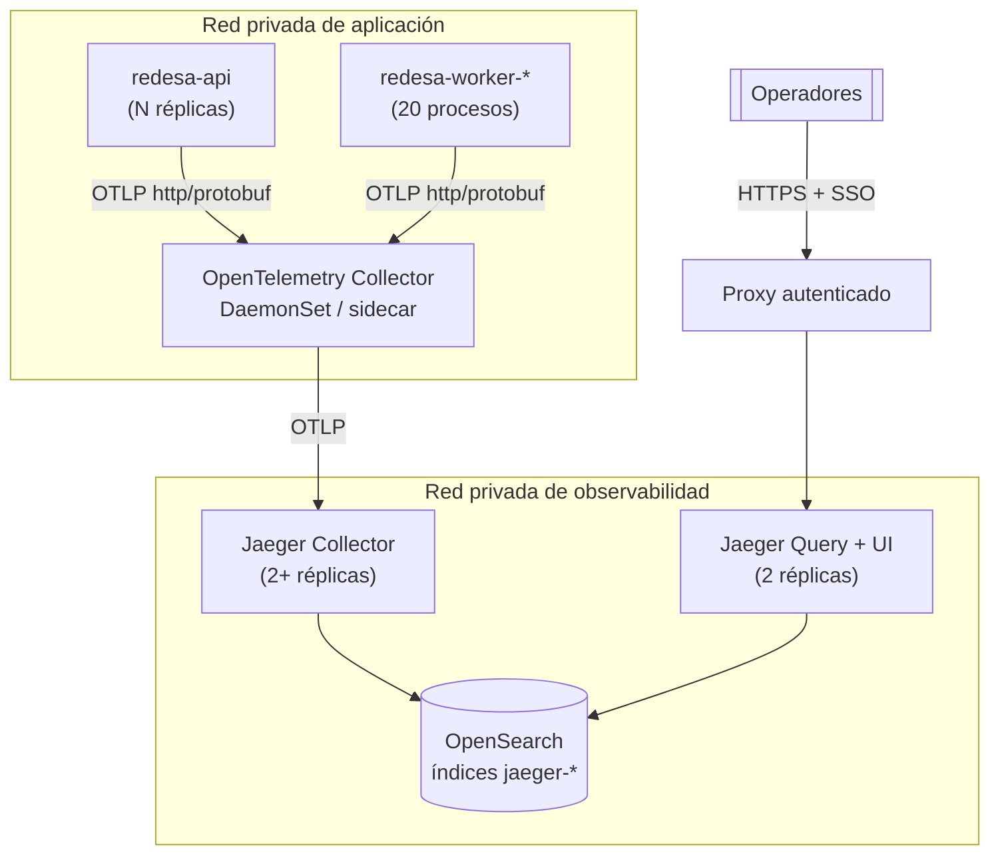

# 03 · Topología de trazas para producción

> Fase 16. La configuración de `docker-compose.jaeger.yml` es **exclusivamente de desarrollo**:
> almacena en memoria, no tiene autenticación y no tiene retención. Este documento describe la
> topología que sí puede operarse.

## 1. Por qué no basta con `all-in-one`

| Aspecto | `all-in-one` (desarrollo) | Requisito de producción |
| --- | --- | --- |
| Almacenamiento | memoria del proceso | persistente, con retención |
| Reinicio | pierde todo | no pierde nada |
| Acceso | abierto | autenticado y cifrado |
| Escalado | proceso único | ingesta y consulta escalan por separado |
| Amortiguación | ninguna | cola y reintento ante indisponibilidad |
| Redacción | ninguna | segunda barrera de privacidad |

## 2. Topología recomendada

## 3. Componentes

| Componente | Función | Réplicas | Notas |
| --- | --- | --- | --- |
| OpenTelemetry Collector | Amortigua, limita memoria, redacta, agrupa en lotes | 1 por nodo (DaemonSet) o sidecar | Configuración en `infra/otel-collector/otel-collector.config.yml` |
| Jaeger Collector | Ingesta y escritura al almacenamiento | ≥ 2 | Sin estado; escala horizontalmente |
| Jaeger Query + UI | Consulta y visualización | 2 | Sin estado |
| Almacenamiento | Persistencia e índices | ver §5 | El componente con estado |

## 4. Puertos y redes

| Origen | Destino | Puerto | Protocolo | Expuesto |
| --- | --- | --- | --- | --- |
| API / workers | Collector | 4318 | OTLP http/protobuf | red privada de aplicación |
| Collector | Jaeger Collector | 4317 | OTLP gRPC + TLS | red privada de observabilidad |
| Jaeger Collector / Query | Almacenamiento | 9200 | HTTPS | red de datos |
| Proxy autenticado | Jaeger Query | 16686 | HTTP | solo desde el proxy |
| Operadores | Proxy | 443 | HTTPS + SSO | corporativo / VPN |
| Orquestador | Collector | 13133 | health check | interno |
| Recolector de métricas | Collector | 8888 | Prometheus | interno |

**Ningún componente se publica en Internet.** El endpoint OTLP no autentica: quien lo alcanzara
podría inyectar trazas falsas o saturar el almacenamiento.

## 5. Almacenamiento: decisión

El proyecto **ya opera OpenSearch** (`docker-compose.yml`, módulo `search_platform`,
`@opensearch-project/opensearch`), con su operación, sus copias de seguridad y su conocimiento ya
establecidos en el equipo.

| Opción | Ventajas | Riesgos | Veredicto |
| --- | --- | --- | --- |
| **OpenSearch** (ya existe) | Cero tecnologías nuevas; backend oficialmente soportado por Jaeger; ILM/ISM da retención declarativa; el equipo ya lo opera | Compite por recursos con el índice de búsqueda si comparten cluster | **Elegida**, en un cluster o al menos un pool de nodos separado |
| Cassandra | Excelente para escritura sostenida | Tecnología nueva: operación, copias, conocimiento y coste desde cero | Descartada: no se justifica sin un volumen que hoy no existe |
| Elasticsearch | Equivalente técnico | Duplicaría un motor casi idéntico al que ya se opera | Descartada |
| SaaS gestionado | Sin operación propia | PHI hacia un tercero: exige análisis de tratamiento de datos y contrato; decisión de negocio, no técnica | Fuera del alcance de esta iniciativa |

**Justificación del volumen.** No se despliega un sistema de almacenamiento nuevo porque no hay
medición de tráfico de producción que lo respalde. Con OpenSearch ya operativo, el coste marginal
de las trazas es un índice más y una política de retención, no una plataforma nueva.

### Dimensionamiento inicial (a recalcular con tráfico real)

| Parámetro | Valor de partida | Cómo ajustarlo |
| --- | --- | --- |
| Spans por petición | ~12 (medido: petición de login con 4 consultas SQL) | Medir con `yarn jaeger:verify` sobre los flujos reales |
| Tamaño por span | ~0,5 KB indexado | Medir sobre el índice real |
| Muestreo en producción | 0,10 (10 %) | §7 |
| Retención | 7 días | [Política de privacidad](04-data-privacy-policy.md) §6 |

Volumen ≈ `peticiones/día × 0,10 × 12 spans × 0,5 KB × 7 días`. A 1 M de peticiones diarias son
del orden de 4 GB de índice vivo. Es una estimación de partida, **no una medición**.

## 6. Seguridad

| Control | Aplicación |
| --- | --- |
| TLS | Collector → Jaeger y Jaeger → almacenamiento (`insecure: false` ya en la configuración) |
| Autenticación de la UI | Proxy con SSO corporativo; Jaeger Query no autentica por sí mismo |
| Autorización | Mismo grupo que ya accede a los logs de producción |
| Aislamiento de red | Tres redes: aplicación, observabilidad, datos |
| Redacción | Procesador `attributes/redact` del Collector, además de los controles en la aplicación |
| Secretos | `JAEGER_COLLECTOR_ENDPOINT` y credenciales del almacenamiento desde el gestor de secretos, nunca en la imagen |

## 7. Muestreo por entorno

| Entorno | `OTEL_TRACES_SAMPLER_ARG` | Motivo |
| --- | --- | --- |
| Desarrollo | `1.0` | Volumen despreciable; se quiere ver todo |
| Pruebas | `0.0` o telemetría apagada | Las pruebas no deben exportar |
| Staging | `0.25` – `1.0` | Tráfico bajo; conviene la cobertura |
| Producción | `0.05` – `0.20` | Punto de partida: `0.10`, revisable con datos reales |

Estrategia `parentbased_traceidratio` en todos los entornos: respeta la decisión del servicio
aguas arriba, de modo que una traza worker → API no queda partida por la mitad.

**Evolución prevista.** Cuando el muestreo probabilístico deje de bastar (errores raros que se
pierden), el paso siguiente es *tail sampling* en el Collector: decidir tras ver la traza completa
y conservar el 100 % de las que tienen error o latencia anómala, más un porcentaje del resto. No se
implementa ahora porque exige que todos los spans de una traza lleguen al mismo Collector
(*load-balancing exporter*), lo que duplica la complejidad del despliegue sin una necesidad medida.

## 8. Escalabilidad

| Cuello de botella | Síntoma | Respuesta |
| --- | --- | --- |
| Ingesta | El Collector rechaza lotes (`memory_limiter`) | Más réplicas del Collector |
| Escritura | Cola del Jaeger Collector creciendo | Más réplicas; revisar el almacenamiento |
| Almacenamiento | Latencia de indexación al alza | Más nodos de datos, o bajar el muestreo |
| Consulta | La UI tarda | Más réplicas de Query; acotar el rango de búsqueda |
| Coste | Índice creciendo sin control | Bajar el muestreo antes que acortar la retención |

## 9. Recuperación

| Fallo | Efecto en el negocio | Recuperación |
| --- | --- | --- |
| Collector caído | **Ninguno.** La exportación falla en segundo plano | El orquestador lo reinicia (health check en :13133) |
| Jaeger Collector caído | Ninguno. El Collector encola y reintenta | Automática; hasta 5000 lotes en cola |
| Almacenamiento caído | Ninguno para el negocio; se pierden trazas al agotarse la cola | Restaurar el cluster; asumir el hueco |
| Pérdida total del almacenamiento | Se pierde el histórico de diagnóstico | **No se restaura desde copia**: con 7 días de retención, el coste de las copias supera al valor. Decisión explícita |

**Invariante de diseño, verificado.** Una operación de negocio nunca espera a la exportación ni
falla por ella. Medido con Jaeger apagado: la API siguió respondiendo (`/health` 200, login 401
normal) con la latencia dentro de la variación normal, y el fallo del exportador apareció como una
línea de diagnóstico en `stderr`, no como un error de la aplicación. Ver
[05-performance-results.md](05-performance-results.md).

## 10. Costes operativos (cualitativo)

| Concepto | Coste | Comentario |
| --- | --- | --- |
| Cómputo del Collector | Bajo | ~100 MB de memoria por instancia |
| Cómputo de Jaeger | Bajo-medio | Sin estado, escala con la ingesta |
| Almacenamiento | **El coste dominante** | Directamente proporcional al muestreo |
| Operación | Bajo | Reutiliza OpenSearch, ya operado |
| Puesta en marcha | Medio | Redes, TLS, SSO del proxy, política ILM/ISM |

La palanca de coste es el **muestreo**, no la retención: bajar de 10 % a 5 % reduce el volumen a la
mitad sin acortar la ventana de investigación.

## Ver también

- [Diseño de la arquitectura](01-architecture-design.md)
- [Política de privacidad de datos](04-data-privacy-policy.md)
- [Runbook operativo](06-operational-runbook.md)
- [Resultados de rendimiento](05-performance-results.md)
