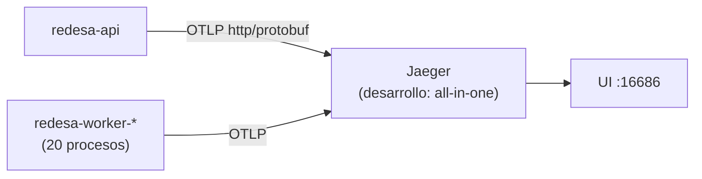

# Trazas

> Trazabilidad distribuida con **OpenTelemetry → OTLP → Jaeger**, implementada sobre los 21
> procesos del backend (API + 20 workers). Cierra la brecha que describía la auditoría previa,
> donde solo existía correlación por request. Ver
> [ADR-0020](../adr/ADR-0020-trazas-opentelemetry-jaeger.md).

## Qué responde hoy una traza

- Qué endpoint recibió la petición y qué controller la atendió.
- Cuánto tardó la operación completa y qué parte del tiempo consumió cada dependencia.
- Qué consultas se hicieron a PostgreSQL y cuánto tardó cada una.
- Qué operación de negocio estaba ejecutándose (`iam.authenticate`, `messaging.outbox publish`, …).
- Dónde falló, con la excepción adjunta al span exacto.
- Qué worker procesó un mensaje y si conservó el contexto de la operación que lo originó.
- Qué logs pertenecen a la misma operación (`trace_id` en cada línea de pino).
- Qué identificador puede entregar un usuario a soporte (cabecera `x-trace-id`).

La pregunta que motivaba esta capacidad —«¿cuánto tardó desde que se creó el pedido hasta que se
entregó el correo?»— se responde ahora siguiendo una sola traza, no correlacionando a mano varios
logs por `aggregateId`/`domainEventId`.

## Arquitectura



En producción se interpone un OpenTelemetry Collector, que amortigua, redacta y agrupa en lotes
antes de escribir en Jaeger — ver [topología de producción](03-production-topology.md).

La aplicación **no está acoplada a Jaeger**: exporta OTLP estándar y ningún módulo de dominio
importa `@opentelemetry/*`. Cambiar de backend de trazas es cambiar una variable de entorno.

## Instrumentación

| Automática | Manual |
| --- | --- |
| HTTP (entrante y saliente), Express, NestJS, PostgreSQL (`pg`), Redis (`ioredis`), MongoDB, `undici` | 5 spans de negocio, más la traza raíz de los 30 jobs programados |

Fuera a propósito: `fs`, `dns` y `net` (ruido sin valor diagnóstico) y `pino` (colisiona con el
`mixin` propio). Detalle en el [catálogo de spans](02-business-spans-catalog.md).

## Correlación con los logs

`buildPinoOptions()` añade `trace_id`, `span_id` y `trace_flags` a cada línea, tomándolos del
contexto activo de OpenTelemetry —nunca de una cabecera enviada por el cliente, que sería
falsificable—. Un único punto de configuración cubre la API y los 20 workers. `req.id` sigue
existiendo como `correlationId` del [modelo de error](../api/error-model.md): ambos conviven.

## Propagación asíncrona

El sistema no tiene broker: usa el patrón outbox sobre PostgreSQL
([ADR-0019](../adr/ADR-0019-patron-outbox.md)). El contexto viaja en `metadata_json._trace` del
evento, de modo que publicación y consumo comparten `trace_id` sin tocar el esquema SQL canónico.
Los eventos anteriores a esta iniciativa se procesan igual, sin ninguna rama especial.

Las llamadas `/internal/*` de los workers a la API sí llevan ya cabecera `traceparent`: verificado
contra Jaeger, una traza rooteada en `worker.messaging.outbox-relay` contiene los spans de
`redesa-worker-messaging` y los de `redesa-api` en la misma traza.

## Uso

```bash
yarn jaeger:up          # Jaeger local
OTEL_ENABLED=true       # en el .env
yarn start:dev
yarn jaeger:verify      # verificación extremo a extremo
```

## Ver también

- [Guía completa para desarrolladores](README.md)
- [Logs](logging.md) — la correlación por `req.id`, que sigue vigente.
- [Métricas](metrics.md).
- [Runbook operativo](06-operational-runbook.md).
