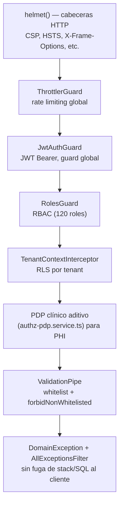

# Arquitectura de seguridad

> Fase 13. Controles verificados contra código real (`src/`) y contrastados con el estándar de
> seguridad de diseño del proyecto (documento interno "Auditoría de seguridad del modelo —
> v4.0.6"). Cada control listado aquí tiene una entidad o mecanismo real, verificado — no es una
> lista aspiracional.

## Capas de defensa, de afuera hacia adentro

Ver [ciclo de vida de una request](../architecture/request-lifecycle.md) para el detalle de cada
capa con evidencia de código.

## Autenticación — controles verificados

| Control | Entidad/mecanismo real | Evidencia |
|---|---|---|
| Credenciales nunca en claro | `iam.authentication_credentials` (`secret_hash` + `hash_algorithm_concept_id`) | Estándar de diseño del proyecto, patrón `*_hash` consistente en el catálogo de entidades |
| MFA | `iam.mfa_factors` | [Catálogo de entidades](../data/entity-catalog.md) — schema `iam` |
| Sesiones y refresh tokens | `iam.sessions`, `iam.refresh_tokens` | ídem |
| Dispositivos | `iam.devices` | ídem |
| Bloqueo anti-fuerza-bruta | `iam.account_lockouts`, `ACCOUNT_LOCK_THRESHOLD` (env, default 5) | `.env.example`, [variables de entorno](../getting-started/environment-variables.md) |
| Claves de API | `iam.api_keys` + `iam.api_key_scopes` (hash, scopes, rate-limit, rotación) | [Catálogo de entidades](../data/entity-catalog.md) |
| Federación / SSO | `auth_providers` (llaves de firma con solo `public_key`, intentos de login) | Módulo `auth_providers`, [ADR-0004](../adr/ADR-0004-autenticacion-jwt-propio.md) |

## Autorización — controles verificados

Ver [autorización](../api/authorization.md) y [ADR-0005](../adr/ADR-0005-autorizacion-rbac-pdp-clinico.md)
para el detalle completo de RBAC + PDP clínico aditivo. Controles adicionales verificados:

| Control | Entidad real |
|---|---|
| Enmascaramiento de campos | `authz.field_permissions` |
| Identidades de máquina (workers, integraciones) | `authz.service_principals` |
| Reglas de acceso por IP | `authz.ip_access_rules` (allow/deny por CIDR) |
| Acceso de emergencia auditado | `authz.break_glass_sessions` |
| Delegación gobernada | `delegated_access` (concesiones con aprobación y eventos) |

## Verificación de identidad y fraude

Módulo `identity_assurance` — señales de fraude, verificación, revisión manual. No se detalla el
algoritmo de scoring en esta fase (fuera del alcance de análisis estático de una auditoría
documental).

## Privacidad y derechos del titular

`audit.dsar_requests` (Data Subject Access Requests — derechos del titular bajo GDPR/HIPAA),
`system_ops.data_classifications`, `data_residency_policies`, `anonymization_rules`, `legal_holds`
— ver [clasificación de sensibilidad](../data/classification.md).

## Discrepancia real encontrada entre diseño y código

El estándar de diseño del proyecto referencia `redis_runtime.rate_limit_buckets` como el
mecanismo de limitación de tasa. **No se encontró esa tabla/clave en el código actual** — el
control real de rate limiting es `ThrottlerGuard` (`@nestjs/throttler`), registrado globalmente en
`src/app.module.ts` (`APP_GUARD`). El **control existe y funciona**, pero por un mecanismo
distinto al nombrado en el documento de diseño original — se documenta la reconciliación en vez de
repetir una referencia no verificable, o de asumir que el control no existe.

## Ver también

- [Modelo de amenazas](threat-model.md)
- [Control de acceso](access-control.md)
- [Aislamiento de tenant](tenant-isolation.md)
- [Auditabilidad](auditability.md)
